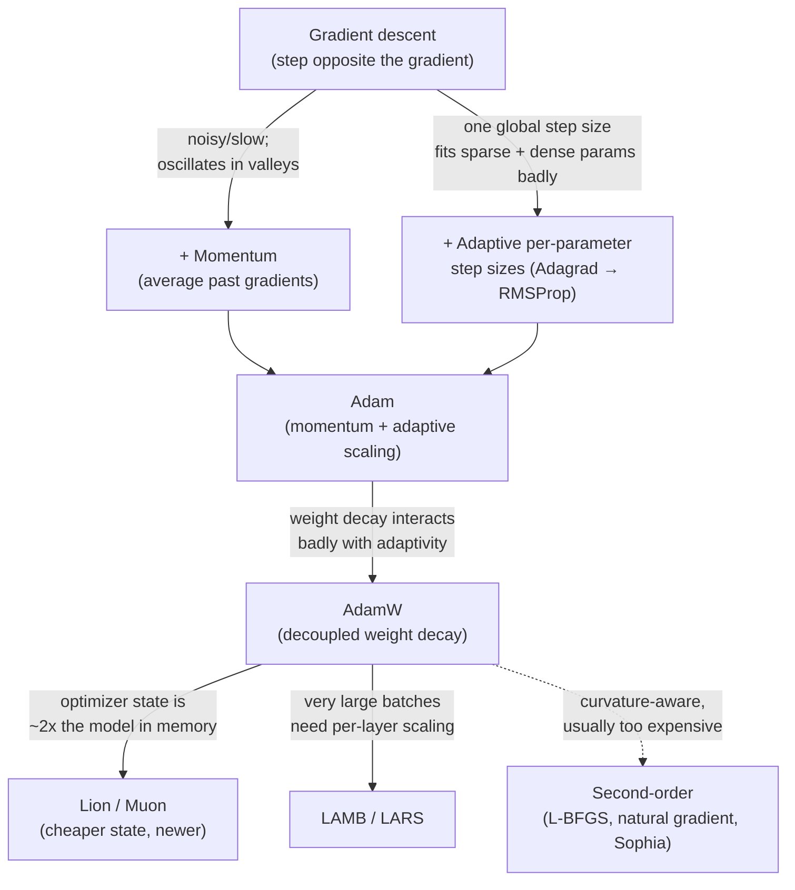

# 优化算法

根据本文的基本原理, 从逻辑回归到数万亿参数的专家混合模型**损失函数**(一个数字衡量模型的预测是多么错误;见[loss-functions.md](loss-functions.md)优化算法是"调整参数"部分. 这份文件涵盖了从第一原则到2026年实际使用的边界模型训练.

整个家庭最好理解为一个单一的想法"损失下降步骤"连续的改进被上来解决特定的问题.下面的图表是整个文件的地图;每个箭头是"...但这有问题,所以我们添加了:".



## 渐进下降:基层情况

**定义.**渐进降低是一种减小函数的反复步骤,以减少它最快的方向.

**起源.**这种方法是19世纪的数学 (考希,1847) 对一个非常不同的问题 (解决方程系统) 应用;其用于训练神经网络的使用可以追溯到1980年代的后扩散时代工作 (Rumelhart,Hinton和Williams,1986),该方法为计算损失函数的梯度提供了实际的方式,与多层网络中的每个参数相对于.

**核心机制.**输出函数 L(θ) 告诉你模型在训练示例中平均表现得多差,对于给定的设置 θ.**缩**L(θ) 是对每个参数的部分衍生物向量*最强的增长*为了减少损失,你会朝着相反的方向走.

```
θ ← θ − η · ∇L(θ)
```

现在** ()**是什么?**学习率**一个小的正数控制你迈出了多大的步骤.这个单一行是几乎所有深度学习培训的机械核心.

通过:在每一步,你计算了损失会如何改变,如果你轻微推进每个参数,然后你推进每个参数,

**具体的一步步例子.**假设整个"模型"是单个参数 θ,损失是 L(θ) = θ2 (一个抛物线,其最小值为 θ = 0).梯度是 L = 2θ.从 θ = 5,以 η = 0.1:

- 步骤1:梯度 = 2·5 = 10;更新 θ ← 5 − 0.1·10 = 4.0.
- 步骤2:梯度=2·4=8;更新 θ ← 4 −0.1·8 = 3.2. 现在的损失是10.24.
- 步骤3:梯度=2·3.2=6.4; θ ← 3.2 −0.64=2.56. 现在的损失为6.55.

每一步都向0 (最小) 移动 θ,步骤自动得到 *较小的*现在想象一下,这不是一个参数,而是数十亿个参数同时发生,每个参数都有自己的部分衍生,你有了训练每个模型的机械心脏. 另外,注意的是 η = 1.1 相反会发生什么:步骤 1将给 θ ← 5 − 1.1·10 = −6,*进一步*这是从一个太大的学习率,具体的分歧.

只有在每个步骤前使用多少数据来估计L的不同:

- **批次 (或"全批次") 梯度下降**计算梯度使用*整体*训练设置在一步前. 这给出了准确的梯度,但对于任何比玩具大大的数据集来说是非常缓慢的,而且需要记忆.
- **缩梯度下降 (SGD)**通过一个*单身*随机选择的每步训练示例. 这种方法是廉价的每步训练,并将噪音注入轨道 (这可以帮助逃离浅的本地最小值),但每步梯度估计非常有噪音,因此到最低的路径是的.
- **迷你批次梯度下降**现在几乎普遍使用的实际中途:每步计算一个小的随机子集中的梯度 (通常是"迷你批量",通常是数以数万个) 这使现代平行硬件 (GPU/TPU 构建以同时进行许多类似的乘法) 损失得很大,并且比单例 SGD 产生了较少噪音的梯度估计.在现代使用中,"SGD"是宽松地用来表示"迷你批量梯度下降,可选的是与动力"

**为什么这很重要.**梯度下降 (及其微量级形式) 是唯一的优化策略,它可以扩展到数十亿参数的模型,因为它只需要本地信息 (梯度) 而不是任何全球的损失表面的视图 ("损失景观" 损失函数的形状与所有参数值相比绘制;一个形,高维度的表面你试图找到一个低点).

**现状.**无条件地,不是原始的SGD,而是基板,下面的每个优化器都建立在.

## 动力

**定义.**动力积累了过去梯度的运行平均值,并使用该平均值而不是仅仅是当前梯度来确定步骤方向.

**起源.**波利亚克 (1964) 在数值优化文献中;自1980年代至90年代以来广泛使用的SGD与momentum形式适应神经网络培训.

**核心机制.**保持速度向量v,更新每一步为:

```
v ← β·v + (1 − β)·∇L(θ)
θ ← θ − η·v
```

 (β,通常是~通过:如果你只对当前梯度进行反应,你会保留最近梯度方向的"记忆"并将其与新的方向混合.如果梯度继续以大致相同的方式指向,速度会增加,你会朝着那个方向移动更快.如一颗滚球向下滚动,并获得速度.如果梯度方向逐步翻转 (在损失景观的狭窄谷中常见的模式),振荡会部分取消,减弱了 SGD 在这些区域中显示的条.

对于文法的说明,因为它让人们在比较教科书方程与实际代码时感到丧:上面的表格 (与`(1 − β)`因素是*指数移动平均值*速度是过去梯度的真实权重平均值.*经典*例如,PyTorch的内置SGD优化器使用的Polyak形式省略了这个因素`v ← β·v + ∇L(θ)`所以速度积累而不是平均值,有效步骤大小大约是1/(1−β) 两者等于重新扩展学习速度,这就是为什么两者都在文献中交换起来;当论文中的方程不完全匹配你的框架中的方程时,不要抛弃.

**为什么这很重要.**简单的SGD在损失景观中缓慢和振荡,在一方向的曲率,在另一方向的曲率浅 (神经网络损失的非常常见形状). 动力使这一情况平滑,并且在不需要额外的梯度计算的情况下大幅加速了化.

**尼斯特罗夫加速梯度 (NAG)**(Nesterov,1983年,适应了2010年代初的深度学习训练) 是一个改进:*之后*通过应用当前速度 (一个"前景"梯度). 这给优化器在过射之前,而不是之后,更有可能纠正路径. 在实践中,NAG对经典动力提供了适度,一致的改善,并且在大多数训练框架中是一种标准选择.

**现状.**虽然目前的LLM培训中没有单独使用 Momentum,但其积累理念被入了亚当和其下游的一切 (见下面).

## 适应学习率方法

动力仍然使用了*其他*学习率为每一个参数.但在一个巨大的网络中,一些参数 (例如,与罕见的特征或罕见的激活路径相关的参数) 比其他更少,更稀疏的梯度信号.固定的全球学习率是不适合同时的.这种方法给每个参数自己的有效学习率,根据个人收到的梯度历史.

### 亚达格拉德

**起源.**杜奇,哈桑和歌手 (2011).

**核心机制.**适应分为每个参数的学习速度,以此参数的过去梯度的平方根的平方根:

```
G ← G + ∇L(θ)²          (element-wise, accumulated over all steps so far)
θ ← θ − η / (√G + ε) · ∇L(θ)
```

 (epsilon) 是一个小常数,防止零分. 通过:历史上获得大梯度的参数得到了有效步骤大小缩小 (他们的G积累快);很少获得大梯度的参数保持了相对较大的有效步骤大小.这对于稀缺的特征非常好 (使用包字样式输入的早期NLP模型),但对于长时间的训练运行具有致命的缺陷:G只会增长,因此有效学习率单调缩到零,训练最终会停滞.

**现状.**曲式衰变问题,仍然偶尔用于具有真正稀疏梯度的曲式问题.

### 子

**起源.**杰弗里·希顿在2012年未发表的Coursera讲座中介绍了它 (一个"纸"是著名的幻灯片,而不是杂志出版物)

**核心机制.**通过使用一个 *指数移动平均值*平方梯度而不是运行总数:

```
G ← β·G + (1 − β)·∇L(θ)²
θ ← θ − η / (√G + ε) · ∇L(θ)
```

通过:因为G现在是一个衰退的平均值而不是不断增长的数量,旧梯度"老化"而不是永久缩小未来的步骤. 这使得Adagrad的适应性学习率利没有停滞.

**现状.**今天很少直接使用,但是亚当 (下面) 的两个直接数学祖先之一.

### 亚当

**定义.**亚当 (Adaptive Moment Estimation) 结合动力 (梯度的移动平均值"第一时刻") 和RMSProp式的适应性扩展 (二次梯度的移动平均值"第二时刻").

**起源.**基恩玛和巴,"亚当: Stochastic优化方法" (2015年初发布为预印2014年底).

**核心机制.**

```
m ← β₁·m + (1 − β₁)·∇L(θ)               (first moment: momentum)
v ← β₂·v + (1 − β₂)·∇L(θ)²              (second moment: RMSProp-style)
m̂ ← m / (1 − β₁ᵗ)                        (bias correction)
v̂ ← v / (1 − β₂ᵗ)                        (bias correction)
θ ← θ − η · m̂ / (√v̂ + ε)
```

典型默认: β1 = 0.9, β2 = 0.999. 通过:m追踪最近的平均值 *方向*向 (momentum);v跟踪最近的平均值*度二*根据参数的梯度 (适应性扩展,如RMSProp). 分割m̂为√v̂意味着:在平滑梯度方向上移动,但对于最近的梯度大小的参数采取较小的步骤 (它们已经变化很快,所以要更加小心) 和较大的相对步骤.对小,一致的梯度的参数进行较大的相对步骤.偏差纠正术语 (分为1 − βt,其中t是步数) 存在于m和v在零开始,因此在早期步骤中偏向于零.

**记忆成本,做成混凝土.**观察亚当保持*两人*对于一个具有混合精度训练的N参数模型,一个常见的会计是,参数本身,它们的梯度和亚当的两个时刻缓冲器,每参数需要16字节的顺序 (确切的数字取决于精度选择,但关键点是乘数).对于一个70亿参数模型,仅仅是训练状态的内存太字节远超过模型的自身权重,这正是为什么[distributed-training.md](../05-training-methodology/distributed-training.md)为了实现这一目标, 美国政府花费了大量的精力,

**为什么这很重要.**亚当将前十年优化研究中的两个最有用的特性 (向向平滑从动力,从RMSProp的每参数扩展) 结合成一个优化器,在各种结构和问题中非常广泛地"出盒子",并且具有最小调整性.这使其成为2015-2020年深度学习繁荣的默认选择,其后代 (亚当W,下面) 仍然是2026年开始培训大型语言模型的默认选择.

**现状.**亚当W (下面) 已经有效地取代了普通亚当的大型培训,但亚当仍然在较小规模和非LLM深度学习工作中非常常见.

### 脱的体重衰减

**定义.**AdamW是体重衰减的Adam (一个调节技术,每步将体重缩小到零,从而阻止过度大的参数值见[regularization-techniques.md](regularization-techniques.md)) 作为一个*单独*步骤,与基于梯度的更新分离,而不是折叠成梯度本身.

**起源.**洛希洛夫和哈特, "脱节体重衰减规律化" (2019).

**核心机制.**在经典L2调节的SGD中,加减权重与加减值的术语相当,并且通过简单地在更新前加 λθ在梯度上实现.但在亚当中,这意味着减权重的术语被除了√v̂以及其他所有参数*减少*减肥是减肥的意图反向的 (它应该以不论其梯度有多杂的速度缩小所有权重到零).而亚当W则在适应量化尺度机器之外,将减肥作为其自己的独立减法:

```
θ ← θ − η·(m̂ / (√v̂ + ε) + λ·θ)
```

通过:适应梯度步骤和"缩小一切"步骤现在是独立的操作,所以权重衰减行为是它应该的方式 (一个恒定的比例拉向零) 无论参数的梯度历史.

**为什么这很重要.**这解决了亚当多年来与规范化结合的细微但真正的错误,并产生了显著更好的概括 (模型未见的数据上的性能,而不是仅仅记住培训数据) 以微不足道的额外成本.这就是为什么亚当W,而不是亚当,是基本上每一个主要的LLM预训练运行标准优化器2026年.

**现状.**亚当W是目前生产的几乎所有基于Transformer的模型的预训练和精细调节的默认优化器选择.

## 较新的优化器:狮子,索菲亚,LAMB/LARS

### 狮子

**起源.**等 (谷歌), "优化算法的象征性发现" (2023)  特别,狮子通过一个自动化程序搜索过程发现了可能更新规则的大量空间,而不是手动取而来.

**核心机制 (简单).**狮子只追踪一个动力周期 (没有像亚当这样的第二时/变量追踪),而不是使用原始动力值来更新,它只使用其*标志*根据学习速度进行的规模:

```
θ ← θ − η · sign(β₁·m + (1 − β₁)·∇L(θ))
```

通过:每个参数每步 (η) 移动的速度在目前的方向上是相同的.  没有参数的规模扩展. 这是一个比亚当的更简单的更新规则,使用了优化状态内存的半个 (没有v 进行跟踪),这在100B+参数模型的规模上很重要,优化状态可以占总内存的很大一部分.

**现状.**据报道,在一些预训练运行中与亚当W相匹配或略有超过了亚当W,但没有作为默认的AdamW取代;采用是真实的,但仍然是2026年亚当W相对的少数.

### 索菲亚

**起源.**等人",索菲亚:语言模型预训练可扩展的二级优化器" (2023).

**核心机制 (简单).**索菲亚是对第二级方法的轻量级近似 (见下) 它估计曲率 (梯度本身在变化速度,即大约是赫西亚的角形,第二次衍生物的矩阵) 便宜,并使用它进一步调整每参数步骤尺寸超出亚当的v术语捕获的,通过剪切机制来保持估计稳定.

**现状.**报告在原稿的预训实验中报告了超过AdamW的速度;从2026年开始,在原作者基准之外的采用是有限的

### 子

**起源.**约旦等 (2024年),随后在2024-2025年间进行扩展和改进工作.

**核心机制 (简单).**子是专门为2D权重设计的*矩阵*在网络内部 (注意力和输送层中的大矩阵见[transformer-architecture.md](../03-deep-learning-architectures/transformer-architecture.md)),并将其更新视为一个矩阵而不是一个独立数量的平袋.**形定位**通过几次矩阵多项式的代,而不是昂贵的精确分解) 在使用它作为更新之前.直观的,这重新平衡了更新,以便它以更一致的强度推进所有不同的"方向"矩阵可以改变,而不是让几个主导方向吸收大部分的步骤.这使得实验 allow训练每单位计算更有效的步骤. Muon通常与AdamW等标准优化器对非矩阵参数 (嵌入,偏差,正常化尺度) 进行配对,这些参数没有相同的2D结构来利用.

**为什么值得包括.**穆恩是自亚当以来第一个从亚当开始看到真正的,广泛报道的语言模型预训练而不是保持一个基准好奇心. 据报道,它可以提高计算效率在有意义的规模,同时也使用比亚当少的优化状态内存 (它仅跟踪它处理的矩阵的动力缓冲器).截至2026年,它代表了亚当W长期统治的最新最可信的挑战者,尽管亚当W仍然是安全的默认,而穆恩的记录仍然更短.

**现状.**现实且不断增长的实用性,但尚未成为默认的,

### 长批训练

**起源.**拉斯:你,吉特曼,和金斯堡 (2017);LAMB:你等 (2019,专门适用于BERT规模的预训).

**核心机制 (简单).**在训练非常大的批量时 (需要有效地使用数千个加速器并行),单一的全球学习率变得不适合,因为不同层面的权重标准与梯度标准比率非常不同.LAMB和LARS将每个层的更新量重新调整为该层的参数标准与更新标准的比例,以便与其自身规模相比,没有单层的权重发生过度快的变化.LAMB专门将这一技巧放在亚当的每参数适应性扩展量上.

**为什么这很重要.**这些使得扩展批量到数万个,而没有培训变得不稳定,这使得组织通过在非常大的加速器集群中并行地减少了预训时间.

**现状.**大规模预训练的最大批次阶段标准;通常不用于细调或小批次训练,而AdamW仍然是标准的.

## 学习率时间表

几乎所有现代培训课程都随着时间的推移而变化**时间表**.

- **步骤衰退**在预设的时代/步骤里程碑时,以固定因素 (例如 ×0.1) 降低 η.[cnn-family.md](../03-deep-learning-architectures/cnn-family.md)).
- **子**在训练过程中从初始值下降到 (接近) 零的可西因曲线后轻松分解 η.广泛用于LLM预训练,因为它避免了步骤衰变的突然跳跃,其形状是一个单一,易于调整的参数 (总步骤).
- **线性加热**在主程开始之前,在 (或接近) 零开始 η,并在训练的第一部分 (通常是总步骤的1-5%) 上线上升.
- **热化+衰变组合**今天的LLM预训的标准配方是线性 (或有时更短,更积极) 升温,然后是素衰退 (或越来越简单的线性衰退) 到最高学习率的小部分.这种结合的形状升高,保持或轻轻衰退,然后衰退更.
- **热化稳定衰退 (WSD)**一个新型,越来越受欢迎的变体,*常数*实际上,它具有实用性,即"稳定"阶段在任何一段时间都会产生可用的检查点 (你没有像曲线的方法一样承诺固定整体训练长度,这将终点成曲线形状),并且你可以在决定停止时分分离一个短的衰退阶段.

快速的直觉*为什么?*时间表是很重要的:学习速度控制着探索和定居之间的紧张性. 起初,你想要在损失景观中迅速移动到一个好地区 (但不太大,你会分歧,因此温暖化会放松你). 在训练中晚些时候,你希望小步骤确切地定居在一个好的最低值中,而不是跳转 (因此衰退).

## 渐进式剪切

**定义.**在应用更新之前,梯度切割将梯度 (或每个参数梯度) 的大小限制,防止任何单个步骤过大.

**为什么这很重要.**深度网络 特别经常性网络 (见 [rnn-lstm-gru.md](../03-deep-learning-architectures/rnn-lstm-gru.md),,,,,,,,,,,,,,,,,,,,,,,,,,,,,,,,,,,,,,,,,,,,,,,,,,,,,,,,,,,,,,,,,,,,,,,,,,,,,,,,,,,,,,,,,,,,,,,,,,,,,,,,,,,,,,,,,,,,,,,,,,,,,,,,,,,,,,,,,,,,,,,,,,,,,,,,,,,,,,,,,,,,,,,,,,,,,,,,,,,,,,,,,,,,,,,,,,,,,,,,,,,,,,,,,,,,,,,,,,,,,,,,,,,,,,,,,,,,,,,,,,,,,,,,,,,,,,,,,,,,,,,,,,,,,,,,,,,,,,,,,,,,**渐进标准切割**标准方法 重新扩展整个梯度向量,使其总体标准 (长度) 永远不会超过固定门,保持方向,但限制大小.这是LLM预训中的几乎普遍的安全机制,无论爆炸是否正在发生,都应用于每一步.

## 第二阶段方法:L-BFGS和自然梯度

**定义.**第二级优化方法使用曲率信息 (赫西式或接近它) 来采取更聪明,更知情的曲率步骤,而不是仅仅依赖于第一派生梯度.

**子子**(限度记忆的布莱登弗莱彻戈德法尔布桑诺,一个比深度学习更早的经典数值优化算法) 使用有限的过去梯度历史接近 (反向) 赫西亚,提供了一步方向,解释了损失表面的曲线程度,而不是的程度. **自然梯度下降**通过Fisher信息矩阵重新调度梯度步骤,该矩阵对模型的几何性进行了计算.*输出分布*而不是原始参数空间,更有原则性但更昂贵的"向下降"概念.

**为什么他们很少在法学士级使用.**两个方法都需要计算,存储或接近一个与矩阵相关的东西,在极限中,是 (参数数数量) 的尺寸 () 完全不可能实现,即使是约为数十亿参数的网络.即使使这些方法为小/中型模型实用的"限量内存"近似也没有达到现代LLM参数计数,而迷你批量训练的性使得精确的曲线估计不靠谱.第一级适应方法 (Adam/AdamW) 通过每参数变化跟踪便宜地获得"足够"的曲线意识,这就是为什么它们在理论上变化程度不那么复杂的规模中取得了成功.

## 总结表

|算法|年份|关键创新|仍有意义 (2026)?|
|---|---|---|---|
|升降率|1847 / 1986 (NN使用) |基于使用本地梯度的反复最小化|是的 通用基板|
|动力/NAG| 1964 / 1983 |通过梯度历史进行轨迹滑|亚当的组成部分;罕见的独立|
|亚达格拉德| 2011 |根据参数适应性学习率|超级 (单调的衰变缺陷) |
|准| 2012 |适应性扩展率 (修复Adagrad) |罕见的独立者;亚当的祖先|
|亚当| 2015 |动力 + RMSProp式扩展组合 |常见,特别是在法学士预训以外|
|亚当W| 2019 |脱权重减退从适应梯度步骤|专业士培训的主要缺失|
|狮子| 2023 |基于标志的更新,是亚当的半个优化器内存.|实际但少数派的收养|
|索菲亚| 2023 |轻量级第二级曲率估计|具有希望,受收的限制|
|子| 2024 |形的矩阵意识更新,状态低于亚当|起; 最可信的最近的亚当W挑战者|
|羊/羊| 2017 / 2019 |对于大型批量来说,层次学习速度的重新扩展|标准用于大批次预训阶段|
|-BFGS / 自然渐变|深度学习前|实际的第二级/曲线意识的步骤|规模稀有 成本是极高的|

## 与其他算法的关系

- 每个优化器都用来最小化在 中定义的损失函数.[loss-functions.md](loss-functions.md).
- 减肥 (在 AdamW 中使用) 是一个规律化技术[regularization-techniques.md](regularization-techniques.md)对于适应优化器中经典L2规律化和脱权重衰减的区别,
- 长批训练直接与[distributed-training.md](../05-training-methodology/distributed-training.md)涵盖*为什么?*需要大量的批量 (同时使用许多加速器),而不是*如何*为了使它们稳定 (本文件的关注).
- 渐进式剪切对于复发式建筑物来说尤其重要[rnn-lstm-gru.md](../03-deep-learning-architectures/rnn-lstm-gru.md)对于在原始最严重的背景下消失/爆炸梯度问题.

## 来源

- 考希"解决同时方程系统的一般方法" (1847)
- 鲁姆尔哈特,希顿,威廉姆斯, "通过后传错误学习表达" (1986)
- 波利亚克"加速代方法的一些方法" (1964)
- 尼斯特罗夫"曲式编程问题解决方法与曲率O(1/k2)" (1983)
- 杜奇,哈桑,歌手, "适应性亚级方法在线学习和制优化" (2011)
- 希顿,RMSProp,Coursera神经网络讲座 (2012,未发表的幻灯片 被广泛引用于会议)
- 马,巴,"亚当:一种方法来优化" (2014/2015)
- 洛希洛夫,哈特, "脱节体重减肥规律化" (2019)
- 陈等人",优化算法的象征性发现" (2023) [狮子]
- 等人",索菲亚:语言模型预训练可扩展的二级优化器" (2023)
- 乔丹等",Muon:一个优化器隐藏的神经网络层" (2024) [子;报告和精炼在后续扩展工作中]
- 你,吉特曼,金斯堡, "大批量缩网络训练" (2017) [子]
- 您及其他研究人员"深度学习的大批量优化:76分钟内培训BERT" (2019) [子]
- 亚马里"自然渐进素在学习中有效工作" (1998)
