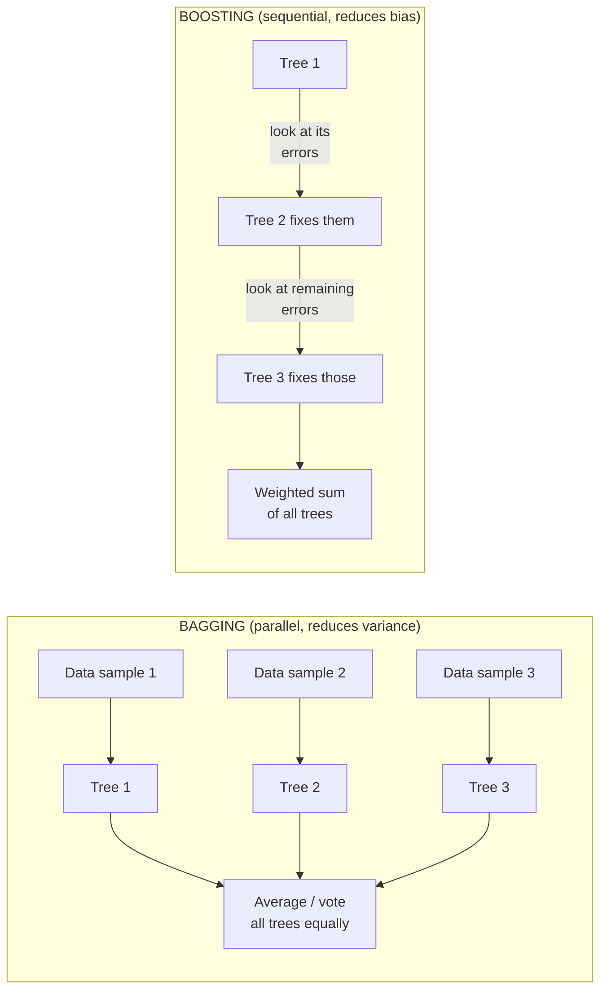

# 组建方法

一组组合将许多个别弱或不完美的模型结合成一个更强大的预测器.*没有*取代表格数据 (数据以数值和类别特征混合的行/列中组织,如电子表或数据库表) 即使在2026年.

几乎所有这些文件都属于两个哲学之一,**包装**列车的车型很多*并行独立*平均取消他们的随机错误;**增强**列车的车型很多*顺序*图表使得对比比较具体:

两种哲学甚至针对不同的失败模式:**变化**由于模型对它看到的特定数据样本的敏感性,**偏见**随机森林是旗舰包装方法;XGBoost/LightGBM/CatBoost是旗舰增强方法.请记住这一分区下面的每个条目都是一个或另一边的改进.

## 包装 (Bootstrap 集成)

**名称和定义**包装在不同随机数据 (采用替换"bootstrap样本"进行样本) 上进行了相同模型类型的许多副本,并平均 (回归) 或多数投票 (分类) 预测.

**起源.**布雷曼"囊预测者" (1996).

**核心机制.**从训练集中绘制B启动样本 (每个样本与原始相同的尺寸,采用替换样本,因此每个样本省略了一些原始的例子,重复了其他样本),每样本训练一个模型,并在推理时平均B模型的预测.

**为什么这很重要.**平均使用不同数据训练的多个模型减少了**变化**(如果使用不同的随机数据样本进行训练,模型的预测会变化多少)**偏见**数学上清洁的方式使一个不稳定的模型 (如单个决策树) 变得更加稳定,因为模型的单个错误在平均时部分取消.

**现状.**很少被单独使用,但是随机森林内部的核心机制 (下面).

## 随机森林

**名称和定义**随机森林是专门应用于决策树的包装,有额外的转折:在每个树的每一个分区,只会考虑随机的子集,而不是所有.

**起源.**布雷曼"随机森林" (2001),建立在自己的包装工作和早期"随机次空间"的想法 (Ho, 1998).

**核心机制.**训练许多决策树 (见[supervised-learning.md](supervised-learning.md)),每个数据都在一个启动样本上,每个分区只考虑一个随机的子集.

**为什么这很重要.**随机特征子集限制 (除了包装数据复样) 进一步脱相关单个树,如果没有它,如果一个特征非常预测,袋子中的几乎每个树都会在顶部分区使用它,而树木最终会非常相似,限制了变异减小平均能提供多少.

**现状.**仍然是一个强大的,非常常用的表数据基线,很容易训练,难以错误配置,即使与相对较少的超参数调整都能过度适应.通常在额外调整的努力值得的情况下,渐变增强 (下) 超过了,但随机森林仍然是"先获得这个,如果需要后调"选择.

**强度和局限性**
- 强度:抗过度配件;需要最小调整;以母语处理混合特征类型;提供有用的特征重要性估计.
- 限制:通常由调节良好的梯度来推进精度;在推理时,大森林可能会缓慢和难以记忆;比单一树更难解释.

## 增强 (概念) 和AdaBoost

**名称和定义**增强构建一个团队*顺序*而不是并行:每一个新型号都专门训练以纠正迄今为止构建的组合错误,而不是作为一个独立的重样品,如包装.

**适应性**("适应性增强"  Freund 和 Schapire, 1997) 是原始的实用增强算法:它训练了一系列"弱学习者" (通常是非常浅的树木,有时只是一个单个分断"决策头"),并且在每一个之后,它增加了训练例子的权重,因此下一个弱学习者被迫专注于困难的情况.最终的预测是所有弱学习者的权重投票,更准确的学习者获得了更多的投票权重.

**为什么这很重要.**根据理论的支持,AdaBoost是第一个证明结合许多学习者,比随机猜测略好,可以产生一个任意精确的组合.

**现状.**在实践中,大大被梯度推进 (下),将相同的"顺序纠正过去错误"概念整合成一个更灵活和有效的优化框架,但AdaBoost仍然是整个推进家族的历史重要入口点.

## 逐步增长

**名称和定义**渐进式增强将AdaBoost的"顺序修复过去错误"的想法概括,*缩*对于当前组的预测,每一个新的树都被训练来预测到目前为止的组的剩余错误.

**起源.**弗里德曼,"贪函数近似:一个增强度的机器" (2001).

**核心机制.**开始一个简单的初始预测 (例如,目标的平均值).在每次增强轮中,计算损失梯度与当前组的预测相对于每个训练例子 (对于MSE损失,这个梯度仅与剩余的真值减 current预测相比例);训练一个新的小树预测该梯度;添加新的树的预测到组,以小学习率缩小 (一个重要的调节剂见[regularization-techniques.md](../01-foundations/regularization-techniques.md)防止任何单个轮子过度纠正).重复多轮.

步行:而不是手工制作如何纠正错误 (如AdaBoost通过例权重化),梯度增强框架"纠正错误"作为字面上通过梯度下降降降低损失函数的最小化,除了每次代的"步骤"是一个全新的树,而不是一个小的数值推向现有参数.这种重构是让梯度增强功能与任何可分化损失函数 (不仅是经典AdaBoost隐含的指数式损失),使其更普遍.

**为什么这很重要.**这种通用化使增强适用于回归,排名和任何具有合理损失函数的其他任务,并产生了2010年代至2020年代的表格数据的单个最佳性能算法家族.

**现状.**占据了2026年表数据的主导地位,主要是通过以下现代化,高度优化的实现.

### 果

**起源.**陈和格斯特林, "XGBoost:可扩展的树木增强系统" (2016).

**核心贡献**XGBoost是一个工程优化,调整的梯度增强的实现:它在树结构本身上添加了明确的L1/L2调整 (惩罚了叶子数量和叶子输出值的大小),使用更为原则性近似方法来有效地找到好的分区 (包括大型或稀疏的数据集),并从头开始设计出速度和平行性 (在树内寻找平行分区,对数据太大于内存的核心计算和硬件意识的优化).

**为什么这很重要.**由于XGBoost的精度和工程抛光组合,它成为了自2015年左右的表格数据机器学习竞赛 (例如,在Kaggle平台上) 的主导工具,并且它仍然是生产表格ML中的默认首选.

### 轻GBM

**起源.**微软的"LightGBM:一个高效的渐进式增强决策树" (2017).

**核心贡献**通过两项创新,LightGBM显著加快了培训,特别是对大型数据集的培训:**基于分数的单边采样 (GOSS)**(保持所有具有较大的梯度的训练示例, 模型目前最错误的示例, 但只随机地对具有较小梯度的示例进行下样,因为它们每次训练轮次贡献的新信息较少)**专属特征捆绑 (EFB)**树木的树木的长度也会变得更快,因为它会在较小的数据集中增加一些过度的风险.

**为什么这很重要.**在发布时,在大型数据集上训练比XGBoost更快,而不放弃太多 (通常是任何) 的准确性.

### 鱼

**起源.**普罗霍伦科瓦等人 (雅德克斯), "CatBoost:无偏见的增强与类别特征" (2018).

**核心贡献**CatBoost的主要功能是本地,统计原则上处理分类特征 (特征采用分类标签而不是数字,如"国家"或"产品类别") 而不需要手动预处理,如一热编码.它使用一个有序的,基于目标统计的编码方案,专门设计以避免微妙的数据泄漏形式 (目标变量信息不知不觉地"泄漏"到功能中,从而膨胀训练性能,但不会通用)

**为什么这很重要.**对于有类型特征丰富的数据集 (在现实业务数据中非常常见的情况,例如产品ID,地理区域,用户细分),CatBoost通常需要最少的手动功能工程,同时与三个主要梯度增强库相匹配或超越它们的准确性.

## 堆叠和混合

**名称和定义**堆叠训练一个"元模型"来结合几个不同的基模型的预测 (可以完全不同的算法类型,例如随机森林,梯度增强的树和神经网络),学习如何信任每个模型,而不是使用简单的固定平均或投票.

**核心机制.**训练多种不同的基础模型.通过截止验证来生成他们的预测 (以避免转型模型只需学习要相信哪个基础模型最难过于训练数据).训练最终的转型模型 (通常是简单的东西,如物流/线性回归) 输入是基础模型的预测,目标是原标签.

**混合物**是一种更简单,更少严格的变体,使用单个持久验证分区,而不是完全的交叉验证,以更快,更简单地实现地生成超级模型的训练数据,而成本也会有所提高.

**为什么这很重要.**堆叠可以通过结合真正不同的模型类型,错误不完全相关, 一个增强的树和神经网络往往犯不同类型的错误,

**现状.**在竞争型ML中很常见 (Kaggle式竞赛,在此,挤出边际精度增长是整个点),但在生产中较少,在多个模型的增加复杂性,延迟和维护负担通常不值得小精度增长.

## 较量表

|方法|训练速度|解释性|典型的使用情况|
|---|---|---|---|
|包装|快速 (可平行) |低 (多个模型) |很少单独使用|
|随机森林|快速 (可平行) |适度 (特征进口) |强,低功耗表表基线|
|适应性|适度 (顺序) |低|现在的历史/教育|
|渐进增长 (一般) |速度较慢 (顺序) |低|实践中,XGBoost/LightGBM/CatBoost 已取代了它|
|果|快速 (优化,并行分区查找) |低|表表 ML 默认选择; 竞争证明 |
|灯GBM|在大型数据上最快|低|快速代的数据集|
|鱼|快速; 具有高效的类别|低|类型特征重表数据|
|堆叠/混合|慢 (列车多个模型+超级模型) |非常低|竞争;有时有必要生产|

## 为什么表格数据仍然属于树木而不是深度学习

由于一些结构性原因,可明确命名:表格特征往往是异质和不光滑 (与像素或音频样本不同,邻近的"特征值"如客户ID或邮政代码没有任何有意义的连续性,用于神经网络的利用),表格数据集往往比竞争性神经网络所需的参数数数量较小,而树木处理缺失的值和混合特征类型的过程中更少的预处理力.这是该领域的一个真正重要的,不明显的事实:在普通圈子之外的"深度学习胜利无处"叙述是专门对表格数据不对的,这仍然是真的,截至2026年.

## 与其他算法的关系

- 决策树,这里的基础学习者,[supervised-learning.md](supervised-learning.md).
- 渐变增强的学习速度作为调节器的想法与学习速度时间表相似[optimization-algorithms.md](../01-foundations/optimization-algorithms.md)虽然应用的机制 (扩展一个全新的树的贡献与扩展梯度步骤) 不同.
- 查看[algorithm-comparison-master.md](../10-comparison-tables/algorithm-comparison-master.md)对于包括这些方法在深度学习架构之同时进行跨界比较.

## 来源

- 布雷曼"包装预测者" (1996)
- 布雷曼"随机森林" (2001)
- 霍, "决定森林建设的随机次空间方法" (1998)
- 弗洛恩德,施皮尔, "在线学习的决定理论概括和促进应用" (1997) [适应性]
- 弗里德曼"贪函数接近:一个渐进增强机器" (2001)
- 陈,盖斯特林, "XGBoost:可扩展的树木增强系统" (2016)
- 基等人",LightGBM:一个高效的渐进增强决策树" (2017)
- 普罗霍伦科瓦等人",CatBoost:无偏见的增强与类别特征" (2018)
