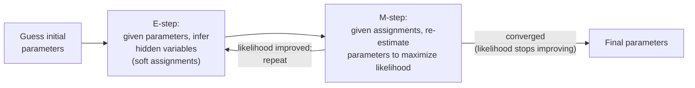

# 概率模型

这份文件涵盖了通过概率分布明确表示不确定性的经典模型,以及用于从未观察到的 (隐藏) 结构的数据中适应许多数据的一般算法 (预期-最大化).这些想法在现代深度生成模型中概念上重复.[vaes.md](../04-generative-models/vaes.md)).

## 简单的贝耶斯 (交叉引用)

简单的贝耶斯被深入地覆盖了[supervised-learning.md](supervised-learning.md)值得注意的是,它也属于这个文件的家族:它是一个完全概率模型,它明确地模拟了P(特征|通过学习一个决定边界,就像逻辑回归或SVM一样.

## 隐藏的马科夫模型 (HMM)

**名称和定义**隐藏马科夫模型模型是通过隐藏 (未观察) 状态的基础序列生成的观测序列,其中每个状态只依赖于之前的状态 (**马科夫的财产**未来只依赖于过去,而不是整个历史)

**起源.**数学理论起源于1960年代末-70年代的Baum和同事;从20世纪80年代开始,HMM在ML/NLP中通过其在语音识别中占主导地位的使用而得到广泛的认识.

**核心机制.**密的定义是: 设置可能隐藏的状态;**过渡概率**矩阵 (每次时间步骤中从每个状态转移到另一个状态的可能性);**排放概率**分布 (根据当前隐藏状态观察每一个可能的输出的可能性);以及初始状态分布.使用特定算法解决了三个经典问题:计算观察序列的概率 (前进算法),找到最可能隐藏状态序列给给定的观测 (维特比算法,动态编程方法),并从数据中学习过渡/排放概率 (通过Baum-Welch,下面 EM算法的具体实例).

通过:想象试图猜测天气 (隐藏状态:阳光明或雨) 仅仅是从观察一个朋友每天是否携带雨 (观察).你看不到天气直接,但你知道雨天更有可能遵循雨天 (一个过渡概率) 和雨天 (一个排放概率) 雨更可能.一个HMM 正式化了这种推理,并提供了算法来推理隐藏的序列和从历史数据中学习概率.

**为什么这很重要.**几十年来,HMM在NLP中一直是语音识别的主导方法,也是语音部分标签和其他序列标签任务的主要方法,因为它们提供了一个基于原则的,可处理的方式来推理隐藏结构的序列,使用相对较少的数据和计算.

**现状.**几乎完全取代了语音识别和序列标签 (RNNs/LSTM) 的深度学习,现在是Transformer.[rnn-lstm-gru.md](../03-deep-learning-architectures/rnn-lstm-gru.md)其他[transformer-architecture.md](../03-deep-learning-architectures/transformer-architecture.md)),可以比HMM的严格的马科夫假设 (无记忆超出一步) 允许的更丰富,更长距离的依赖性模型.HMM仍然在一些低资源设置,生物信息学 (例如基因序列建模) 和其它位中使用,其中其数据效率和解释性被估值于原始精度.

## 盖斯混合物模型 (GMM)

**名称和定义**盖斯混合模型代表了概率分布,作为几种盖斯分布 (正常,"钟曲线") 的权重组合,每个分布都有自己的平均和变异.

**核心机制.**基因基因基因基因基因基因基因基因基因基因基因基因基因基因基因基因基因基因基因基因基因基因基因基因基因基因基因基因基因基因基因基因基因基因基因基因基因基因基因基因基因基因基因基因基因基因基因基因基因基因基因基因基因基因基因基因基因基因基因基因基因基因基因基因基因基因基因基因基因基因基因基因基因基因基因基因基因基因基因基因基因基因基因基因基因基因基因基因基因基因基因基因基因基因基因基因基因基因基因基因基因基因基因基因基因基因基因基因基因基因基因基因基因基因基因基因基因基因基因基因基因基因基因基因基因基因基因基因基因基因基因基因基因基因基因基因基因基因基因基因基因基因基因基因基因基因基因基因基因基因基因基因基因基因基因基因基因基因基因基因基因基因基因基因基因基因基因基因基因基因基因基因基因基因基因基因基因基因基因基因基因基因基因基因基因基因基因基因基因基因基因基因基因基因基因基因基因基因基因基因基因基因基因基因基因基因基因基因基因基因基因基因基因基因基因基因基因基因基因基因基因基因基因基因基因基因基因基因基因基因基因基因基因基因基因基因基因基因基因基因基因基因基因基因基因基因基因基因基因基因基因基因基因基因基因基因基因基因基因基因基因基因基因基因基因基因基因基因基因基因基因基因基因基因基因基因基因基因基因基因基因基因基因基因基因基因基因基因基因基因基因基因基因基因基因基因基因基因基因基因基因基因基因基因基因基因基因基因基因基基基因基因基基基基因基因基基基基基基基基基基基基基基基基基基基基基基基基基基基基基基基基基基基基基基基基基基基基基基基基基基基基基基基基基基基基基基基基基基基基基基基基基基基基基基基基基基基基基基基基基基基基基基基基基基基基基基基基基基基基基基基基基基基基基基基基基基基基基基基基基基基基基基基基基基基基基基基基基基基基基基基基基基基基基基基基基基基基基基基基基基基基基基基基基基基基基基基基基基基基基基基基基基基基基基基基基基基基基基基基基基基基基基基基基基基基基基基基基基基基基基基基基基基基基基基基基基基基基基基基基基基基基基基基基基基基基基基基基基基基基基基基基基基基基基基基基基基基基基基基基基基基基基基基基基基基基基基基基基基基基基基基基基基基基基基基基基基基基基基基基基基基基基基基基基基基基基基基基基基基基基基基基基基基基基基基基基基基基基基基基基基基基基基基基基基基基基基基基基基基基基基*哪一个*它们的构成是每个点的构成, 这正是 EM 算法 (下面) 设计的隐藏结构问题.

**为什么这很重要.**基因基因基因基因基因基因基因基因基因基因基因基因基因基因基因基因基因基因基因基因基因基因基因基因基因基因基因基因基因基因基因基因基因基因基因基因基因基因基因基因基因基因基因基因基因基因基因基因基因基因基因基因基因基因基因基因基因基因基因基因基因基因基因基因基因基因基因基因基因基因基因基因基因基因基因基因基因基因基因基因基因基因基因基因基因基因基因基因基因基因基因基因基因基因基因基因基因基因基因基因基因基因基因基因基因基因基因基因基因基因基因基因基因基因基因基因基因基因基因基因基因基因基因基因基因基因基因基因基因基因基因基因基因基因基因基因基因基因基因基因基因基因基因基因基因基因基因基因基因基因基因基因基因基因基因基因基因基因基因基因基因基因基因基因基因基因基因基因基因基因基因基因基因基因基因基因基因基因基因基因基因基因基因基因基因基因基因基因基因基因基因基因基因基因基因基因基因基因基因基因基因基因基因基因基因基因基因基因基因基因基因基因基因基因基因基因基因基因基因基因基因基因基因基因基因基因基因基因基因基因基因基因基因基因基因基因基因基因基因基因基因基因基因基因基因基因基因基因基因基因基因基因基因基因基因基因基因基因基因基因基因基因基因基因基因基因基因基因基因基因基因基因基因基因基因基因基因基因基因基因基因基基基基因基因基基基基基因基因基基基基基因基基基基因基因基基基基基因基基基基基因基基基基基基因基因基基基基基基基基基基基基基基基基基基基基基基基基基基基基基基基基基基基基基基基基基基基基基基基基基基基基基基基基基基基基基基基基基基基基基基基基基基基基基基基基基基基基基基基基基基基基基基基基基基基基基基基基基基基基基基基基基基基基基基基基基基基基基基基基基基基基基基基基基基基基基基基基基基基基基基基基基基基基基基基基基基基基基基基基基基基基基基基基基基基基基基基基基基基基基基基基基基基基基基基基基基基基基基基基基基基基基基基基基基基基基基基基基基基基基基基基基基基基基基基基基基基基基基基基基基基基基基基基基基基基基基基基基基基基基基基基基基基基基基基基基基基基基基基基基基基基基基基基基基基基基基基基基基基基基基基基基基基基基基基基基基基基基基基基基基基基基基基基基基基基基基基基基基基基基基基基基基基基基基基基基基基基基基基基基基基基基基基基基基基基基基基基基基基基基基基基基基基基基基基基基基基基基基基基基基基[unsupervised-learning.md](unsupervised-learning.md)) 两种重要方式:集群可以延长/圆,而不是被迫成为球形 (因为每个高斯元件都有自己的共变结构,而不是单一的中心点),集群分配是"软" (每个点都获得属于每个集群的概率,而不是单一的硬分配) 而不是硬的,所有或没有分配 k-means使用.

**现状.**仍然用于密度估计和软集群任务,特别是当基本的假设是大致的高斯人形群合集是合理的;不太常见于快速集群的 k- 手段,并且通常被深度生成模型所取代 (见[04-生成型号](../04-generative-models/))用于模型复杂的高维度数据分布,如图像.

## 预期最大化 (EM) 算法

**名称和定义**EM是一个用于寻找最大概率参数估计的一般反复算法,当模型涉及隐藏/未观察变量时 (如"在GMM中产生了什么高斯元件这个点",或"在HMM中隐藏的状态是什么").

**起源.**德姆斯特,莱德,鲁宾,"通过EM算法通过不完整数据的最大概率" (1977) 论文正式化和命名了一般技术,尽管具体的实例 (如HMM的Baum-Welch) 之前.

**核心机制.**转变过程在两个步骤之间,直到转变:

- **电子步骤 (预期):**根据模型的当前参数,计算隐藏变量的预期值 (例如,对于GMM,计算每个数据点属于每个高斯元件的概率,考虑到当前元件参数).
- **转移 (转移)**根据预期隐藏变量值,重新估计模型参数以最大限度地提高观察数据的概率 (例如,利用点重新计算每个高斯元件的平均和变量,按其E-步成员概率权重).

通过:这是 k-means 中看到的相同的蛋模式 (事实上, k-means 是简化,用于限制的 GMM 的 EM 特殊情况) 你不能知道隐藏的任务,而不知道参数,你不能估计参数,而不知道任务,所以你交替,每一个完整的 E-M 周期保证不会减少观察数据的可能性 (尽管它可以卡在本地最佳,所以多个随机初始化是常见的做法,就像 k-means一样). 记住一个句子版本:** EM是"猜,然后一次上半个,永远,直到它停止改善".**由于每一步半步本身都是保持另一半的最大化,所以它只能移动平面或上坡. 这就是EM的全部吸引力:没有学习率调整,没有过度步骤的风险,并且可以在梯度下降的方式偏离.

**为什么这很重要.** EM提供了一个适用于整个"隐藏结构"问题 (GMM,HMM等) 的一般用途的配方,而不是需要针对每个问题进行定制衍生,其核心想法是:[vaes.md](../04-generative-models/vaes.md)),尽管VAE使用基于梯度的优化而不是EM的精确交替步骤.

**现状.**仍然直接用于适应GMM和HMM; 概念上是概率图形模型和变化推理的更广泛领域的基础,即使确切的EM配方并非字面上使用.

## 贝叶斯网络 (概念级别)

**名称和定义**贝叶斯网络是基于图的表现,对多个变量进行联合概率分布,其中每个变量都是节点,指导边缘代表直接概率依赖性.

**概念上,这是为什么重要.**为了代表许多变量上的联合分布,需要一个概率表,其尺寸以指数增长,变量数量超越少数变量是完全不可行的.贝耶斯网络的图形结构编码*哪一个*变量实际上直接影响彼此,让你将整个联合分布纳入一个更小的地方,每个节点的条件分布 (每个节点的分布仅仅是其父母).这是HMM的基础概念 (实际上,这是一个特定的贝耶斯网络:一个链,每个隐藏状态只依赖于前一个,每个观察只依赖于相应的隐藏状态).

**现状.**贝叶斯网络仍然在特定领域中使用,其中可解释,明确的因果/概率结构是重要的 医疗诊断系统,一些风险建模和专家系统 但一般的图形模型推理机器 (信仰传播和相关的准确/近似推理算法) 是一个专业的子领域.[scope-and-methodology.md](../00-overview/scope-and-methodology.md)).

## 较量表

|模型|代表|通过|现代状态|
|---|---|---|---|
|简单的贝耶斯|功能|具有独立性假设的类型|封闭形式的计算|轻量基线 (见 [supervised-learning.md](supervised-learning.md)) |
|马|隐藏的马科夫状态的序列|姆-威尔奇 (一个EM实例) |对于大多数序列任务,其后面是RNN/Transformer|
|类|多式连续分布 |电气|用于密度估计/软集群;基层与深度生成模型|
|贝叶斯网络|通过图表进行的一般因子结合分布|变化 (结构+参数学习) |专业领域 (诊断,风险建模);概念水平|

## 与其他算法的关系

- 平均值 (见[unsupervised-learning.md](unsupervised-learning.md)) 是一种硬分配 EM 特殊情况,用于 GMM.
- 模是贝叶斯网络的特定类型,是直接的概念前身,[rnn-lstm-gru.md](../03-deep-learning-architectures/rnn-lstm-gru.md)) 在大多数实际的序列建模中被取代.
- 对于化分析的方法, EM算法的替代优化想法是用于训练 VAE的变化推理的概念祖先 (见[vaes.md](../04-generative-models/vaes.md)).

## 来源

- 姆,佩特里,索尔斯,韦斯,"马科夫链的概率函数统计分析中发生的最大化技术" (1970) [姆-威尔奇/HMM理论]
- 德姆斯特,莱德,鲁宾, "通过EM算法从不完整数据中最大可能" (1977)
- 拉宾纳"隐藏马科夫模型和语音识别中的选择应用的教程" (1989) 广泛引用了语音中HMM的应用参考
- 珍珠"智能系统中的可能推理" (1988) [贝叶斯网络]
