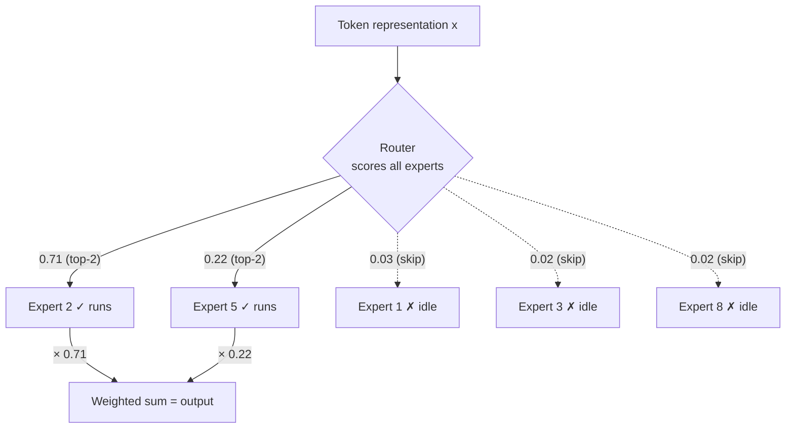

# 专家组合

专家混合 (MoE) 是一个建筑模式,将模型的总参数数与处理单个词元的计算成本分离开来. 让模型比实际使用的任何输入更多的参数. 这是大多数边界LLM与原始2017年Transformer做出的第二大偏差 (RoPE式定位编码后).[transformer-architecture.md](transformer-architecture.md).

## 动机:从计算中脱离参数

**问题是什么?**在标准 (密集) Transformer中,每个参数用于处理每个词元. 翻倍模型的参数数数大约翻倍计算 (在浮点操作中测量或FLOP) 需要处理每个词元,无论是在训练过程中还是推理时. 这是一个严格的配合:你不能获得"更多的知识能力"而不还要支付"更多的计算每词元",尽管直觉地,一个非常大的模型"知道"可能只适用于其输入的小部分 (专业数据,特定语言,特定领域).

**关于"经济发展"的想法.**换一个单一,密集的输送前进子层在Transformer块内 (见 [transformer-architecture.md](transformer-architecture.md)) 许多并行传输子网络,称为**专家**加上一个小的**路由器**网络 (或"门") 选择了每个词元的专家 (通常是十几个或更多的专家中1-2个) 进行处理.其余专家完全被跳过该词元,因此它们的参数存在 (贡献了模型总规模和内存足迹),但对该特定词元没有计算成本.

通过具体说明:想象一下一个每个MoE层的8名专家的模型,每个模型的尺寸与正常的输送前进子层相同,但路由器只会激活每词元的2名专家.该层的总参数数大约为8×密集层,但每词元的计算成本只有大约2×.你得到一个具有更大的总容量 (知识) 的模型 (分布在许多专家之间) 没有对比增加处理每个词元所需的计算.这是MoE的核心价值提案:更多参数 (并且,经验性来说,通常更好的质量) 在计算成本更接近较小的密集模型.

## 路由机制:顶部门

**核心机制.**路由器通常是一个简单的线性层,它采用了一个词元的隐藏表示,并为每个专家产生分数;一个软max (或更简单的正常化) 将这些转换为权重,并且只有最高分数的专家实际上运行,他们的输出结合 (按他们的路由器分数权重) 成为该词元的最终输出.

```
scores = x · W_router
top_k_experts, weights = TopK(softmax(scores), k)
output = Σ_{i in top_k_experts} weights_i · Expert_i(x)
```



通过:对于每个词元,路由器有效地问"我的专家中哪个对这个特定输入最相关?"并只支付运行这些词元的计算成本 (上面的固体箭头说专家2和5);其余的则为这个词元 (dashed arrows) 坐空.由于此决定是每词元 (而不是每序列或每批量),相同的序列中的不同的词元可以向完全不同的专家路由,这对直觉而言是自然适合的,不同类型的内容 (例如代码与散文或不同的语言) 可能会从专业子网络中受益.关键的会计:有8个专家和2个顶级路由,该模型有~只有一个专家层的参数,~由于8名专家中6名被跳过任何一个词元,所以"你有参数"和"你每词元支付的计算"之间的差距是MoE存在的全部原因.

## 负载平衡损失

**这解决了问题.**没有限制,仅仅训练为减少模型的主要损失的路由器可以很容易崩,只使用少数"最喜欢"专家几乎为所有事情, 让大多数专家慢性不够训练,

**核心机制.**助力器**负载平衡损失**通过推广,将代码的输出量增加到训练目标,惩罚路由器将太多代码发送给太少专家. 代码的输出量通常是为了鼓励每个专家的代码的部分在一批中大致相同. 这种输出增加到 (而不是取代) 主要任务损失,具有小的权重系数,因此它会推动路由行为朝着平衡方向,而不会主导模型的初级训练信号.

**为什么这很重要.**没有负载平衡,MoE训练是经验不稳定的,并且容易完全像上述的专家崩失败模式;负载平衡损失是实际MoE训练配方的几乎普遍组成部分.

## 转换器

**起源.**费德斯,索夫,沙泽 (谷歌), "切换Transformer:简单有效的零省率的扩展到数万亿参数模型" (2021),建立在LSTM的早期稀缺门口MoE工作 (Shazeer等人,2017).

**核心贡献**转换器简化路由到极端:顶级-1路由 (每个词元都会被一个专家所做,而不是多个专家的混合),作者表明,它仍然可以稳定地训练 (使用适当的负载平衡和其他稳定技巧),同时比早期的MoE工作中常见的顶级-2或更多路由更简单和更有效的计算.

**为什么这很重要.**转换器证明,MoE架构可以扩展到前所未有的总参数数量 (在当时的数兆里,这是一个令人惊叹的数字),同时保持每词元计算成本的可管理性,直接验证了MoE方法作为一个可行的途径,以实现更大的模型,而没有比较大的计算预算.

## 片

**起源.**雷皮希恩等 (谷歌), "GShard:使用条件计算和自动碎片化扩展巨型模型" (2020年).

**核心贡献**GShard的主要贡献不仅是关于路由算法本身,更是关于实际训练规模上的MoE模型所需的分布式系统工程:自动分断 (分开) 许多加速器设备中的不同专家,并有效地将词元向其分配专家的设备进行路由.

**为什么这很重要.**由于GShard的分碎技术是基本基础设施,基本上是所有大规模的MOE培训的基础,[distributed-training.md](../05-training-methodology/distributed-training.md).

## 混合物

**起源.**导弹AI,"专家混合" (2024,在2023年底首次开放量释放后).

**核心贡献**混合电脑是一个突出,广泛使用的开放权重示范,即MoE架构 (具体来说,在原始Mixtral 8x7B中每层8专家中排名为前2的路由) 可以达到与其活性计算成本相比的强性能,使MoE的精度按线索FLOP效益在最大的闭实验室之外是可感知和复制的.

**为什么这很重要.**开放的发布显著扩大了更广泛的研究和开源社区中MoE架构的实用,实践理解和采用,

### 精细粮和共享专家 (2024+精炼)

最近的开放量MoE模型 (DeepSeek-MoE线是广泛引用的例子) 通过两种方法来精炼基本设计,**细粒专家**们的经验,*较小的*推理是结合式,更多的专家,较小的专家,可能的专家数量*组合*通过测量,一个词元可以被调整成一个巨大的增长,从而使模型具有更细颗粒的专业化,**共同的专家**指定一个或几个专家,*每一个*作为一个常见的技术,该技术的应用程序将在线技术技术的基础上进行.该技术的应用程序将在线技术的基础上进行进行.该技术的应用程序将在线技术的基础上进行.该技术的应用程序将在线技术的基础上进行.

## 目前的边境使用模式

截至2026年,多个边境实验室使用MoE架构来实现其最大的通用模型. 随着目标模型规模的增长,稀疏度的计算精度益处变得越来越有吸引力,因为MoE提供了一种保持增长的方法,而没有在每种词元服务所需的 (非常昂贵的,在边境规模) 计算中保持成比例增长. 也就是说,MoE不是普遍默认:密集型模型仍然是较小规模和延迟敏感的部署的常见,因为MoE引入了实际的额外复杂性. 路由/负载平衡机械,分布式系统的复杂性在设备中分断专家 (见[distributed-training.md](../05-training-methodology/distributed-training.md)),以及一个存储足迹 (所有专家都必须可加载,即使每词元只运行几次),[serving-and-batching.md](../06-inference-optimization/serving-and-batching.md)).

## 强度和局限性

- 优势:在非常大规模的计算-FLOP上,实质上更好的精度;总模型"知识能力"可以在很大程度上独立于每词元推理成本;在多个实验室公开知名的架构中,在边界规模上实验性有效.
- 限制:完整模型内存足迹保持很大 (所有专家都必须在某个地方居住,即使每词元不使用),即使计算成本有利,这对于部署成本也是重要的;训练比密集模型更不稳定和复杂 (路由崩,负载平衡调整);分布式服务/训练基础设施比密集模型更复杂;路由决策有点不透明/难以解释.

## 较量表

|系统|年份|关键创新|仍有意义 (2026)?|
|---|---|---|---|
|稀有门口的MOE (基于LSTM) | 2017 |专家路由概念|历史 被Transformer部取代|
|片| 2020 |专家自动分断设备|是的 基础分布式培训技术|
|转换器| 2021 |简化了前一路线,数万亿参数尺度|是的 路由简单的后代仍然有影响力|
|混合物| 2023-2024 |强大的开放权重的MoE示范|是的 广泛使用/引用的开放权重的MOE |

## 与其他算法的关系

- 转变器块内部的密集的输送前进子层被MoE取代[transformer-architecture.md](transformer-architecture.md)对于该区块的全部结构.
- 专家分断设备是模型/ensor平行化技术的具体应用,[distributed-training.md](../05-training-methodology/distributed-training.md).
- 电脑与记忆的交易对[serving-and-batching.md](../06-inference-optimization/serving-and-batching.md)其他[quantization.md](../06-inference-optimization/quantization.md)两者都涉及部署非常大型模型的成本.

## 来源

- 沙泽等人",极其大的神经网络:专家层的稀疏口混合" (2017)
- 莱皮希恩等",GShard:使用条件计算和自动碎片化扩展巨型模型" (2020)
- 费杜斯,索夫,沙泽,"转换器:简单有效的节省性,扩展到数万亿个参数模型" (2021)
- 导工人工智能,专家混合物 (2024)
