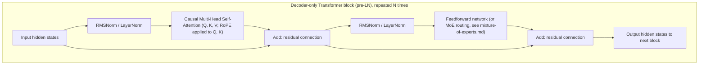

# Transformer架构

几乎每一个其他地方讨论的大型模型都在[rlhf-and-alignment.md](../05-training-methodology/rlhf-and-alignment.md)任何产品模型都在[04-生成型号](../04-generative-models/)更多的图像/视频/音频,[06- 输入优化](../06-inference-optimization/)是Transformer或直接适应的Transformer.该文件从最初的原则建立了机制:自觉注意,然后多头注意,然后定位编码,然后三个主要布局变体 (编码解码器,仅编码器,仅编码器),LN前与后LN辩论,从原始2017年的论文到当今的边界模型的历史谱系,以及将建筑选择与计算和数据预算联系在一起的扩展法则.

## 为什么需要注意

根据[rnn-lstm-gru.md](rnn-lstm-gru.md)根据Bahdanau/Long attention,一个seq2seq解码器可以回顾每个编码器位置,而不是依赖于一个瓶向量.但该设置中的编码器和解码器仍然是RNNs 处理其序列一次一次,每个步骤都取决于前一个.这有两个值得明确命名的后果:它固有的序列 (直到计算时间步骤50才可以计算49),这限制了它在构建的硬件上如何并行一次做许多独立计算 (GPU/TPU);它仍然遭受消失的梯度-超距离问题,因为过去的信息必须通过许多隐藏的序列状态更新流向一个词元的注意力.Transformer的核心机制是将整个信息在一个隐藏的状态中完全放弃,但不会影响整个重复状态.

## 自我注意,逐步增强

**目标.**为了在序列中的每个位置,生成一个新的表示,以动态的方式从其他位置中包含相关信息,基于内容而不是固定模式.

**问题,关键和价值观,从第一原则.**对于每个输入位置 (例如,一个词元的嵌入向量 查看"嵌入"的词典),模型通过乘以三个独立的学习权重矩阵来计算三个不同的向量:

```
q = x · W_Q      (query)
k = x · W_K      (key)
v = x · W_V      (value)
```

通过直观的比喻来推广:把这看作是一种软而可分化的词典.**查询**根据目前的位置计算,它代表"我目前正在寻找什么".**关键**根据每一个位置 (包括当前位置) 计算的"我包含/广告什么"**价值**为了决定给定的位置应该如何关注其他位置,你将该位置的查询与每个位置的关键进行比较 (通过点数值一个相似度测量:指向相似的两个向量具有一个大点值);这种比较,在一些正常化后,产生了一组注意力权重,而位置的新表示是每个位置的权重总和*价值*运用这些权重.

值得注意的是:与CNN过器不同 (固定权重,不论内容如何,相同的计算)[cnn-family.md](cnn-family.md)注意力权重 是从推理/训练时间的序列实际内容动态计算出来的,而不是预先固定出来的. 这就是使注意力成为一个**基于内容**机械制而不是**基于位置**虽然位置编码,下面涵盖,添加位置信息回,因为原始的注意力根本没有固有的秩序概念.

## 标量点产品关注

**现在我们要做什么?**

```
Attention(Q, K, V) = softmax(Q·Kᵀ / √d_k) · V
```

经历,一词一词:
- Q,K,V是矩阵,每个位置在序列中,分列为一个查询/关键/值向量.
- Q·KT计算每个查询的点数对每个键,产生原始相似度分数矩阵 (每个查询位置的一行,每个键位置的一列为 n × n 矩阵为长度 n 的序列).
- √d 分为_没有这种扩展,作为d_由于它们是d的总和,所以它们的总数是d._缩为度,即缩为度,即缩为度,即缩为度,即缩为度,即缩为度._无需维度, k保持点产品在良好的范围.
- 软max将每一行原始分数转换为有效的概率分布 (总共为1) 见[loss-functions.md](../01-foundations/loss-functions.md)对于软max机械.
- 乘以V取取,每个查询位置,每一个位置的值向量的权重总和,使用查询的注意权重行作为权重.

净效果:每个位置的新表示是每个其他位置的信息的内容依赖混合,混合权重取决于每个位置的关键对该位置查询有多相关.

**数据流量,作为一个图片.**对于一个单个查询位置,在3个词元序列中进行:

```
                 ┌──────── keys ────────┐
   query q ──┬──►  k₁      k₂      k₃
             │    (dot)   (dot)   (dot)      ← q·kᵢ : "how relevant is each position to me?"
             │      │       │       │
             │   ÷√d_k    ÷√d_k   ÷√d_k       ← scale down
             │      └───────┼───────┘
             │           softmax               ← turn scores into weights that sum to 1
             │         w₁   w₂   w₃            e.g.  0.1  0.7  0.2
             │          │    │    │
   values ───┼──►  v₁   v₂   v₃                ← each position also offers a value vector
             │       ×0.1 ×0.7 ×0.2
             └────────►  Σ  = output           ← weighted sum: 0.1·v₁ + 0.7·v₂ + 0.2·v₃
```

**作为一个小的实例,所以"权重的值总数"是具体的.**假设计算和扩展点产品后,一个查询的三个分数是[1.0, 3.0, 1.0]软max将这些转化为权重[0.11, 0.79, 0.11]如果三个值向量发生为v1 = [2, 0]子[0, 4]子[1, 1]对于此查询的输出为0.11·[2,0] + 0.79·[0,4] + 0.11·[1,1] ≈ [0.33, 3.28]被v2压倒性地塑造,因为查询发现位置2最相关.这是整个机制:相关性分数变成权重,权重混合值.转换器中的其他一切都是围绕这个操作进行账本.

**原因掩盖 (简短预览).**仅用于解码器,自动降低生成 (见 [autoregressive-generation.md](../04-generative-models/autoregressive-generation.md)),每位职位只能参加*之前*位置 (它不应该得到"看到未来"它应该预测). 这只是通过设置任何位置-对的原始注意力分数实现,关键位置在查询位置后到负无限之前,软max 软max然后分配这些位置完全零权重.

**解决一个常见的困惑.**"一次处理整个序列"是正确的.*培训*对于一个变化器的首页优势,但在一个变化器的首页优势是*产物*词元50仍然是每次一个词元的产品 (它不能在决定词元50之前计算词元51),因为词元50成为词元51的输入的一部分).*培训时间*由于这些数据的数据的流程,KV缓存 (见[kv-cache-and-attention-optimization.md](../06-inference-optimization/kv-cache-and-attention-optimization.md)存储已生成的词元的密钥和值,所以不需要在每一个连续生成步骤中重新计算.

## 多头注意力

**想到的.**而不是计算一个单一的注意力模式, 分开Q,K,V成几个小的"头",每个都有自己的独立学习W_问,W_,_在每个头部内,运行分别的点产品关注,并将结果连接在一起 (随后再进行一个学习的线性投影).

```
head_i = Attention(Q·W_Q_i, K·W_K_i, V·W_V_i)
MultiHead(Q, K, V) = Concat(head_1, ..., head_h) · W_O
```

通过:一个单一的注意头只能一次表达一个"类型"的相关性模式 (例如",关注句子的主题").多个头让模型同时追踪几个不同的关系,并行一个头可能学习跟踪语法依赖 (如主题-动词协议),另一个可能追踪核心引用 (代名词指的是哪个名词),另一个可能主要关注附近的位置,等等每个在自己的低维子空间内,然后通过最终W结合所有这些观点_类似于CNN层如何同时学习许多不同的过器,而不是只学习一个过器 (见[cnn-family.md](cnn-family.md)),使该层具有更大的代表性能力,

## 输入前置子层 (块的另一半)

Transformer的重点是重点,但这仅仅是半个块,根据参数数,通常是小的一半.**关注后由位置式传输网络 (FFN)**总体而言,FFN约占区块参数的三分之二,并且占其计算的比较量.

**这是什么.**由于它是一个由两个层组成的神经网络,*独立和同样对每个位置*(每个词元的权重相同):它将每个位置的向量投射到更大的隐藏维度 (通常是模型宽度的4x),应用非线性,并向下投射.

```
FFN(x) = W₂ · nonlinearity(W₁ · x + b₁) + b₂
```

**劳动分工.**一个有用的 (如果简化) 心理模型:注意力是标志的所在*混合和交换*投资者可以在投资平台上获得信息 ("我应该注意什么?"),而FFN是每个词元的位置.*过程和转变*关注将信息移动到位置之间;FFN对此进行位置计算.这对其余的仓库来说很重要:FFN是专家混合器用许多平行专家取代的子层 (见[mixture-of-experts.md](mixture-of-experts.md) MoE基本上是"换一个FFN为许多,并将每个词元转向少数"),以及大量的解释性研究 (见[open-problems.md](../09-roadmaps/open-problems.md)) 表明模型存储的大部分事实"知识"在这些FFN权重中生活,而不是在注意层中.

**没有线性.**早期的Transformer使用了ReLU (见 [cnn-family.md](cnn-family.md));大多数现代LLM使用更平滑的门变体,如GELU或,很常见地,SwiGLU (一个门的单元,其中一个线性投影调节另一个).

## 位置编码

**问题是什么?**自注意力,如上所述,**变量等等式**如果您混输入位置的顺序,计算的输出将会被混同样,没有其他变化 (等式意味着"输入输入,输出输出输出相同";这微妙地不同于输出输出.*变态*无论如何,结果都是相同的,这是一个问题:注意力没有内置的概念*序列*对于"狗咬人"而言,这很重要.

**鼻状位置编码**(在原始2017年Transformer中使用).在每个位置的输入嵌入中添加一个固定 (未学习) 矢量,其中每个维度是位置的或函数,每个维度的频率不同:

```
PE(pos, 2i)   = sin(pos / 10000^(2i/d))
PE(pos, 2i+1) = cos(pos / 10000^(2i/d))
```

穿越:这为每一个位置产生了一个独特的"指纹"向量,使用一系列频率 (某些维度与位置之间迅速振荡,其他缓慢),作者特别选择了此类变形,因为突体具有方便的数学特性:位置编码 (pos + k) 可以被表达为位置编码的固定线性转变,作者假设将使模型更容易学习通过*相对*位置.

**学习了位置编码.**简单的替代方案:只需给每个位置自己的学习嵌入向量 (从表上看,就像词元嵌入),通过像任何其他参数一样的背扩散训练,而不是预先固定. 这更容易实现,但不会自动将其归结为比训练中看到的长度更长的序列长度 (模型从未遇到的位置索引没有学习嵌入),而状编码原则上可以计算任意位置.

**转型位置嵌入式 (ROPE).**现在在2026年起的大型语言模型中占主导地位的方法.

- **起源.**苏及其他研究人员"RoFormer:增强转变器与旋转位置嵌入" (2021).
- **核心机制.**转换为 输入嵌入式,*旋转*在计算注意点产品之前,查询和关键向量 (以维对,被视为2D平面) 按与其在序列中的位置相比例的角度进行.
- **为什么这很重要.**这种结构具有优雅的特性:在位置m的查询和位置n的键之间,两者都被 RoPE 旋转后,最终只依赖于它们的点数.*相对*这给了"相对位置意识",而非其绝对位置.这只暗示了突形编码的确切,数学上清洁的形式,并且往往更好地将其概括到训练中看到的序列长度之外 (这是一个重要的实践属性,因为生产LLM通常被要求处理比最初训练的较长的文本) 虽然远远超越训练长度仍然通常需要额外的技术 (旋转频率的插入/抽插方案) 才能在实践中运作良好.
- **现状.**截至2026年,RoPE是大多数现代开放权重和边界LLM中默认位置编码方案,它已经取代了用于大规模语言模型预训的双腰和简单学习位置编码.

## 编码-解码器,仅编码和仅解码器架构

原始的Transformer纸引入了一个**编码器-解码器**设计:一个编码堆处理整个输入序列 (使用不受限制的"双向"自注意,每个位置都能看到其他位置,因为全部输入都可先使用),而一个解码堆生成输出序列一次的词元,使用因果化掩饰的自注意对它迄今为止产生的东西,加上**交叉注意力**(一个变体,查询来自解码器,但键/值来自编码器输出,让解码器回顾输入,直接类似于Bahdanau/Long注意). 这种布局是自然适合具有真正不同的输入和输出任务 (机器翻译是论文的原始目标任务).

两种简化变体出现,

**只有编码器 (BERT式).**起源:Devlin等人",BERT:深度双向转换器预训练语言理解" (2018).仅使用编码器堆,在整个输入上没有限制的双向注意力.通过面具语言建模训练 (随机隐藏一些输入词元并从周围的环境中预测它们在两方向见[pretraining-strategies.md](../05-training-methodology/pretraining-strategies.md)只有编码器模型能够产生丰富的表示效果.*了解*任务 (分类,从一段经文中提取答案跨度,句子相似性/嵌入任务) 但它们自然不适合开放式生成,因为生成需要一次生产词元,而不需要看到你尚未生成的"未来"词元

**只有解码器 (GPT式).**起源:Radford等人 (OpenAI), "通过生成预训练提高语言理解" (GPT-1, 2018).仅使用解码器堆 (因果化伪装的自我注意,没有交叉注意,因为没有单独的编码器),通过下一个代码预测 (预测每个词元从之前的词元中预测) 查看[autoregressive-generation.md](../04-generative-models/autoregressive-generation.md)).

**为什么只有解码器才能赢得创业 LLM.**几个相似的原因,值得明确说明,因为这是该领域近期历史中最重要的架构决定之一: (1) 原始,无标签的文本的下一个代码预测是一个训练目标,基本上无限的免费监督每个文档中的每个代码同时是一个训练示例,没有需要手动标签或掩盖方案设计,这很重要,一旦你试图使用互联网规模文本; (2) 一个单独的解码模型自然统一"理解"和"代码" 相同的下一个代码预测目标,应用于足够大规模,产生一个模型,也可以回答问题,总结和遵循说明,而不需要一个任务特定的架构或调整,以实现解码能力; (3) 简单零码模型是单独的,每个模型的基础架构 (见GPT-2),在实体上可以实现一个单独的结构,并使每个模型的成本变得非常简单,在实体上可以实现一个单独的基础架构,并使每个模型的实际结构变得非常简单.[历史timeline-2017-2023.md](../08-history/timeline-2017-2023.md)) 到2026年,基本上每个边界通用LLM (在所有主要实验室中) 都仅用于解码器;只有编码器的模型仍然在活跃,真正用于嵌入/检索和分类任务中,双向环境是一个真正的优势,并且不需要开放的生成,而真正的编码器-解码器Transformer仍然存在于某些特定翻译和其他序列成序列的应用中.

## 预年与后年

**问题是什么?**哪里,应该准确地进行层正常化 (见[regularization-techniques.md](../01-foundations/regularization-techniques.md)) 与Transformer块的注意力和输送次层相对?

**后LN (原始2017年设计).**每个子层的输出通过残留连接加入其输入 (见[cnn-family.md](cnn-family.md)对于一般概念而言,*接下来*正常化`output = LayerNorm(x + Sublayer(x))`.

**预LN (现在是主导选择).**适用于正常化*在之前*低层,剩余连接完全绕过正常化: `output = x + Sublayer(LayerNorm(x))`.

**为什么LN前赢得了.**在LN后,残余路径本身经历了正常化操作,特别是在训练初期,特别是对于许多变体块的非常深层堆,发现训练不稳定,通常需要仔细的,缓慢的学习速度升温时间表 (见[optimization-algorithms.md](../01-foundations/optimization-algorithms.md)为了避免分歧.在LN前,残余路径是一个清洁,无障碍的身份连接 (直接没有发生任何事),使其保持了残余连接所谓的梯度高速公路完全完整,并使得更深的Transformer堆能够稳定地训练,并且更不脆弱的超参数调整. 折衷是LN前的模型原则上可以有更少的正常化最终输出 (因为最后的操作本身不是正常化),这就是为什么许多LN前的架构在输出投影之前在整个堆后添加一个最终LayerNorm/RMSN的选择.截至2026年,LN前 (或其小变体) 是基本上所有大规模的Transformer预训练标准.

## 建筑图



## 从"注意力就是你需要的"到现代的边界模型

**起源.**瓦斯瓦尼等人 (谷歌), "注意力是你需要的" (2017) 引入了上面描述的完整架构 (多头自注意,突形定位编码,编码器-解码器布局,LN后),最初是机器翻译.

从这个起点开始,对这个库最相关的谱系大致运行:仅编码器 (BERT, 2018) 和仅编码器 (GPT-1, 2018) 作为专业变体开 → GPT线 (GPT-2, 2019; GPT-3, 2020) 证明了扩展仅编码器模型的参数和训练数据产生了越来越普遍的,不具备射击能力的行为,没有建筑变化 →预LN成为标准,因为模型变得更深 → RoPE (2021) 移动了突/学习的位置编码 → 专家混合变体 (见[mixture-of-experts.md](mixture-of-experts.md)) 开始从每词元计算成本 →集成查询和多查询注意力中分离参数数数量 (见 [kv-cache-and-attention-optimization.md](../06-inference-optimization/kv-cache-and-attention-optimization.md)通过"长文本模型"来使服务更便宜 →到20世纪20年代中期,实验室中的边界模型是,从建筑角度来看,仅使用解码器的Transformer (通常是使用MoE层) 使用RoPE和LN前/RMSNorm,规模,培训数据和培训后方法更加不同 (见[05-培训方法](../05-training-methodology/)许多实验室的基础建筑选择非常相似,这是该领域近期历史中一个显著而广泛观察到的模式.

## 规模定位法:卡普兰等人和辛奇拉

**卡普兰等人",神经语言模型的扩展法则" (2020年).**这篇论文显示,一个Transformer语言模型的损失遵循一个顺利的,可预测的权力法关系,三个数量:模型大小 (参数计数),数据集大小 (词元见),和计算预算 (大约是参数 ×词元处理) 每个更大的值,相对于其他进行适当的处理,可靠地产生较低的损失,以准确的方式提前抽出和规划大规模的训练运行,而不是通过试错发现正确的规模.本文的一个具体,影响力的结论是,鉴于固定的计算预算,更好花在一个较大的模型上训练相对较少的数据,而不是花在更平衡的方法上 这个指点的实践者对训练非常大的模型的数据集进行了训练,后期,这些模型的规模较小.

**霍夫曼等人 (DeepMind), "训练计算最佳大语言模型" (2022) "辛奇拉"论文.**这项研究重新审视了计算分配问题,并通过更广泛的实验,**计算最佳**模型大小和数据大小之间的分比比比卡普兰等人最初的指导建议要更接近. 大概,模型大小和训练词元应该随着计算的增长而相似比例一起扩展 (论文中的常见指南是每参数约20个训练词元,尽管准确的比例取决于实验设置的具体情况,不应该被视为一个刚性普遍常数).他们的标题实验证明是Chinchilla,一个较小的模型训练在比当代模型更多的数据上,在同一个计算预算中优于较大的"训练不足相对大小"模型.

**这与建筑有关,而不仅仅是训练方法.**扩展法则直接告诉一个模型的层次,注意力头和隐藏的尺寸应该是多大的给定目标计算/数据预算,而对更多培训数据的智拉式重新平衡 (与卡普兰时代指导相对于) 是2022年以来的边界预训练运行强调数据量和质量的一个原因 (见[curriculum-and-data-strategies.md](../05-training-methodology/curriculum-and-data-strategies.md)它们本身并不能预测下游任务的性能,训练后的行为或RLHF等技术的影响.[rlhf-and-alignment.md](../05-training-methodology/rlhf-and-alignment.md)),这些都已经成为了至少与原始预训规模一样重要的,

## 比较表

|变量|注意力模式|通过|最适合的|仍有相关性 (2026) |
|---|---|---|---|---|
|编码器-解码器|双向 (编码器) +因果性 +跨向注意力 (解码器) |具体任务 (例如翻译对) |不同输入/输出序列任务|位 (特定于翻译系统) |
|仅使用编码器 (BERT式) |双向|面具语言建模|类别,嵌入,检索|是的  嵌入/检索中占主导地位|
|仅使用解码器 (GPT式) |原因 (掩盖) |下一个标志预测|开放式生成,通用 LLM |是的 在边界一般用途模型中占主导地位|

## 与其他算法的关系

- 自注意力Q/K/V机制是直接的泛化 Bahdanau/Luong注意力[rnn-lstm-gru.md](rnn-lstm-gru.md).
- 剩余连接和正常化层一般在[cnn-family.md](cnn-family.md)其他[regularization-techniques.md](../01-foundations/regularization-techniques.md)它们在Transformer块内具体位置.
- 转变器块中的输送前进子层是现代MoE架构中插入的专家混合路由[mixture-of-experts.md](mixture-of-experts.md).
- 关注的 O(n2) 成本在序列长度 n 是状态空间模型的直接动机 (见 [state-space-models.md](state-space-models.md)) 和大多数人[06- 输入优化](../06-inference-optimization/)(FlashAttention,KV缓存管理,GQA/MQA,投机解码)
- 详细介绍了下一个标记预测培训[autoregressive-generation.md](../04-generative-models/autoregressive-generation.md)其他[pretraining-strategies.md](../05-training-methodology/pretraining-strategies.md).

## 来源

- 瓦斯瓦尼等人",你只需要注意力" (2017)
- 德文,张,李,图塔诺瓦, "BERT:深度双向Transformer预训练语言理解" (2018)
- 拉德福德等人",通过生成式预训练提高语言理解" (2018) [子-1]
- 拉德福德等人",语言模型是无监督的多任务学习者" (2019) [子-2]
- 布朗等人",语言模型是少人学会的" (2020) [子3]
- 苏及其他研究人员"RoFormer:增强转变器与旋转位置嵌入" (2021)
- 卡普兰等人",神经语言模型的扩展法则" (2020)
- 霍夫曼等人",训练计算最佳的大语言模型" (2022) [鱼]
