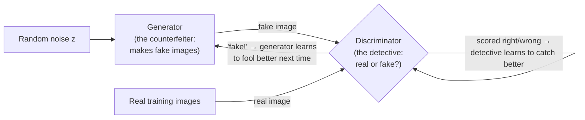

# 创建的竞争网络

产生对抗网络 (GAN) 在大约2014-2020年间是高质量的图像生成的主导方法.本文件涵盖对抗框架,其核心训练不稳定性问题,两个具有里程碑意义的架构,因为这与机制本身一样重要,所以GAN为什么失去了流散模型的基础 (见[diffusion-models.md](diffusion-models.md)) 对于图像生成.

## 产生/歧视者对抗框架

**名称和定义**网络系统由两个神经网络组成,**发电机**通过"随机噪音"来输入,**歧视者**试图区分发电机的假冒与真实训练实例.

经典的比喻是假冒者与侦探,



由于这些网络的存在,它们的存在与数据的存在都会变得更加差异性. 由于这些网络的存在,它们的存在与数据的存在都会变得更加差异性. 由于这些网络的存在,它们的存在与数据的存在都会变得更加差异性.

**起源.**据"Generative Adversarial Networks" (2014年) 的报道,

**核心机制 最小目标.**

```
min_G max_D  𝔼_{x~data}[log D(x)] + 𝔼_{z~noise}[log(1 − D(G(z)))]
```

通过:E (预期 是数量的平均值,按每个结果的概率进行权重) 在这里意味着"平均对实际数据样本 x"在第一期和"平均对随机噪音样本 z"在第二期.*最大化*给生成的假设分配高概率 (D(x) 接近1) 给真实数据和低概率 (D(G(z)) 接近0*减少*,它希望D(G(z))尽可能接近1 ,即它想欺骗歧视者认为其假冒是真实的.这就是为什么它被称为"反向"和框架为**极限游戏**两个网络的目标是直接相反的,训练间交替在对对方的当前行为进行改善.在这个游戏的 (理论) 均衡下,生成器产生了无法与真实数据区分的样本,而分辨器只能做随机猜测 (D 输出在任何地方都是0.5).

**为什么这个框架是新奇的.**在GAN之前,大多数生成方法 (如[vaes.md](vaes.md)) 直接优化了模型的样本与真实的数据分布相匹配的某种明确衡量量 (例如,最大化概率).GAN相反,隐含地训练模型,通过获得足够好的方式来欺骗第二个同时训练的网络.

## 模式崩和训练不稳定

**模式崩.**一种常见的故障模式,在该模式下,发电机发现了少量的输出 (甚至一个单个输出) 可以可靠地欺骗当前的歧视者,并崩,只生产了那些,牺牲了全生成模型的多样性,以换取一个狭窄的"安全"输出.一旦这种情况发生,发电机就没有动力探索数据分布的其他部分,因为它已经成功 (从本地角度来看) 击败当前的歧视者.

**训练不稳定,一般.**由于GAN训练是一个同时的两个玩家游戏,而不是一个单一的,行为良好的优化问题,它缺乏直接损失最小化的强大的融合保障 发电机和歧视器最终可以在周期中追逐彼此而不是稳定平衡,一个网络的改进可以突然使另一个网络的工作变得更加困难 (破坏后续更新),并且让GAN训练良好在实践中历史上需要相当大的建筑和超参数护理 (例如仔细平衡每个网络对另一个网络的更新频率,以及多年来开发的特定的正常化/规范化技巧)

## 电气

**起源.**拉德福德,梅茨,辛塔拉, "与深度卷积生成对抗网络的无监督代表性学习" (2015).

**核心贡献**DCGAN建立了一套建筑指导,用于构建稳定的卷积GAN,用于图像生成,使用步骤卷积而不是聚合层,批量正常化 (见[regularization-techniques.md](../01-foundations/regularization-techniques.md)在生成器和分辨器,以及特定激活功能选择中,与较早,不那么精心设计的GAN架构相比,培训稳定性得到了显著改善.

**为什么这很重要.**通过分析发电机的学习潜伏空间, 查看词典, 如生成图像之间的顺利插入, 显示了GAN正在学习有意义的,结构化的内部图像表现, 而不是仅仅记住训练示例.

## 风格

**起源.**卡拉斯,莱恩,艾拉 (NVIDIA), "生成对抗网络的基于风格的生成器架构" (2019),后续版本 (StyleGAN2, StyleGAN3) 改进了这种方法.

**核心贡献**斯泰尔甘重新设计了发电机,以在整个网络中以多种不同的分辨率/层次注入潜伏空间信息 (而不是仅在输入),以神经风格转移研究的技术为基础,这给了对不同视觉细节的控制更精细,更分离的控制 (例如,像姿势和脸状这样的粗特征在皮肤纹理或头发线程等细节上有所独立控制).

**为什么这很重要.**在当时,StileGAN在光现实形象生成质量 (特别是人类面孔) 中产生了前所未有的飞跃,其层次的隐藏注射设计成为了更广泛的可控制图像生成的影响力模板.

**现状.**风格GAN及其后代仍然用于某些特定应用 (特别是高效率面部生成/编辑,其中评估了GAN特定属性,如清洁结构,可编辑的隐藏空间),但不再是通用,开放域的图像生成的默认选择.

## 为什么扩散取代了图像生成的GAN

对于这个问题来说,值得具体说明, 因为这是一个重要的具体案例研究,

- **训练稳定性.**扩散模型 (见[diffusion-models.md](diffusion-models.md)通过一个简单,良好的行为,指责预测目标 (向模型在训练中直接访问的目标的回归) 而不是同时的两人对抗游戏 没有模拟模式崩或发电器/歧视者破坏稳定管理,这使得扩散模型更可靠和可预测,以训练在规模.
- **样本多样性.**它们可能会系统地低估实际数据分布的部分;通过相邻的概率目标训练的扩散模型 (见[diffusion-models.md](diffusion-models.md)经验学会更准确地覆盖了培训分布的多样性.
- **基于可能性的培训.**扩散的培训目标是基于一个更清洁的理论关系的概率框架,以确定模型的分布与真实的数据分布相匹配,而GAN的反向信号只是一个间接,隐含的代理,
- **扩展行为.**扩散模型,经验上,比GAN更优雅和可预测地扩展到更大,更多样化的,高分辨率的生成任务 (包括在巨大的,高度多样化的数据集上训练的文本到图像生成),这些任务复杂性和数据集多样性随着增长而更加与训练稳定性斗争.

**总体GAN的现状**2026年起,专门用于开放域的大规模图像生成 (现在占据空间扩散模型的主导地位)[diffusion-models.md](diffusion-models.md)),但GAN仍然用于特定的狭窄应用程序 (实时或资源有限的生成) (训练有素的GAN发电机通常是单个快速前进通道,而没有扩散的多步骤的反复采样过程) 查看[diffusion-models.md](diffusion-models.md)),某些图像转换和编辑任务,以及一些专业领域 (如面部生成/编辑位 StyleGAN优秀),其中它们的特定属性仍然有价值.

## 强度和局限性

- 优势:快速采样 (单一向前通过发电机,不同于扩散的反复过程);在训练良好时,可以产生非常敏,高效的输出;经过良好研究的隐形空间结构使特定的编辑/插曲应用成为可能.
- 限制:训练不稳定性和模式崩仍然是实际的实际风险;没有内置的概率估计 (直接测量"该模型的分布与真实的数据分布有多好"的原则性方法更难);一般在样本多样性和大规模的开放域生成质量方面,扩散模型的表现超过了.

## 较量表

|系统|年份|关键创新|仍有意义 (2026)?|
|---|---|---|---|
|原始的GAN| 2014 |逆境最低培训框架|历史/基础|
|州| 2015 |稳定卷积GAN架构指导方针 |影响力型号;今天很少直接使用|
|风格| 2019+ |层潜伏注射,解开式控制方式 |面部生成/编辑应用程序|

## 与其他算法的关系

- 甘和无 (见 [vaes.md](vaes.md)学习从数据分布中生成现实样本 使用非常不同的机制 (对立游戏与明确的概率变量模型).
- 与扩散模型的比较 (见[diffusion-models.md](diffusion-models.md)) 在此文件中最重要的单一交叉引用.
- 对于在"GAN"中所涵盖的单一,明确的损失,GAN培训动态 (两个相互竞争的目标) 是一个有用的概念对比.[loss-functions.md](../01-foundations/loss-functions.md)GAN是"损失函数"不是一个固定的东西,

## 来源

- 广告服务有限公司
- 拉德福德,梅茨,辛塔拉,"与深度缩生成对抗网络的无监督代表性学习" (2015)
- 卡拉斯,莱恩,艾拉, "创建对抗网络的基于风格的生成器架构" (2019)
