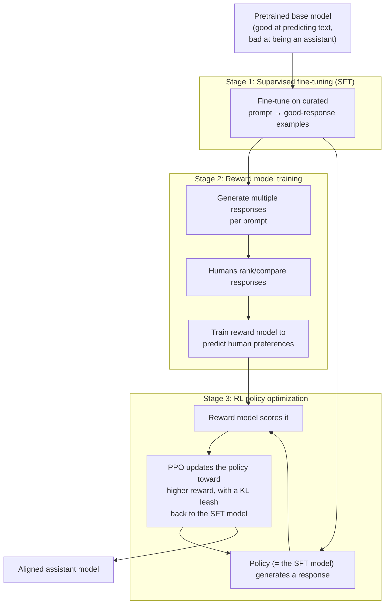

# 和调整

培训方法是将原始的预测预测预训模型转换成原始的培训方法 (见[pretraining-strategies.md](pretraining-strategies.md)) 成为一个遵循指令,避免有害输出,并且一般地表现出其开发人员打算的方式的助手**排列**文件将整个管道从一端到另一端进行,然后涵盖了自RLHF首次普及以来重新塑造了空间的RL免费替代方案 (DPO) 和相关技术 (RLAIF,宪法AI).该文件假设熟悉了RL基本概念.[加强学习](../07-reinforcement-learning/)特别是政策梯度方法和PPO (见[policy-gradient-methods.md](../07-reinforcement-learning/policy-gradient-methods.md)) 与密切相关[rl-for-llms.md](../07-reinforcement-learning/rl-for-llms.md)作为这一具体应用的RL理论到实践桥梁.

## 为什么单独预训不够

**差距.**通过互联网文本的下一个词元预测训练的模型 (见 [pretraining-strategies.md](pretraining-strategies.md)) 能预测什么是标志*统计可能*接下来在类似训练数据的文本中来,这是一个不同的目标,而不是"产生用户实际想要的反应","忠诚地遵循指令",或"拒绝有害请求".一个原始预训练模型,被问到一个问题,可能会像一个可信的声音,但无助的延续 (例如,列出更多类似的问题,因为这是网络文本中的一个常见模式) 而不是直接的,有用的答案.RLHF存在于此缺口:塑造模型的行为,人类实际想要什么从助理,使用人类判断作为训练信号,而不是仅依赖于原始文本的统计模式.

## 道,端到端

经典的RLHF管道有三个阶段,每个阶段都产生了一个文物,下一个阶段消耗了:



### 阶段1:监督的细调 (SFT)

**机械.**在任何RL发生之前,预训练模型首先进行细节调整 (见[finetuning-and-peft.md](finetuning-and-peft.md)提示与人类示范者认为好的反应 (有用,良好的格式化,适当的谨慎) 结合.这是标准监督学习:模型被训练直接模仿这些人写或人批准的示范反应,使用相同的下一个代号交叉缩损失作为预训练 (见[loss-functions.md](../01-foundations/loss-functions.md)),只是在这个更小的,策划的,以指示和响应形式的数据集上.

**为什么这个阶段存在.**通过SFT将模型进入大致正确的"模式" ,以类似助理格式响应指示,而不是继续文字,像原始预训练模型的方式 为接下来的RL阶段提供了比原始预训练模型更好的起点.

### 第二阶段:奖励模式培训

**机械.**收集许多提示,生成多个候选人对每个答案 (通常是从SFT模型中),并让人类标签师对这些答案进行排名或比较 (通常通过对比: "这两个答案中的哪个更好?" 比赋予绝对数值更容易和可靠地判断人类).训练一个独立的神经网络**奖励模式**为了预测人类偏好判断:给出提示和响应,输出一个规模分数,这样人类偏好的响应得到比没有的响应更高的分数.

**为什么要做一个独立的模型,为什么要做得分而不是直接监督.**收集一个人类对每一个可能的反应的比较判断,在RL培训期间政策可能产生会太慢和昂贵.RL培训需要评估培训过程中产生大量的反应.奖励模型是一次训练,在一个可管理的数量实际的人类比较,然后在整个 (更大的)RL培训过程中作为一个快速,自动替代的人类法官使用.

### 阶段3:RL政策优化 (基于PPO)

**机械.**现在称为SFT模型**政策**RL术语的"被训练做出决定",在这里,关于产生词元的决定) 通过加强学习进行进一步训练:对于给定的提示,政策产生响应,奖励模型评分响应,并更新政策的参数 (通过PPO 近距离政策优化,在全机械深度覆盖在 [policy-gradient-methods.md](../07-reinforcement-learning/policy-gradient-methods.md)) 为了使未来更有可能的高收益反应.

**根据KL的规定,KL的罚款是从SFT模型中漂移的罚款.**关键细节:RL目标不仅仅是最大化奖励模型分数.它还包括罚款条款一个KL差异 (见[loss-functions.md](../01-foundations/loss-functions.md)) 现行政策的产量分布与原始SFT模型的产量分布之间,

```
objective = 𝔼[reward_model_score] − β · D_KL(policy ‖ SFT_model)
```

通过:没有这种惩罚,RL过程有助于利用 (不完美,从有限样本中学习) 奖励模式中的任何不完美性 找到一些狭窄,可能奇怪的输出模式,奖励模型碰巧得分高,但人类实际上不会认为好 (一种失败模式通常称为**奖励黑客**作为一个带,KL处罚保持政策的行为与SFT模型的更广泛验证行为相对合理,以换取一些潜在的奖励模型得分收益,以保持政策的产量可认可合理.

**为什么整个管道都重要.**根据InstructGPT (Ouyang等, 2022) 和ChatGPT的普及,RLHF是采用了有能力但很难使用的预训练语言模型,并将其转化为帮助的,遵循指令的助理,从2022年开始定义了LLM产品类型.[历史timeline-2017-2023.md](../08-history/timeline-2017-2023.md)对于这个领域的更广泛历史的时刻.

###  GRPO 是一个更简单的RL算法,成为推理的突出

对于当前的图像来说,值得注意的是:经典的RLHF使用PPO,**价值模型**(一个"批评者" 见 [policy-gradient-methods.md](../07-reinforcement-learning/policy-gradient-methods.md)) 随着政策的推测,每个部分反应的效率大致翻了训练模型所需的记忆量. **集团相对政策优化**通过深度搜索引入,自此被广泛采用 (特别是针对推理专注的培训,见[rl-for-llms.md](../07-reinforcement-learning/rl-for-llms.md)),通过一个简单的技巧,取消了单独的值模型:*集团*通过一个小组的答案,*平均值*评分是每个反应的基线 (一个比其组平均水平更好的反应得到了积极的学习信号,更糟糕的结果变得负面).这"将每个答案与其兄弟答案的平均水平进行比较"取代了学到的评论家的工作,用便宜的即时统计数据. 收益是更简单的,低记忆的RL循环,使得可验证的奖励的大规模RL (见[rl-for-llms.md](../07-reinforcement-learning/rl-for-llms.md)) 更加实用 GRPO是2024-2025年强大的开放推理模式浪潮最相关的算法之一.

## 直接偏好优化 (DPO) 一个免RL的替代方案

**起源.**拉斐洛夫等人",直接优化偏好:你的语言模型是秘密的奖励模型" (2023).

**问题是DPO解决的.**上面的RLHF管道是复杂的,实际上可能很脆弱:它需要培训和维持一个独立的奖励模式,运行一个实际的RL培训循环 (PPO,具有自身的稳定挑战见[policy-gradient-methods.md](../07-reinforcement-learning/policy-gradient-methods.md)),并仔细调整KL罚率β,其他超参数中,比标准监督的细调运行更多的移动部件,并且有更多的训练错误的地方.

**核心机制 (概念性).**根据DPO的关键数学见解,上述RLHF目标 (通过KL处罚对参考政策进行奖励最大化) 具有最佳政策和隐含奖励函数之间的密闭关系. 这意味着你可以跳过明确奖励模型的培训,完全跳过RL运行,而不是直接优化人类偏好比较数据的政策,使用隐含编码的损失函数"使偏好反应更可能相对于偏好反应,而不偏离参考模型太远".

**为什么这很重要.**在许多环境中,DPO实现了与全RLHF相比较的结果,同时实现更简单,训练更稳定. 没有单独的奖励模式,没有RL训练循环,没有PPO特定的超参数调整.

## 技术的发展

**名称和定义**通过其他人工智能模型生成的偏好判断,取代 (或补充) 人类偏好标签,减少了所需的人类标签量.

**为什么它出现.**收集大规模,高质量的人类偏好数据是缓慢和昂贵的.如果一个足够有能力的人工智能模型能够产生与人类所说的有关偏好判断,那么这种判断可以在成本和时间的很小一部分的情况下代替 (或与) 人类标签,让偏好数据集扩展到人类标签预算本身所允许的范围之外.

**交易.**RLAIF可以显著削减首选数据收集的成本和回复时间,但它继承了判断AI模型的偏见或盲点,它的判断仅仅是值得信赖的,

## 宪法人工智能

**起源.**百合等人 (人类学),"宪法人工智能:人工智能反的无害性" (2022).

**核心机制.**宪法人工智能不仅依赖于人类标记的"有害"与"可接受"输出的例子,而是使用了一套书面的明确原则 (一个"宪法") 并根据这些原则进行模型批评和修改自己的输出,生成了对监督的细节调整阶段 (自我批评和修改的例子) 和偏好比较阶段的训练数据, 入了RLAIF类型的过程 减少了人类标记的量, 特别需要防止伤害行为,同时使这种行为背后的指导原则比一个隐含的模式更明确和可审计, 仅仅从分散的人类标签中学习.

**为什么这很重要.**这种方法使得指导模型的伤害避免行为的价值更明确,更直接可检查 (你可以阅读宪法本身) 与千万个个人的标签决定推理的纯粹隐含模式相比,并减少了人类标签负担,特别用于与安全相关的行为.

## 基于RLHF和DPO的方法之间的交易

|尺寸|完整的RLHF (奖励模式+PPO) |准 (和类似的直接优先方法)|
|---|---|---|
|复杂性|高 (奖励模式+RL循环+KL调整) |低 (单一监督式培训循环) |
|培训稳定性|可能脆弱 (RL特定不稳定性) |总体上更稳定|
|计算成本|高等 (奖励模式培训+RL部署) |低|
|灵活性用于其他目的重复奖励信号|是的 (奖励模型是可重复使用的文物) |没有明确的奖励模式|
|经验质量 (据广泛报道) |强,经过较长的历史,在边界范围内得到了证实|虽然在每个环境中,完全的比较图像仍然是活跃的研究领域.|

**现状.**截至2026年,这两种方法都在整个领域积极使用.一些组织主要依赖于DPO类型的方法来实现简单性和稳定性,其他组织继续使用完整的RLHF (或混合管道结合了两种元素),特别是当一个独立的,可重复使用的奖励模型或基于RL的控制对培训过程具有价值时.这是实践持续发展的领域,并且该仓库避免夸大尚未存在的结合意见.

## 与其他算法的关系

- 基本的RLHF是全力覆盖的机械深度.[policy-gradient-methods.md](../07-reinforcement-learning/policy-gradient-methods.md); [rl-for-llms.md](../07-reinforcement-learning/rl-for-llms.md)是将一般RL理论与本特定应用程序连接的专门桥梁文件.
- 在此中,KL分离处罚是同一项数学对象.[loss-functions.md](../01-foundations/loss-functions.md).
- 通过使用相同的细调机制,[finetuning-and-peft.md](finetuning-and-peft.md)通过PEFT方法,如LORA,以提高效率.
- 论优化技术的目标通常是调整RLHF/DPO的模型.[06- 输入优化](../06-inference-optimization/)一旦训练完成.

## 来源

- 克里斯蒂安·等人",从人类偏好中深入加强学习" (2017) 基础的RLHF方法,早于其LLM应用
- 欧阳等人 (OpenAI), "培训语言模型以遵循指令与人类反" (2022) [导航GPT]
- 拉斐洛夫等人",直接优化偏好:你的语言模式是秘密的奖励模式" (2023)
- 沙奥等人 (DeepSeek), "深度搜索数学:在开放语言模型中推进数学推理的边界" (2024) [鱼类]
- 百伊等人 (人类学),"宪法人工智能:人工智能反的无害性" (2022)
- 培训一个有帮助和无害的助理,通过人类反来加强学习 (2022)
