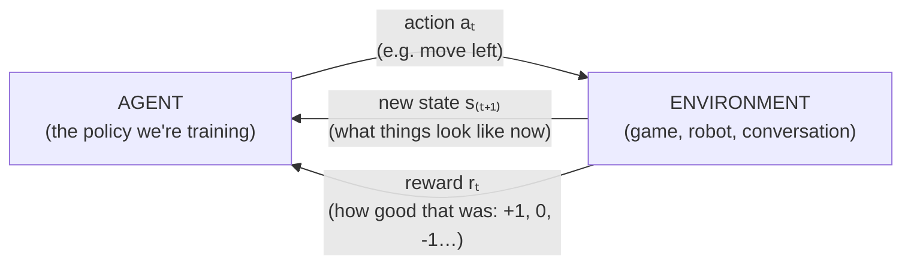

# 基于价值的RL方法

强化学习 (RL) 是机器学习的分支,与本库其他地方所涵盖的监督/自我监督学习不同:RL代理通过与环境互动,采取行动和获得奖励来学习,试图学习一种最大化累积奖励的策略.

整个场合都是建立在一个循环上 代理行动,世界以新的情况和奖励回应,重复 ,值得在任何算法之前考虑这个图像,因为其他一切 (在这个文件和在 [policy-gradient-methods.md](policy-gradient-methods.md)其他[rl-for-llms.md](rl-for-llms.md)) 是一种不同的学习策略:



唯一让RL比监督学习更难的是:奖励通常不告诉你*哪一个*实际上,这项行动是重要的,而奖励只到达最后. 找出哪些早期行动值得获得延迟奖励的信誉是最好的.**信用分配问题**几乎每个RL算法都在核心上是不同的答案.

## 马科夫决策过程 (MDP) 的框架

**名称和定义**根据马科夫决策过程,在不确定性下,**州**游戏板位置等,一个可能的集合**行动**其他类型的选择:**奖励**信号 (在某个状态下采取行动后收到的数字,表明该结果是多么好的),**政策**(经纪人策略,可能是学习的,以选择当前状态的行动规则).

**为什么叫"马科夫"?**根据[probabilistic-models.md](../02-classical-ml/probabilistic-models.md)马尔科夫属性假设未来只取决于过去,只通过现在的状态,这意味着当前状态包含了做出最佳决定所需的所有信息;你不需要之前发生的一切事物的完整历史来决定接下来要做什么.现实世界问题并不总是完全满足这一点 (克游戏的最佳行动可能取决于手中的投注模式,而不是只是当前的卡片),但设计好的状态表示通常可以捕获足够的相关历史,使马尔科夫假设成为合理的近似.

**目标.**们的目标是学习一个最大限度的政策**累计奖励**不仅是下一步行动的直接回报,而且是整个剧集或长期累积的总回报,通常是**折扣因素**γ (gamma,0至1) 之间的数量,对未来的奖励的权重略低于即时的奖励,以保持总数在长或无限的视野上进行数学行为,并反映了对较早的奖励而不是同样大小的后期奖励的合理偏好.

## 如何学习Q

**名称和定义**如何学习Q-学习**函数**                                                                                                                                                                                                                                                                                                                                                                                                                                                                                                                               **无模型**模型的方法与模型的方法相比.[model-based-rl.md](model-based-rl.md)).

**起源.**沃茨金斯"从延迟奖励中学习" (博士论文,1989年).

**核心机制.**

```
Q(s, a) ← Q(s, a) + α · [ r + γ · max_a' Q(s', a') − Q(s, a) ]
```

通过:在采取行动后,在状态 s,观察奖励 r,并登陆新的状态 s,更新当前估计 Q(s,a) 移动一点 (由学习率控制 α 见[optimization-algorithms.md](../01-foundations/optimization-algorithms.md)) 为了更好的估计:刚刚收到的奖励,加上新州的最佳可用行动的折扣价值 (最高)._假设你会在未来发挥最佳作用.**起**更新使用模型自身的当前 (不完美) 未来价值估计来改善其当前价值估计,逐步完善了两者,随着更多的经验积累,而不是需要等到完整的集结以了解真正的总奖励.一旦学到了一个好的Q函数,最佳的政策很简单:在任何状态下,只需选择具有最高Q价值的行动.

**具体更新.**现在,该代理跳跃,获得奖励r=2,并落地在状态 s' 状态下,最好的可用行动值 Q(s,最好的) =10.**目标**更新推出了旧估计的10%的方向:Q(s,"跳") ← 5.0 + 0.1·(11 − 5.0) = 5.6.**时间差异 (TD) 错误**"现实比我预测的6个好,所以提升我的预测".在一个环境中重复这几百万次,估计将趋于真正的长期价值.*倒退*一步一步一个好的结果就会提高前面的国家的价值,*这*信用还没有扩散到建立它的早期行动.

**为什么这很重要.**简单,可证明的融合 (在某些条件下) 的方法,仅仅是通过试错互动学习最佳行为,而不需要提前了解环境的底层动态.

**扩展问题.**经典Q-学习将Q(s,a) 作为一个明确的表格,每一个状态动作对的一个输入 完全不适用于任何环境中具有大型或连续状态空间 (例如,来自视频游戏的原始像素输入,具有天文学上大量的可能像素配置),因为没有办法存储,更不用说学习,每个可想象的状态的单独值.

## 深度Q网络 (DQN)

**起源.**通过深度强化学习进行控制 (2015,发表在自然杂志上).

**核心机制.**通过梯度下降训练,DQN将一个状态 (例如原始像素) 作为输入和输出的不可思议的大型Q表替换为一个神经网络Q(s,a; θ)[optimization-algorithms.md](../01-foundations/optimization-algorithms.md)) 为了尽量减少目前预测与上述图表Q学习中使用的相同启动目标 (奖励加上折扣预计未来价值) 的差异.

**为什么这很重要.**通过使用单个一般的架构和学习算法,在其中许多方面实现与人类相比的性能. 深度学习和强化学习可以在有意义的规模上成功结合,这是更广泛的深度学习叙述中的一个重要时刻.[历史timeline-2000s-2017.md](../08-history/timeline-2000s-2017.md).

**两种主要的稳定技巧在DQN旁边推出:**

- **经验重演.**随着游戏状态的发生,在一个非常相关的,非随机数据的流程上训练神经网络,从一个大型重播缓冲中随机抽取的数据,使训练类似于更好地理解的,更稳定的等 (独立和相同分布式) 数据假设,标准的深度学习依赖.
- **目标网络.**注意Q学习更新目标 (r + γ · max)_a' Q(s', a')) 使用了*其他*网络的预测作为其培训目标的一部分 如果网络的参数每一步都会更新,这个目标也会在每一步都会改变,追逐一个不断变化的目标,这可能会破坏培训的稳定.**目标网络**为了计算这个启动目标, 保持训练目标更稳定,

## 双重DQN

**起源.**范哈塞尔特,格泽,银, "双Q学习的深度强化学习" (2016).

**解决的问题.**标准Q学习的最大值_"Q"是""的术语,*过度估值*实际行动值,因为通过多个噪音估计, 总是选择那一天有什么噪音的估计, 不一定是最好的行动.

**核心机制.**双DQN脱*哪一个*选出最好的行动*如何*通过两个不同的网络来评估该行动的价值 (实际上,在这两个角色中,将现有的在线和目标网络重新利用标准DQN) 这大大取消了过度估值偏见,因为两个网络的噪音不太可能与相同的过度估值行动相一致.

## 双色球

**起源.**等, "深度强化学习的双重网络架构" (2016).

**核心机制.**双DQN重组网络产量成两个分流:**国家价值**根据估计, 率的增长率 (不论采取哪些措施,总体情况是多么好) 和**优势**估计A,a) (与该状态中可用的平均行动相比,该具体行动有多好或更糟),然后再组合到最终Q值估计:Q,s,a) =V,s) +A,s,a) (以正常化调整来保持分解的定义). 通过:在许多状态下,所采取的具体行动对结果并不重要 (所有行动都导致类似的结果),并且单独学习"这种状态一般有多好"和"这种特定行动有多重要"使网络能够有效地学习状态-价值部分,即使在状态中区分行动提供了很少的额外训练信号.

## 较量表

|方法|年份|关键创新|仍有意义 (2026)?|
|---|---|---|---|
|类学习 (表) | 1989 |无模型,启动的价值学习|基本理论;直接不实用|
|鱼类| 2013/2015 |神经网络Q功能+体验重播+目标网络 |基本;仍然被使用/教作为基线价值基础方法|
|双重DQN| 2016 |脱离行动选择与评估,纠正过度估值偏见|常见的精炼,仍在基于价值的方法选择时使用|
|双色球比赛| 2016 |区分国家价值和优势估计|常见的精炼,通常与上述结合.|

## 与其他算法的关系

- 马科夫的财产与其处理直接联系.[probabilistic-models.md](../02-classical-ml/probabilistic-models.md)(HMMs)
- 价值型方法是RL两个主要范例之一;其他的政策梯度方法 (包括PPO,是现代RLHF的核心),[policy-gradient-methods.md](policy-gradient-methods.md).
- 无模型方法,如Q学习/DQN,与基于模型的方法直接相比.[model-based-rl.md](model-based-rl.md).
- 基于梯度的训练使用了像本库其他地方一样的优化机器.[optimization-algorithms.md](../01-foundations/optimization-algorithms.md).

## 来源

- 沃特金斯"从延迟奖励中学习" (博士论文,1989)
- 尼及其他, "用深度强化学习玩阿塔利" (2013)
- 通过深度增强学习进行人力级控制 (2015)
- 范哈塞尔特,格泽,银, "双Q学习的深度增强学习" (2016)
- 等, "深度增强学习的双重网络架构" (2016)
