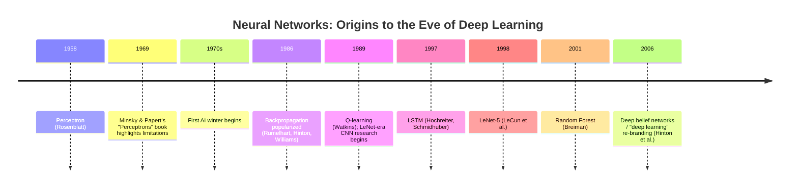

# 时间:50年代 - 2000年代

这是四个时间史文件中的第一个 (也见[timeline-2000s-2017.md](timeline-2000s-2017.md), [timeline-2017-2023.md](timeline-2017-2023.md)其他[timeline-2023-present.md](timeline-2023-present.md)),涵盖神经网络研究的起源,该领域的第一场重大挫折以及最终使深度学习成为可能的想法的缓慢重建.[scope-and-methodology.md](../00-overview/scope-and-methodology.md)历史记录所支持的日期也被引用,而不确定性则被标记,而不是被纸化.

## 时间线图

## 感知器 (1958)

**这是什么.**弗兰克·罗森布拉特的Perceptron (1958) 是最早的可训练的人工神经网络模型之一:一个单层可调节的权重可以通过反复训练规则学习分类简单的模式,从生物学神经元的想法中得到了宽松的启发.它当时引起了巨大的公众兴奋.包括新闻报道表明,可以"行走,说话,看到,写作,繁殖自己并意识到它的存在"的机器即将出现,这是人工智能的早期例子,超越了该技术的实际能力,这一模式在这个历史的几个后期重复.

## 感觉器的局限性和第一个人工智能冬季

**发生了什么事.**林斯基和帕珀特的1969年书*感知器*严格地证明,单层感知器 (罗森布拉特推广的架构) 数学上无法学习某些简单的函数最著名的是,XOR (独占或) 逻辑函数,它需要一个非线性决策界限,而单层的权重根本无法代表.这种发现经常被引用为后续多年的资金回退和对神经网络研究的热情的重要贡献首个"AI冬季",尽管值得确切地说,多层网络 (即*能使用*它们的运行方式是以 XOR 和类似函数为代表的.*列车*更多的 AI 网络将在近20年内无法普及 (见下面的反扩散). 较广泛的 AI 冬季 (大约是1970年代) 也有其他原因,除了这一特定发现之外,包括对多个 AI 研究计划的进展速度的更广泛的失望,而不是仅仅是神经网络.

## 后传播普及 (1986)

**发生了什么事.**鲁姆哈特,希顿和威廉姆斯的1986年论文"通过反向传播错误学习表示"普及了反向传播,这是计算损失函数的梯度如何依赖于多层网络中的每个权重的有效算法,使用了通过网络系统地向后应用的链式计算规则 (见[optimization-algorithms.md](../01-foundations/optimization-algorithms.md)值得注意的是,背后传播的核心数学思想早些时候已经由几个研究人员独立发现 (包括Werbos在1970年代的研究,以及其他研究),

**为什么这很重要.**背扩散直接解决了使多层网络不实用的训练问题,提供了可扩展的训练方式,以培训经典单层感知器无法代表的更深层的架构,

## 早期的CNN和LeNet

**发生了什么事.**基于后延伸,Yann LeCun及其同事在80年代末和90年代开发了卷积神经网络架构,最终是LeNet-5 (1998,见 [cnn-family.md](../03-deep-learning-architectures/cnn-family.md)),通过后传传授培训的CNN,在手写数字识别方面取得了强大的实践成果.

**为什么这很重要.**利内特证明,结合后扩散的卷积加合架构可以从端到端解决真正的实际问题,建立了架构模板 (见[cnn-family.md](../03-deep-learning-architectures/cnn-family.md)根据此类数据库的每一个后续CNN都建立在此基础上.

## 美国国家气象技术研究中心 (1997)

**发生了什么事.**霍克莱特和施密德伯的1997年LSTM论文 (见[rnn-lstm-gru.md](../03-deep-learning-architectures/rnn-lstm-gru.md)) 引入了能够在序列中学习长距离依赖性的封闭复制单元,直接解决了普通复制网络所遭受的消失梯度问题.

## 现代经典 ML发展 (文本)

除了神经网络研究,这一时期还产生了许多传统的 ML工具包,[子](../02-classical-ml/)):支持向量机 (Cortes, Vapnik, 1995),随机森林 (Breiman, 2001),以及AdaBoost/增强后代 (Freund, Schapire, 1997) 都在同一幅窗口中出现,它们在很大程度上与神经网络研究并发起,而不是与神经网络直接竞争.

## 2006年"深度学习"的重塑

**发生了什么事.**2006年,杰弗里·希顿和他的同事发表了关于训练"深度信仰网络"的研究工作. 堆的特定类型的概率模型 (限制的博尔茨曼机器) 一次训练一个层,然后可以作为传统的深度神经网络进行细节调整. 这项研究被广泛认为是该领域普及了"深度学习"这个术语,并证明了训练网络的实用配方比以前的常见做法更深,当时通过简单的背传播直接训练非常深度网络仍然很困难 (问题,如在[cnn-family.md](../03-deep-learning-architectures/cnn-family.md)接下来,近十年后,

**为什么这很重要.**这一时刻通常被视为"深度学习"时代的象征性开始,作为一个命名的,自觉的研究计划,为下一个十年中更为戏剧性的突破奠定了基础.[timeline-2000s-2017.md](timeline-2000s-2017.md)最值得注意的是亚历克斯网的2012年图像网结果.

## 与其他文件的关系

- 现代机械技术的完整化和建筑概念 (后传,CNN,LSTM) 已被全面覆盖.[01-基金会](../01-foundations/), [03-深度学习架构cnn-family.md](../03-deep-learning-architectures/cnn-family.md)其他[03-深度学习架构rnn-lstm-gru.md](../03-deep-learning-architectures/rnn-lstm-gru.md).
- 这档案直接进入[timeline-2000s-2017.md](timeline-2000s-2017.md)覆盖 AlexNet, Word2vec, Seq2seq, ResNet,以及通往Transformer的道路.

## 来源

- 罗森布拉特"感知器:大脑中的信息存储和组织的概率模型" (1958)
- 敏斯基,帕珀特,"感知器" (1969)
- 鲁姆尔哈特,希顿,威廉姆斯, "通过后传错误学习表达" (1986)
- 科特斯,瓦普尼克,"支持向量网络" (1995)
- 霍克莱特,施密德布尔, "长短内存" (1997)
- 弗洛恩德,施皮尔, "在线学习的决定理论概括和促进应用" (1997)
- 莱昆,博托,班基奥,哈夫纳,"应用在文档识别上基于基数的学习" (1998)
- 布雷曼"随机森林" (2001)
- 希顿,奥辛德罗,泰,"深信网络的快速学习算法" (2006)
