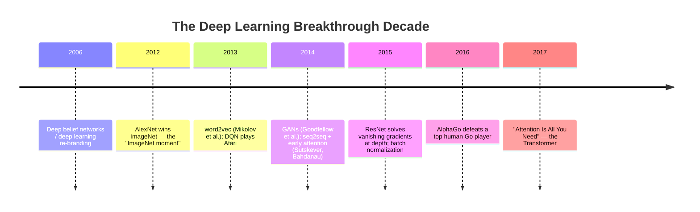

# 时间:2000年至2017年

本文件涵盖从深度学习重新品牌时段 (见[timeline-1950s-2000s.md](timeline-1950s-2000s.md)通过转型器架构的出版,深度学习从一个有前途的研究方向转向计算机视觉,语音和NLP早期阶段的主导范式的十年.

## 时间线图

## 亚历克斯网和图像网时刻 (2012)

**发生了什么事.**根据详细的内容[cnn-family.md](../03-deep-learning-architectures/cnn-family.md)克里谢夫斯基,苏茨基弗和希顿的AlexNet赢得了2012年ImageNet大规模视觉识别挑战赛,

**为什么它被视为一个转折点.**这一结果被广泛认为是将主流计算机视觉研究社区的共识转移到深度学习作为主导方法的单一时刻,而不是几个竞争型范式 (特别是手工工程功能管道与经典ML结合).这次胜利的规模和它依赖于将在下一个十年中重复的成分 (GPU训练,大标签数据集,ReLU激活,退出) 使2012成为这个历史的自然转折点.

## word2vec及早期嵌入 (2013)

**发生了什么事.**米科洛夫等人 (2013) 引入了 word2vec,一种学习单词的密集向量表示方法 (嵌入式见词典) 纯粹从大文本体中的共发生模式中,这样在类似的背景中使用的单词最终会出现类似的向量,这很有名地证明这些嵌入式的简单向量算法可以捕获有意义的关系 (正规,广泛引用的例子是"国王"减去"男人"加上"女人"的向量接近"女王"的向量).

**为什么这很重要.**单词2vec是一个早期,有影响力的证明,[pretraining-strategies.md](../05-training-methodology/pretraining-strategies.md)) 从原始,未标记的文本中学习有用的表达,没有手动注释 可以产生真正有用的,语义结构化的表达,这是一个可预见的早期的远大规模的自我监督预训,将成为定义LLM时代.

## 强化学习和深度强化学习 (2013)

**发生了什么事.**根据[value-based-methods.md](../07-reinforcement-learning/value-based-methods.md)通过使用一个一般的架构和算法,在各种游戏中实现与人类相比的性能.

**为什么这很重要.**深度学习可以成功结合深度学习和强化学习建立深度学习作为一个认真的研究方向,并建立了后来的更突出的AlphaGo结果 (下面).

## 类产品 (2014)

**发生了什么事.**吉德菲洛等人推出了创建对抗网络 (见[gans.md](../04-generative-models/gans.md)),将生成模型作为一个生成器和歧视网络之间的对抗游戏.

**为什么这很重要.**随后几年,GAN成为高效率图像生成的领先方法,并代表了一个真正新型的培训范式 (两个网络之间的竞争),与当时的深度学习中其他地方使用的更标准的概率最大化框架不同.

## 后续和早期关注 (2014-2015)

**发生了什么事.**苏茨基弗,维尼尔斯和莱的序列到序列框架 (2014,见 [rnn-lstm-gru.md](../03-deep-learning-architectures/rnn-lstm-gru.md)) 通过使用RNNs/LSTM将一个序列映射到另一个序列的通用编码解码器配方,Bahdanau等人的注意力机制 (2014) 和Luong等人的后续改进 (2015) 通过让一个解码器动态地回来每个编码器位置来解决seq2seq的信息瓶.

**为什么这很重要.**作为一个"重点"的重点,[rnn-lstm-gru.md](../03-deep-learning-architectures/rnn-lstm-gru.md)其他[transformer-architecture.md](../03-deep-learning-architectures/transformer-architecture.md)这个时期是核心思想 (计算相关性分数,软max它们成权重,取权重的总数) 首次出现的,仍然嵌入在一个复发的架构而不是作为一个完全的替代品.

## 网页版

**发生了什么事.**他,张,任和太阳的ResNet (见 [cnn-family.md](../03-deep-learning-architectures/cnn-family.md)) 引入了跳转/残留连接,解决了缩问题,这使得平面网络无法可靠地过去了大约20-30层,并使网络深度超过100层.

**为什么这很重要.**除了其直接的计算机视觉结果之外,残留连接成为所有深度学习中最广泛重复使用的建筑组件之一.[transformer-architecture.md](../03-deep-learning-architectures/transformer-architecture.md)) 和从那以后几乎发展的每一个深层建筑.

## 果版 (2016)

**发生了什么事.**由于Go的巨大游戏树和手工制作评估功能的困难,许多球员预计将在10年或更长时间内完成比赛.

**为什么这很重要.**果将深度神经网络 (用于评估位置和建议移动) 结合到蒙特卡洛树搜索计划 (见[model-based-rl.md](../07-reinforcement-learning/model-based-rl.md)对于最近的 MuZero 系统来说,它的非常公开成功成为了广大公众最广泛认可的"AI里程碑"之一,[timeline-2017-2023.md](timeline-2017-2023.md)).

## "你需要注意的只是你" (2017)

**发生了什么事.**瓦斯瓦尼等人的Transformer论文 (见 [transformer-architecture.md](../03-deep-learning-architectures/transformer-architecture.md)) 证明,完全由注意力机制构建的机器翻译模型 没有重复,没有卷积 可以匹配或超过最好的基于RNN/LSTM的seq2seq系统的质量,同时由于其可并行的性,训练速度更快.

**为什么它是整个历史的关键点.**建筑和方法论的每一个主要发展都被[timeline-2017-2023.md](timeline-2017-2023.md)其他[timeline-2023-present.md](timeline-2023-present.md)BERT,GPT,规模法,RLHF,整个现代LLM时代 直接建立在这个建筑上.这是该库的历史叙述中最清晰的分界线:几乎所有内容都在[03-深度学习架构](../03-deep-learning-architectures/)其他[05-培训方法](../05-training-methodology/)由于这份2017年的单一文件,

## 与其他文件的关系

- 文件从[timeline-1950s-2000s.md](timeline-1950s-2000s.md)入了[timeline-2017-2023.md](timeline-2017-2023.md)现在,我们要做什么?
- 几乎每个建筑都在其他地方都得到了完整的机械处理:[cnn-family.md](../03-deep-learning-architectures/cnn-family.md)其他国家[rnn-lstm-gru.md](../03-deep-learning-architectures/rnn-lstm-gru.md), , , , , , , , , , , , , , , , , , , ,,,,,,,,,,,,,,,,,,,,,,,,,,,,,,,,,,,,,,,,,,,,,,,,,,,,,,,,,,,,,,,,,,,,,,,,,,,,,,,,,,,,,,,,,,,,,,,,,,,,,,,,,,,,,,,,,,,,,,,,,,,,,,,,,,,,,,,,,,,,,,,,,,,,,,,,,,,,,,,,,,,,,,,,,,,,,,,,,,,,,,,,,,,,,,,,,,,,,,,,,,,[gans.md](../04-generative-models/gans.md), [value-based-methods.md](../07-reinforcement-learning/value-based-methods.md)其他国家[transformer-architecture.md](../03-deep-learning-architectures/transformer-architecture.md).

## 来源

- 克里谢夫斯基,苏茨基弗,希顿, "与深度缩神经网络的图像网分类" (2012)
- 麦科洛夫,陈,科拉多,迪恩, "在矢量空间中的词表达的有效估算" (2013) [词2vec]
- 尼及其他, "用深度强化学习玩阿塔利" (2013)
- 广告服务有限公司
- 苏茨基弗,维尼尔,莱, "随机学习与神经网络" (2014)
- 巴哈达纳,乔,班基奥, "通过共同学习协调和翻译的神经机器翻译" (2014)
- 他,张,任,孙, "对图像识别的深度残留学习" (2015)
- 银等",深度神经网络和树木搜索" (2016) [类]
- 瓦斯瓦尼等人",你只需要注意力" (2017)
