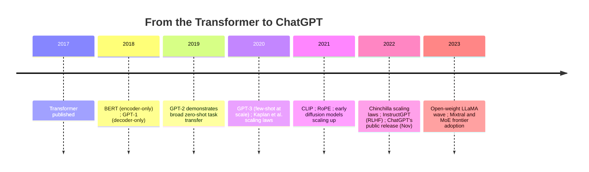

# 时间表:2017年至2023年

转变器发布后,该文件立即恢复 (见[timeline-2000s-2017.md](timeline-2000s-2017.md)) 及该建筑与积极的扩展和新的后培训方法结合,以现代的LLM作为产品类型的产品的时期, culminating在ChatGPT的公开发布,被广泛认为是广大公众,而不仅仅是研究界,意识到该领域的进步的时刻.

## 时间线图

## 欧盟和欧盟的合作伙伴

**发生了什么事.**同年出现了两种特种Transformer架构:Devlin等的BERT (仅使用编码器,面具语言建模,见[transformer-architecture.md](../03-deep-learning-architectures/transformer-architecture.md)) 和Radford等人的GPT-1 (仅用于解码器,下一个代码预测,见[autoregressive-generation.md](../04-generative-models/autoregressive-generation.md)).

**为什么这很重要.**这就是"哪个建筑变体赢得哪个目的"的问题 (详细介绍在[transformer-architecture.md](../03-deep-learning-architectures/transformer-architecture.md)BERT成为理解/嵌入任务的主导方法,而GPT线的仅用解码器,生成方法将继续定义一般用途的LLM类别.

## 基质质质量测试 (GPT-2) 进展 (2019)

**发生了什么事.**GPT-2扩大了相同的仅用于解码器的架构和下一个词元预测目标,并证明了其发布最初是由于担心潜在的滥用,本身是一个早期的迹象,该领域对越来越有能力的生成文本模型的双重使用问题进行了处理.

**为什么这很重要.**这是第一个强有力的公开证据表明,仅仅规模,没有具体任务架构或细调,可以释放广泛的一般能力直接预示GPT-3在下一年的更大规模确认相同的趋势.

## 基质质量制造业和扩展法 (2020)

**发生了什么事.**布朗等人的GPT-3 (2020) 进一步扩大了相同的配方,并且通过纯粹的提示来证明了强大的少数拍摄学习 (见词典),而无需为许多任务进行基梯度基调调.同年,卡普兰等人发表了第一份有影响力的扩展法论文 (见 [transformer-architecture.md](../03-deep-learning-architectures/transformer-architecture.md)),表明语言模型的损失与模型大小,数据大小和计算的可预测的权力法关系.

**为什么这很重要.**卡普兰等的扩展法规为该领域提供了第一次,基于可预测的抽象而不是试错的计划,直接塑造了"更大的更好"扩展竞赛,在2022年Chinchilla的修订之前,重新平衡了该领域的思考.*如何*为了扩展.

## 和 (2021)

**发生了什么事.**拉德福德等人的CIP (见[pretraining-strategies.md](../05-training-methodology/pretraining-strategies.md)) 证明,对象与文字对象的对比预训可以产生强大的零镜头图像分类和共享视觉语言嵌入空间,成为后来的多模式和文本与图像系统的基础基础设施.[transformer-architecture.md](../03-deep-learning-architectures/transformer-architecture.md)) 引入了旋转位置嵌入式,这些嵌入式将成为大型语言模型中占主导地位编码方案.

## 扩大扩散模式 (2020-2022)

**发生了什么事.**根据Ho et al.的2020年DDPM制定 (见 [diffusion-models.md](../04-generative-models/diffusion-models.md)),扩散模型家族在2021-2022年迅速扩大,最终导致隐藏扩散 (Rombach等,2021/2022) 和其广泛使用的实现,稳定扩散,以及在同一宽窗口中发布的其他突出文本到图像系统.

**为什么这很重要.**这段时间是扩散模型将GAN (见[gans.md](../04-generative-models/gans.md)) 作为图像生成的主导方法,[diffusion-models.md](../04-generative-models/diffusion-models.md)培训稳定性,样品多样性以及自然条件化机制 (无分类指导) 都起到了作用.

## 鱼 (2022)

**发生了什么事.**霍夫曼等人的"辛奇拉论文" (见[transformer-architecture.md](../03-deep-learning-architectures/transformer-architecture.md)) 修改了该领域对计算优化培训的理解,表明许多当代大型模型相对于其规模缺乏培训,并且一个基于大量数据培训的较小模型可以在同一计算预算下超过一个较大的,不充分培训的模型.

**为什么这很重要.**这直接改变了随后的预训练实践 (见[pretraining-strategies.md](../05-training-methodology/pretraining-strategies.md)) 更加重视数据量和质量,而不是仅仅是原始参数数量.

## 导航GPT和RLHF (2022)

**发生了什么事.**阳等人的InstructGPT论文 (见[rlhf-and-alignment.md](../05-training-methodology/rlhf-and-alignment.md)) 展示了现代RLHF管道监督的细节调整,奖励模型培训和基于PPO的政策优化应用于GPT-3规模模型,生产一个模型,它遵循指令并比原料预训练模型更好地匹配用户意图,尽管比它构建的基 GPT-3模型要小得多.

**为什么这很重要.**这份论文是该库认为建立了原料预训练的LLM成为可用的,遵循指令的助理的方法

## 查特GPT的公开发布 (2022年11月)

**发生了什么事.**开通AI在2022年底公开发布ChatGPT,基于上述RLHF风格方法,非常快速地达到了庞大的公众观众.

**为什么这很重要,在场上和在场外.**这是一个在整个历史中最重要的"公众意识"的转折点, 可比较于AlphaGo的2016年比赛的可见性.[timeline-2000s-2017.md](timeline-2000s-2017.md)) 且直接引发了行业投资,公共论坛,实验室竞争紧迫性以及对人工智能的政策关注,这些都持续持续在该期间.[timeline-2023-present.md](timeline-2023-present.md).

## 开放权重波:LLaMA和继任者 (2023)

**发生了什么事.**梅塔的LLaMA模型家族 (首次发布于2023年2月) 和其许多继任者和衍生品 (跨越多个组织) 让研究人员获得越来越具能力的模型权重,并在不同的许可条款中更广泛地使用了比GPT-3和ChatGPT特征化的封闭,仅API访问的分布模型有意义.

**为什么这很重要.**这大大扩大了能够使用真正有能力的法定律师进行实践研究和开发的机会,推动了开源精细调度,开发和采用PEFT方法的浪潮 (见[finetuning-and-peft.md](../05-training-methodology/finetuning-and-peft.md)实验在整个社区,而不仅仅是在大型实验室.

## 专家混合的边境通过 (2023)

**发生了什么事.**基于早期的MoE研究 (Switch Transformer,GShard 见 [mixture-of-experts.md](../03-deep-learning-architectures/mixture-of-experts.md)),Mistral AI的Mixtral (2023年底) 是一个突出的开放权重示范,即MoE架构可以达到与其活性计算成本相比的强性能.

**为什么这很重要.**这是一个时间表中显著的点,以前更为学术的建筑方向 (Sparse MoE) 成为了具体的,公开证明的实际选择,

## 与其他文件的关系

- 文件从[timeline-2000s-2017.md](timeline-2000s-2017.md)入了[timeline-2023-present.md](timeline-2023-present.md)综合性培训,包括多模式融合和基于推理的培训.
- 几乎每个活动都在其他地方得到了全面的技术处理:[transformer-architecture.md](../03-deep-learning-architectures/transformer-architecture.md)根据"欧洲经济发展局"的规定,[rlhf-and-alignment.md](../05-training-methodology/rlhf-and-alignment.md)其他国家[diffusion-models.md](../04-generative-models/diffusion-models.md), [mixture-of-experts.md](../03-deep-learning-architectures/mixture-of-experts.md).

## 来源

- 德文,张,李,图塔诺瓦, "BERT:深度双向Transformer预训练语言理解" (2018)
- 拉德福德等人",通过生成式预训练提高语言理解" (2018) [子-1]
- 拉德福德等人",语言模型是无监督的多任务学习者" (2019) [子-2]
- 布朗等人",语言模型是少人学会的" (2020) [子3]
- 卡普兰等人",神经语言模型的扩展法则" (2020)
- 霍,贾因,阿贝尔, "谴责传播概率模型" (2020)
- 拉德福德等人",从自然语言监督中学习可转移视觉模型" (2021) [子]
- 苏及其他研究人员"RoFormer:增强转变器与旋转位置嵌入" (2021)
- 罗姆巴赫,布拉特曼,洛伦兹,埃塞尔,奥默, "高分辨率图像合成与隐形扩散模型" (2021/2022)
- 霍夫曼等人",训练计算最佳的大语言模型" (2022) [鱼]
- 乌阳等",培训语言模型以遵循指令与人类反" (2022) [导航GPT]
- 图弗龙等人 (Meta), "LLaMA:开放和有效的基础语言模型" (2023)
- 智能智能迷思,专家混合 (2023/2024)
