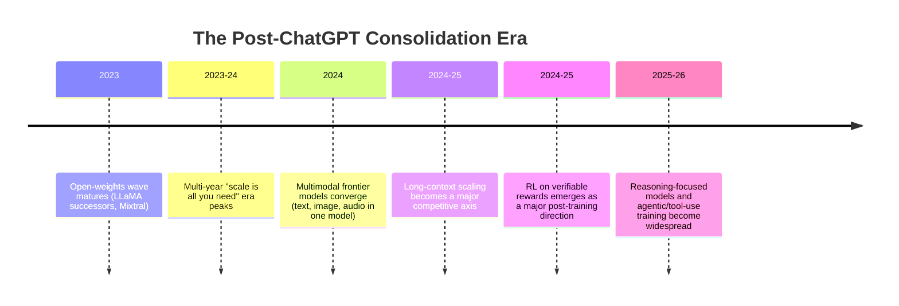

# 时间:2023 - 现在

这四个历史文件中,这是最近的,而且必然是最少的结算. 事件在这里更接近于本库的写作 (2026年中期),并且没有像以前的时代那样受益于多年的后期和学术后期.[scope-and-methodology.md](../00-overview/scope-and-methodology.md)),该文件依据广泛报道的发展情况,明确说明历史记录仍在哪里;[九条路线图](../09-roadmaps/)任何要求都必须明确标记`[Projection]`.

## 时间线图

## 继续开放权重竞争和MOE的采用

**发生了什么事.**根据"LLaMA"和"Mixtral"的发展情况[timeline-2017-2023.md](timeline-2017-2023.md)随着多个组织的不断,越来越有能力的开放权重模型家族的竞争性发布,同时也继续采用专家混合架构 (见[mixture-of-experts.md](../03-deep-learning-architectures/mixture-of-experts.md)) 在边境实验室中最大的模型中.

**为什么这对历史有所重要.**据报道,与2020-2022年相比,最好的开放型号和最好的封闭/API仅限型号之间的差距在此期间将大幅缩小,尽管封闭的边界实验室在任何时候都继续领导最有能力的系统.

## 多模式融合

**发生了什么事.**边界模型的发展从单独的,专业的模式 (一种语言模型,一个单独的图像模型,一个单独的音频模型) 转向单独的模型,这些模型是培训的,以处理多种模式的本土文本,图像,音频,在某些情况下视频在一个架构和一个权重组内,而不是将单独训练的组件粘合在一起.

**为什么这很重要.**这反映了更广泛的投注,即共享的表现和跨模式的联合培训产生了比保持单独的专业模型更具能力和更高效的系统,并使"原生多模式"成为了边界通用模型的标准期望,而不是专业的附加能力.

## 长文本扩展

**发生了什么事.**文本窗口大小 (模型可以一次处理多少文本/输入 直接与 KV缓存成本相关[kv-cache-and-attention-optimization.md](../06-inference-optimization/kv-cache-and-attention-optimization.md)) 在此期间大幅增长,边界模型从数万个文本词元转移到足够大的文本窗口,以在一个通道中处理非常长的文档,广泛的对话历史或大型代码库.

**为什么这很重要.**这一转变是其中大部分推理优化工作的直接驱动因素.[06- 输入优化](../06-inference-optimization/)GQA,PagedAttention,以及对国家空间模型的研究兴趣 (见[state-space-models.md](../03-deep-learning-architectures/state-space-models.md)) 都部分是对较长的环境对注意力的方位扩展和KV缓存的线性但仍然实质性的内存足迹造成的成本压力的反应.

## 关于可验证的奖励和基于推理的培训的RL

**发生了什么事.**根据详细的内容[rl-for-llms.md](../07-reinforcement-learning/rl-for-llms.md)培训后的方法学转变显著,模型通过增强学习而接受自动验证的奖励 (检查数学答案是否正确,代码是否通过测试和类似的客观可检查标准) 而不是仅仅依赖于学习的,以人偏好训练的奖励模型. 这已被广泛报告为生产具有更强大的多步推理行为模型的核心.

**为什么这被视为最近的重大方法转变.**根据该库对近期事件的诚实不确定性政策,这是一个广泛报告和显著的重要方向,反映在多个实验室公开描述的培训方法,而不是一个单一的,准确的日期,普遍一致的"时刻",ChatGPT的发布方式. 精确的技术,术语和相对重点在各组织中不同,这仍然是一个活跃的,在写作该库的时间 (2026年中旬) 发展快速的领域,这就是为什么[rl-for-llms.md](../07-reinforcement-learning/rl-for-llms.md)对于这个问题来说,我们仍然不确定是什么.

## 代理和工具使用培训

**发生了什么事.**除了基于推理的培训,越来越多的重点都放在了培训模型使用外部工具 (运行代码,搜索网络,调用外部API/功能) 和运行在更长的多步骤任务视野上,每步都不具直接的人类监督经常被描述为"代理"行为.

**关于这个问题是什么原因,以及我们对这个问题的确定的不确定性.**这一方向与长远的代理可靠性问题直接联系起来.[九条路线图/open-problems.md](../09-roadmaps/open-problems.md)截至本文,这仍然是一个快速提高能力和相应快速发现新故障模式的活跃领域,并且这个库故意避免过度声称"解决"的可靠长视野代理行为是如何到2026年中期.

## 写历史的记载,接近现在

据构建,这份文件的历史叙述部分在未来几年内看起来很可能看起来不完整或权重化不同. 某些事件被视为重要可能比目前看起来更不重要,一些尚未广泛报道的更安静的发展可能会后期变得更重要. 这不是该库的特点.这是最近历史写作的固有的属性,这就是为什么该库在该文件之间划出了坚定的线 (广泛报道的过去/当前发展)[九条路线图](../09-roadmaps/)它们的含义是:

## 与其他文件的关系

- 文件从[timeline-2017-2023.md](timeline-2017-2023.md)并且是该库的最新时间表叙述.[九条路线图](../09-roadmaps/)现在,我们正在投机.
- 可验证的奖励的RL完全覆盖在[rl-for-llms.md](../07-reinforcement-learning/rl-for-llms.md)长文本/KV缓存成本压力[kv-cache-and-attention-optimization.md](../06-inference-optimization/kv-cache-and-attention-optimization.md)其他[state-space-models.md](../03-deep-learning-architectures/state-space-models.md).

## 来源

- 根据该库的声明方法,该文件比前三个时间线文件更依赖于"广泛报告"的特征,反映了这些事件的更近期,更少的解决性质 (见[scope-and-methodology.md](../00-overview/scope-and-methodology.md)).
- 图弗龙等人 (Meta), "LLaMA:开放和有效的基础语言模型" (2023) [继续开放权重竞争的背景]
- 智能智能"专家混合" (2023/2024) [继续采用MOE的背景]
