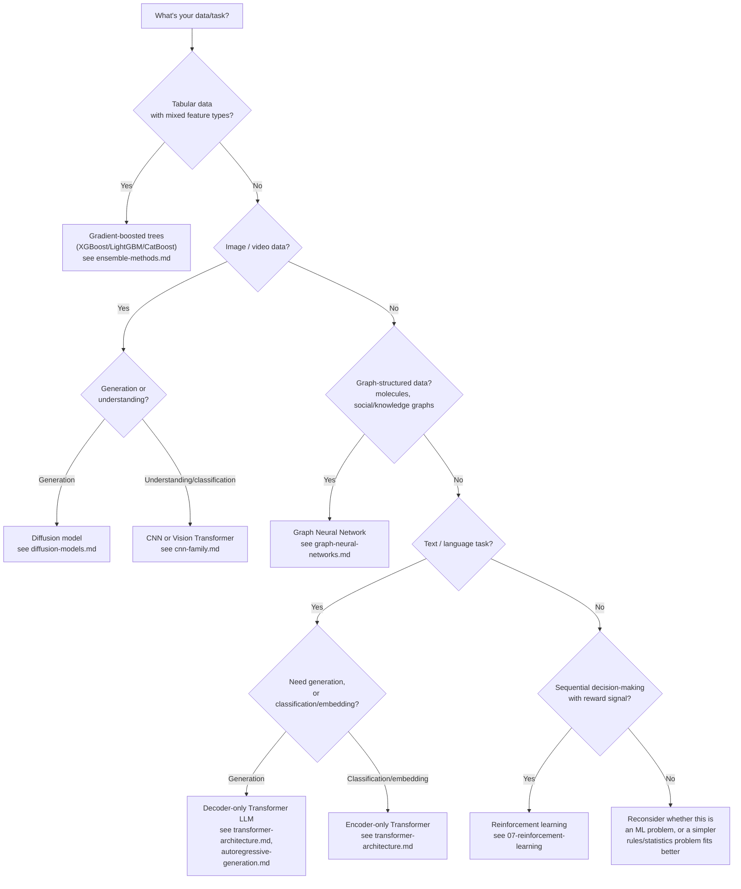

# 什么时候使用

根据本文的内容,我们将使用"决策树"来进行快速的第一步,并使用下面的解释文本来解释每个分支的理由.

## 决策树:选择模型方法

## 经典 ML与深度学习

**使用经典的ML (尤其是向的树木) 查看[ensemble-methods.md](../02-classical-ml/ensemble-methods.md)) 当:**数据表格,特征数量中度,数据集规模与竞争型深度模型所需的相比较小到中等,解释性或快速代是重要的.[ensemble-methods.md](../02-classical-ml/ensemble-methods.md)这不是"以更少的价格结算"的选择 往往有梯度的树木*超出了其他*基于结构性原因 (异质,非光滑的特征;与竞争型深度模型尺寸相比较小的数据集)

**使用深度学习:**数据具有有意义的空间,序列或关系结构 (图像,音频,文本,图形),一个建筑可以作为诱导偏见利用 (见[cnn-family.md](../03-deep-learning-architectures/cnn-family.md), [transformer-architecture.md](../03-deep-learning-architectures/transformer-architecture.md), [graph-neural-networks.md](../03-deep-learning-architectures/graph-neural-networks.md)),以及/或有足够的数据可供使得学习的表示超过手工设计的功能.

## 选择优化器

个人[optimization-algorithms.md](../01-foundations/optimization-algorithms.md): **默认的 AdamW**考虑狮子或索菲亚,只要你正在进行大规模预训练,并且有能力验证与亚当W的替代方案,

## 选择一个产生的模范家庭

个人[04-生成型号](../04-generative-models/): **对于图像/视频/音频,默认的扩散**(见[diffusion-models.md](../04-generative-models/diffusion-models.md)) 除非您特别需要类似GAN的单次快速采样 (见[gans.md](../04-generative-models/gans.md)) 或精确概率计算 (基于流量模型见[flow-based-models.md](../04-generative-models/flow-based-models.md)),从2026年起两个较窄的位.**对于文本,自动降解码器生成是默认的**(见[autoregressive-generation.md](../04-generative-models/autoregressive-generation.md)目前没有主流替代方案,可以替代它为开放式文本生成.

## 选择一个细节调整方法

个人[finetuning-and-peft.md](../05-training-methodology/finetuning-and-peft.md): **默认的 LoRA**适应预训练模型到新任务或领域; **特别使用QLoRA,当硬件内存是绑定限制时**; **备份完整的调整**在最大任务性能值得计算/记忆成本相当高的情况下,或者在进行大规模的持续预训练而不是狭窄任务适应的情况下.

## 选择调整/培训后的方法

个人[rlhf-and-alignment.md](../05-training-methodology/rlhf-and-alignment.md): **默认的DPO**如果您想要一个更简单,更稳定的管道,而没有RL基础设施,则可根据优先级进行细节调整; **使用全 RLHF**如果您特别需要一个独立的,可重复使用的奖励模型或基于RL的精细控制培训; **使用可验证的奖励的RL**(见[rl-for-llms.md](../07-reinforcement-learning/rl-for-llms.md)) 专门用于自动可检查正确性 (数学,代码,逻辑) 的领域,这些领域与开放式任务的偏好方法相继,而不是相继.

## 选择推理优化

个人[06- 输入优化](../06-inference-optimization/): **应用 FlashAttention 和连续批量基本上总是**他们接近免费的胜利,没有质量的折衷 (见[kv-cache-and-attention-optimization.md](../06-inference-optimization/kv-cache-and-attention-optimization.md)其他[serving-and-batching.md](../06-inference-optimization/serving-and-batching.md)). **应用量化**(见[quantization.md](../06-inference-optimization/quantization.md)) 记忆/成本是强制性的限制,并且您可以验证您的使用情况可接受的准确性影响. **应用投机解码**(见[speculative-decoding.md](../06-inference-optimization/speculative-decoding.md)) 延迟是重要的,你可以保持一个相匹配的草案模型或使用一个免于草案模型的变体 (Medusa,看头解码).**在培训时选择GQA风格的建筑**长文本,高价格服务是优先事项.

## 与其他文件的关系

- 实际化[algorithm-comparison-master.md](algorithm-comparison-master.md)其他[compute-cost-comparison.md](compute-cost-comparison.md)阅读这些数据,以此指导的基础是相对数据.
- 对于任何建议的完整机制和理由,请按照相关部分文件的交叉链接进行.
