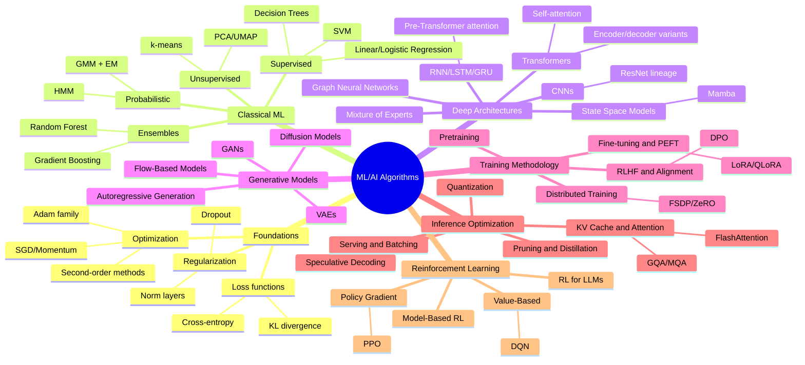

# Taxonomy Map

This is the visual entry point to the repository: a map of how every algorithm family covered here relates to every other one. Use it to orient yourself before diving into a specific file, or to find the right neighborhood when you know roughly what you're looking for but not the exact file name.

## How to read this

The mindmap below groups algorithms by the role they play (foundations, classical ML, deep architectures, generative models, training methodology, inference optimization, reinforcement learning), not by chronology — for the chronological view, see [08-history](../08-history/). Branches are not exhaustive lists; they name the major entries so you can jump to the right file. Full checklists live in each section's files.

## Cross-cutting relationships

The mindmap above groups by section, but many of the most important relationships in ML cut *across* those sections. This is the connective tissue readers most often miss:

- **Optimization underlies everything.** Every architecture in `03-deep-learning-architectures` and every generative model in `04-generative-models` is trained using an optimizer from `01-foundations/optimization-algorithms.md` (almost always Adam or AdamW at this point). Optimization choice is orthogonal to architecture choice.
- **Regularization and normalization are architecture components, not afterthoughts.** LayerNorm and RMSNorm (`01-foundations/regularization-techniques.md`) are literally inside the Transformer block (`03-deep-learning-architectures/transformer-architecture.md`) — they aren't bolted on top.
- **The EM algorithm** (`02-classical-ml/probabilistic-models.md`) is a conceptual ancestor of the reasoning used in variational inference, which shows up again in VAEs (`04-generative-models/vaes.md`).
- **Attention is a single mechanism reused three times.** Bahdanau/Luong attention in `03-deep-learning-architectures/rnn-lstm-gru.md` is the direct conceptual predecessor of self-attention in `03-deep-learning-architectures/transformer-architecture.md`, which is itself the mechanism being made cheaper by every file in `06-inference-optimization`.
- **RLHF is where `07-reinforcement-learning` and `05-training-methodology` merge.** The policy-gradient theory in `07-reinforcement-learning/policy-gradient-methods.md` (especially PPO) is the RL engine underneath `05-training-methodology/rlhf-and-alignment.md`; `07-reinforcement-learning/rl-for-llms.md` is written specifically as the bridge between the two.
- **Generative model families are competing solutions to the same problem** (model a data distribution well enough to sample new realistic examples from it): GANs, VAEs, diffusion models, autoregressive models, and flow-based models are five different answers, and `04-generative-models/diffusion-models.md` and `04-generative-models/gans.md` both explain, from their own side, why diffusion displaced GANs for image generation.
- **Inference optimization techniques stack.** Quantization, pruning/distillation, KV-cache optimization, speculative decoding, and serving/batching are not mutually exclusive alternatives — production LLM serving systems combine several at once. `10-comparison-tables/compute-cost-comparison.md` treats them as a combinable stack rather than a single choice.
- **Scaling laws connect architecture, pretraining, and roadmaps.** The Kaplan et al. and Chinchilla scaling laws (`03-deep-learning-architectures/transformer-architecture.md` and `05-training-methodology/pretraining-strategies.md`) are also the empirical basis for the extrapolations in `09-roadmaps/near-term-outlook.md`.

## Where to go next

- New to the repo? Start with the [README](/README.md) table of contents, then this file, then `01-foundations`.
- Looking for a specific algorithm? Use the [glossary](glossary.md) — every jargon term links to the file where it's covered in depth.
- Want the historical narrative instead of the topical one? Go straight to [08-history](../08-history/).
