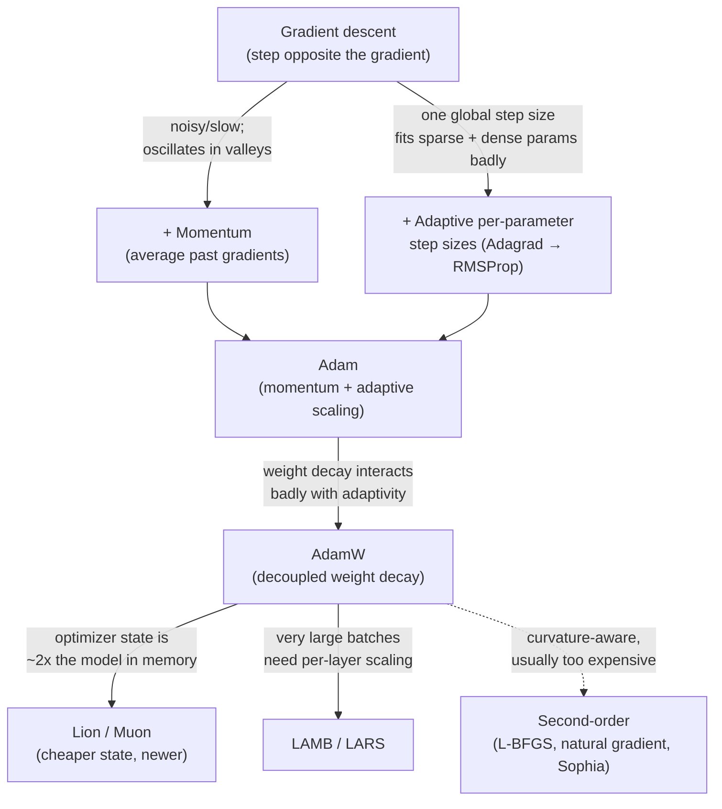

# Optimization Algorithms

Every model in this repository — from a logistic regression to a trillion-parameter mixture-of-experts model — is trained the same fundamental way: define a **loss function** (a number that measures how wrong the model's predictions are; see [loss-functions.md](loss-functions.md)), then adjust the model's parameters to make that number smaller. Optimization algorithms are the "adjust the parameters" part. This file covers that family from first principles up through what's actually used to train frontier models in 2026.

The whole family is best understood as a single idea — "step downhill on the loss" — with successive refinements bolted on to fix specific problems. The diagram below is the map for this entire file; each arrow is "…but that had a problem, so we added:".



## Gradient descent: the base case

**Definition.** Gradient descent is an iterative algorithm for minimizing a function by repeatedly stepping in the direction that decreases it fastest.

**Origin.** The method is 19th-century mathematics (Cauchy, 1847) applied to a very different problem (solving systems of equations); its use for training neural networks dates to the backpropagation-era work of the 1980s (Rumelhart, Hinton, and Williams, 1986), which gave a practical way to compute the gradient of a loss function with respect to every parameter in a multi-layer network.

**Core mechanism.** A neural network has some large vector of parameters θ (weights and biases). The loss function L(θ) tells you how badly the model performs, averaged over training examples, for a given setting of θ. The **gradient** ∇L(θ) is the vector of partial derivatives of L with respect to every parameter — it points in the direction of *steepest increase* of the loss. So to decrease the loss, you step in the opposite direction:

```
θ ← θ − η · ∇L(θ)
```

Here **η (eta)** is the **learning rate** — a small positive number controlling how big a step you take. This single line is the mechanical core of almost all of deep learning training. Everything else in this file is a refinement of it.

Walkthrough: at every step, you compute how the loss would change if you nudged each parameter slightly, then you nudge every parameter a little bit in the direction that reduces the loss, scaled by η. Too large an η and you overshoot the minimum and can diverge; too small and training crawls.

**A concrete one-step example.** It's worth grounding this in actual numbers once, since the equation hides how simple each step is. Suppose the entire "model" is a single parameter θ and the loss is L(θ) = θ² (a parabola with its minimum at θ = 0). The gradient is ∇L = 2θ. Start at θ = 5, with η = 0.1:

- Step 1: gradient = 2·5 = 10; update θ ← 5 − 0.1·10 = 4.0. Loss went from 25 to 16.
- Step 2: gradient = 2·4 = 8; update θ ← 4 − 0.1·8 = 3.2. Loss now 10.24.
- Step 3: gradient = 2·3.2 = 6.4; θ ← 3.2 − 0.64 = 2.56. Loss now 6.55.

Each step moves θ toward 0 (the minimum), and the steps automatically get *smaller* as the gradient shrinks near the bottom — you don't need to slow down manually, the gradient does it for you. Now imagine this happening not for one parameter but for billions simultaneously, each with its own partial derivative, and you have the mechanical heart of training every model in this repository. Note also what would happen with η = 1.1 instead: step 1 would give θ ← 5 − 1.1·10 = −6, *further* from the minimum than where you started — this is divergence from too large a learning rate, made concrete.

There are three variants, differing only in how much data you use to estimate ∇L before each step:

- **Batch (or "full-batch") gradient descent** computes the gradient using the *entire* training set before taking one step. This gives an exact gradient but is prohibitively slow and memory-hungry for any dataset larger than toy-sized — you can't fit a modern training set in memory at once, and you'd only get one parameter update per full pass over the data.
- **Stochastic gradient descent (SGD)** computes the gradient using a *single* randomly-chosen training example per step. This is cheap per-step and injects noise into the trajectory (which can help escape shallow local minima), but the per-step gradient estimate is very noisy, so the path to the minimum is jagged.
- **Mini-batch gradient descent** is the practical middle ground almost universally used today: compute the gradient over a small random subset (a "mini-batch," typically tens to thousands of examples) per step. This amortizes well over modern parallel hardware (GPUs/TPUs are built to do many similar multiplications at once) and gives a gradient estimate with much less noise than single-example SGD. In modern usage, "SGD" is used loosely to mean "mini-batch gradient descent, optionally with momentum" — you'll see this terminology looseness in most papers and this repository follows it, calling out true single-example SGD explicitly when the distinction matters.

**Why it mattered.** Gradient descent (and its mini-batch form) is the only optimization strategy that scales to models with billions of parameters, because it only requires local information (the gradient) rather than any global view of the loss surface (the "loss landscape" — the shape of the loss function plotted against all the parameter values; a bumpy, high-dimensional surface you're trying to find a low point in).

**Current status.** Dominant, unconditionally — not as raw SGD, but as the substrate every optimizer below builds on.

## Momentum

**Definition.** Momentum accumulates a running average of past gradients and uses that average — rather than just the current gradient — to determine the step direction.

**Origin.** Polyak (1964) in the numerical optimization literature; adapted for neural network training in the SGD-with-momentum form widely used since the 1980s-90s.

**Core mechanism.** Maintain a velocity vector v, updated each step as:

```
v ← β·v + (1 − β)·∇L(θ)
θ ← θ − η·v
```

β (beta, typically ~0.9) controls how much of the previous velocity carries over. Walkthrough: instead of reacting only to the current gradient, you keep a "memory" of recent gradient directions and blend it with the new one. If gradients keep pointing roughly the same way, velocity builds up and you move faster in that direction — like a ball rolling downhill and gaining speed. If the gradient direction flips step to step (a common pattern in narrow valleys of the loss landscape), the oscillations partially cancel out, damping the zig-zag that plain SGD exhibits in those regions.

A note on formulations, since it trips people up when they compare textbook equations to actual code: the form above (with the `(1 − β)` factor) is the *exponential-moving-average* version, where velocity is a true weighted average of past gradients. The *classical* Polyak form used by, for example, PyTorch's built-in SGD optimizer omits that factor — `v ← β·v + ∇L(θ)` — so velocity accumulates rather than averages, and the effective step size is larger by roughly a factor of 1/(1−β). The two are equivalent up to a rescaling of the learning rate, which is why both appear interchangeably in the literature; don't be thrown when the equation in a paper doesn't exactly match the one in your framework.

**Why it mattered.** Plain SGD is slow and oscillatory in loss landscapes with steep curvature in one direction and shallow curvature in another (a very common shape for neural network losses). Momentum smooths this out and speeds up convergence substantially without extra gradient computations.

**Nesterov Accelerated Gradient (NAG)** (Nesterov, 1983, adapted to deep learning training in the early 2010s) is a refinement: instead of computing the gradient at the current position, you compute it at the position you'd be at *after* applying the current velocity (a "look-ahead" gradient). This gives the optimizer a chance to correct course before overshooting, rather than after. In practice NAG gives a modest, consistent improvement over classical momentum and is a standard option in most training frameworks.

**Current status.** Momentum is not used standalone in current LLM training, but its accumulation idea is baked into Adam and everything downstream of it (see below).

## Adaptive learning rate methods

Momentum still uses the *same* learning rate η for every parameter. But in a huge network, some parameters (e.g., those tied to rare features or rarely-activated pathways) get much smaller, sparser gradient signals than others. A fixed global learning rate is a poor fit for both at once. This family of methods gives each parameter its own effective learning rate, adapted from the history of gradients it has personally received.

### Adagrad

**Origin.** Duchi, Hazan, and Singer (2011).

**Core mechanism.** Adagrad divides the learning rate for each parameter by the square root of the sum of squared past gradients for that parameter:

```
G ← G + ∇L(θ)²          (element-wise, accumulated over all steps so far)
θ ← θ − η / (√G + ε) · ∇L(θ)
```

ε (epsilon) is a tiny constant preventing division by zero. Walkthrough: parameters that have historically received large gradients get their effective step size shrunk (their G accumulates fast); parameters that rarely get large gradients keep a relatively larger effective step size. This is very good for sparse features (common in early NLP models using bag-of-words-style inputs) but has a fatal flaw for long training runs: G only grows, so the effective learning rate monotonically shrinks toward zero and training eventually stalls.

**Current status.** Superseded for deep learning by RMSProp/Adam, which fix the monotonic-decay problem. Still occasionally used for convex problems with genuinely sparse gradients.

### RMSProp

**Origin.** Introduced by Geoffrey Hinton in an unpublished 2012 Coursera lecture (a case where the "paper" is, famously, a slide deck, not a journal publication — a fact worth flagging explicitly since it's an exception to normal attribution).

**Core mechanism.** RMSProp fixes Adagrad's ever-shrinking-learning-rate problem by using an *exponential moving average* of squared gradients instead of a running sum:

```
G ← β·G + (1 − β)·∇L(θ)²
θ ← θ − η / (√G + ε) · ∇L(θ)
```

Walkthrough: because G is now a decaying average rather than an ever-growing sum, old gradients "age out" instead of permanently shrinking future steps. This keeps the adaptive-learning-rate benefit of Adagrad without the stall.

**Current status.** Rarely used directly today but is one of the two direct mathematical ancestors of Adam (below).

### Adam

**Definition.** Adam ("Adaptive Moment Estimation") combines momentum (a moving average of gradients — the "first moment") with RMSProp-style adaptive scaling (a moving average of squared gradients — the "second moment").

**Origin.** Kingma and Ba, "Adam: A Method for Stochastic Optimization" (2015 — first released as a preprint in late 2014).

**Core mechanism.**

```
m ← β₁·m + (1 − β₁)·∇L(θ)               (first moment: momentum)
v ← β₂·v + (1 − β₂)·∇L(θ)²              (second moment: RMSProp-style)
m̂ ← m / (1 − β₁ᵗ)                        (bias correction)
v̂ ← v / (1 − β₂ᵗ)                        (bias correction)
θ ← θ − η · m̂ / (√v̂ + ε)
```

Typical defaults: β₁ = 0.9, β₂ = 0.999. Walkthrough: m tracks the recent average *direction* of the gradient (momentum); v tracks the recent average *magnitude squared* of the gradient per parameter (adaptive scaling, like RMSProp). Dividing m̂ by √v̂ means: move in the smoothed gradient direction, but take smaller steps for parameters whose gradients have recently been large in magnitude (they're already changing fast, so be more careful) and larger relative steps for parameters with small, consistent gradients. The bias-correction terms (dividing by 1 − βᵗ, where t is the step count) exist because m and v are initialized at zero and are therefore biased toward zero in early steps — the correction compensates for that early-training artifact.

**The memory cost, made concrete.** Notice that Adam keeps *two* extra full-size buffers, m and v — one number each, per model parameter. This is the "optimizer state" referenced throughout this repository, and its size is easy to underestimate: for a model with N parameters trained in mixed precision, a common accounting is that the parameters themselves, their gradients, and Adam's two moment buffers together require on the order of 16 bytes per parameter (the exact figure depends on precision choices, but the key point is the multiplier). For a 70-billion-parameter model that's well over a terabyte of memory just for training state — far more than the model's own weights — which is precisely why [distributed-training.md](../05-training-methodology/distributed-training.md) spends so much effort sharding this state across devices, and why the cheaper-state optimizers below (Lion, Muon) are attractive at frontier scale.

**Why it mattered.** Adam combines the two most useful properties from the prior decade of optimizer research (directional smoothing from momentum, per-parameter scaling from RMSProp) into one optimizer that works well "out of the box" across a very wide range of architectures and problems with minimal tuning. This made it the default choice for most of the 2015-2020 deep learning boom, and its descendant (AdamW, below) remains the default for training large language models as of 2026.

**Current status.** AdamW (below) has effectively replaced plain Adam for large-scale training, but Adam is still extremely common in smaller-scale and non-LLM deep learning work.

### AdamW — decoupled weight decay

**Definition.** AdamW is Adam with weight decay (a regularization technique that shrinks weights toward zero each step, discouraging overly large parameter values — see [regularization-techniques.md](regularization-techniques.md)) applied as a *separate* step, decoupled from the gradient-based update, rather than folded into the gradient itself.

**Origin.** Loshchilov and Hutter, "Decoupled Weight Decay Regularization" (2019).

**Core mechanism.** In classic L2-regularized SGD, adding weight decay is mathematically equivalent to adding a term to the loss and is achieved by simply adding λθ to the gradient before the update. But in Adam, doing that means the weight-decay term gets divided by √v̂ along with everything else — parameters with large recent gradients get *less* weight decay, which is backwards from the intent of weight decay (it should shrink all weights toward zero at a rate independent of how noisy their gradients have been). AdamW instead applies weight decay as its own separate subtraction, outside the adaptive-scaling machinery:

```
θ ← θ − η·(m̂ / (√v̂ + ε) + λ·θ)
```

Walkthrough: the adaptive gradient step and the "shrink everything a little" step are now independent operations, so weight decay behaves the way it's supposed to (a constant proportional pull toward zero) regardless of a parameter's gradient history.

**Why it mattered.** This fixed a subtle but real bug in how Adam had been combined with regularization for years, and empirically produces noticeably better generalization (performance on data the model hasn't seen, as opposed to just memorizing training data) at negligible extra cost. This is why AdamW, not Adam, is the standard optimizer for essentially every major LLM pretraining run as of 2026.

**Current status.** Dominant. AdamW is the default optimizer choice for pretraining and fine-tuning almost every transformer-based model in production today.

## Newer optimizers: Lion, Sophia, LAMB/LARS

### Lion

**Origin.** Chen et al. (Google), "Symbolic Discovery of Optimization Algorithms" (2023) — notably, Lion was found via an automated program-search process over a large space of possible update rules, rather than derived by hand.

**Core mechanism (brief).** Lion tracks only a momentum term (no second moment/variance tracking like Adam), and instead of using the raw momentum value for the update, it uses only its *sign* (+1 or −1 per parameter), scaled by the learning rate:

```
θ ← θ − η · sign(β₁·m + (1 − β₁)·∇L(θ))
```

Walkthrough: every parameter moves by exactly the same magnitude per step (η) in the direction its momentum currently points — no per-parameter magnitude scaling at all. This is a much simpler update rule than Adam's, and uses half the optimizer state memory (no v to track), which matters at the scale of a 100B+ parameter model where optimizer state can be a large fraction of total memory.

**Current status.** Used at some organizations for large-scale training, reported to match or slightly beat AdamW on some pretraining runs at lower memory cost, but has not displaced AdamW as the default; adoption is real but still a minority relative to AdamW as of 2026.

### Sophia

**Origin.** Liu et al., "Sophia: A Scalable Stochastic Second-Order Optimizer for Language Model Pre-training" (2023).

**Core mechanism (brief).** Sophia is a lightweight approximation to a second-order method (see below) — it estimates curvature (how quickly the gradient itself is changing, i.e., roughly the diagonal of the Hessian, the matrix of second derivatives) cheaply and uses it to further adapt the per-parameter step size beyond what Adam's v term captures, with a clipping mechanism to keep the estimate stable.

**Current status.** Reported speedups over AdamW in the original paper's pretraining experiments; adoption outside the original authors' benchmarks is limited as of 2026 — treat as promising but not (yet) an industry default.

### Muon

**Origin.** Jordan et al. (2024), with subsequent scaling and refinement work through 2024-2025.

**Core mechanism (brief).** Muon is designed specifically for the 2D weight *matrices* inside a network (the large matrices in attention and feedforward layers — see [transformer-architecture.md](../03-deep-learning-architectures/transformer-architecture.md)), and treats their updates as a matrix rather than as a flat bag of independent numbers. It takes a momentum-averaged gradient and applies an **orthogonalization** step (approximated cheaply via a few iterations of a matrix polynomial, rather than an expensive exact decomposition) before using it as the update. Intuitively, this rebalances the update so that it pushes with more uniform strength across all the different "directions" the matrix can change in, rather than letting a few dominant directions absorb most of the step — which empirically lets training take more productive steps per unit of compute. Muon is typically paired with a standard optimizer like AdamW for the non-matrix parameters (embeddings, biases, normalization scales), which don't have the same 2D structure to exploit.

**Why it's worth including.** Muon is one of the first optimizers since Adam to see genuine, widely-reported traction for large-scale language model pretraining rather than remaining a benchmark curiosity — reported to improve compute efficiency at meaningful scale while also using less optimizer-state memory than Adam (it tracks only a momentum buffer for the matrices it handles). As of 2026 it represents the most credible recent challenger to AdamW's long dominance, though AdamW remains the safe default and Muon's track record is still much shorter.

**Current status.** Emerging; real and growing adoption for large-scale pretraining, but not yet the default, and still accumulating the years of broad validation AdamW has.

### LAMB and LARS — large-batch training

**Origin.** LARS: You, Gitman, and Ginsburg (2017); LAMB: You et al. (2019, applied specifically to BERT-scale pretraining).

**Core mechanism (brief).** When training with very large batch sizes (needed to use thousands of accelerators in parallel efficiently), a single global learning rate becomes a poor fit because different layers have very different weight-norm-to-gradient-norm ratios. LAMB and LARS rescale each layer's update by the ratio of that layer's parameter norm to its update norm, so that no single layer's weights change disproportionately fast relative to their own scale. LAMB specifically layers this trick on top of Adam's per-parameter adaptive scaling.

**Why it mattered.** These made it practical to scale batch sizes into the tens of thousands without training becoming unstable, which is what let organizations cut wall-clock pretraining time by parallelizing across very large accelerator clusters.

**Current status.** Standard for the largest-batch phases of large-scale pretraining; not typically used for fine-tuning or small-batch training, where AdamW remains standard.

## Learning rate schedules

The learning rate η is not usually held constant through training — nearly all modern training runs vary it over time according to a **schedule**.

- **Step decay** — drop η by a fixed factor (e.g., ×0.1) at pre-set epoch/step milestones. Simple, common in older computer-vision training recipes (see [cnn-family.md](../03-deep-learning-architectures/cnn-family.md)).
- **Cosine annealing** — smoothly decay η following a cosine curve from an initial value down to (near) zero over the course of training. Widely used for LLM pretraining because it avoids the abrupt jumps of step decay and its shape is a single, easy-to-tune parameter (total steps).
- **Linear warmup** — start η at (or near) zero and ramp it up linearly over the first portion of training (often 1-5% of total steps) before the main schedule kicks in. This matters because early in training, gradients (and Adam's variance estimates in particular) are noisy and poorly calibrated; jumping straight to a large η can cause the run to diverge before it stabilizes.
- **Warmup + decay combinations** — the standard recipe for LLM pretraining today is linear (or sometimes shorter, aggressive) warmup followed by cosine decay (or, increasingly, a simpler linear decay) to a small fraction of the peak learning rate. This combined shape — ramp up, hold or gently decay, then decay more steeply — is close to universal across major pretraining runs as of 2026.
- **Warmup-Stable-Decay (WSD)** — a newer, increasingly popular variant that warms up, then holds the learning rate at a *constant* high value for the bulk of training, then decays sharply only at the very end. Its practical appeal is that the "stable" phase produces a usable checkpoint at any point along the way (you haven't committed to a fixed total training length the way cosine annealing does, which bakes the endpoint into the curve's shape), and you can branch off a short decay phase whenever you decide to stop — convenient when the final training budget isn't fixed in advance, and when you want to run and evaluate multiple candidate stopping points from one long stable run.

A quick intuition for *why* schedules matter at all: the learning rate controls a tension between exploration and settling. Early on, you want relatively large steps to move quickly across the loss landscape toward a good region (but not so large you diverge — hence warmup easing you in). Late in training, you want small steps to settle precisely into a good minimum rather than bouncing around it (hence decay). The various schedules are just different-shaped answers to "how fast should I transition from the first regime to the second?"

## Gradient clipping

**Definition.** Gradient clipping caps the magnitude of the gradient (or of each parameter's gradient) before applying an update, preventing any single step from being too large.

**Why it matters.** Deep networks — especially recurrent ones (see [rnn-lstm-gru.md](../03-deep-learning-architectures/rnn-lstm-gru.md)) and large transformers early in training — can occasionally produce a gradient with enormous magnitude (a "gradient explosion" — the gradient's scale blows up multiplicatively as it's backpropagated through many layers or time steps, in contrast to the opposite failure mode, "vanishing gradients," where the scale shrinks toward zero instead). An enormous, un-clipped gradient can cause a single catastrophic update that destabilizes or destroys days of training progress. **Gradient norm clipping** — the standard approach — rescales the entire gradient vector so its overall norm (length) never exceeds a fixed threshold, preserving direction but capping magnitude. This is now a near-universal safety mechanism in LLM pretraining, applied every step regardless of whether an explosion is currently happening.

## Second-order methods: L-BFGS and natural gradient

**Definition.** Second-order optimization methods use curvature information (the Hessian, or an approximation to it) to take smarter, curvature-aware steps, rather than relying purely on the first-derivative gradient.

**L-BFGS** (Limited-memory Broyden–Fletcher–Goldfarb–Shanno, a classic numerical-optimization algorithm predating deep learning) approximates the (inverse) Hessian using a limited history of past gradients, giving a step direction that accounts for how curved the loss surface is, not just how steep. **Natural gradient descent** (Amari, 1998) instead rescales the gradient step using the Fisher information matrix, which accounts for the geometry of the model's *output distribution* rather than raw parameter space — a more principled but far more expensive notion of "steepest descent."

**Why they're rarely used at LLM scale.** Both methods require computing, storing, or approximating something related to a matrix that is, in the limit, the size of (number of parameters)² — utterly infeasible to materialize even approximately for a network with billions of parameters. Even the "limited-memory" approximations that make these methods practical for small/medium models don't scale to modern LLM parameter counts, and the stochasticity of mini-batch training makes precise curvature estimates unreliable anyway. First-order adaptive methods (Adam/AdamW) get "enough" curvature-awareness cheaply through their per-parameter variance tracking, which is why they've won at scale despite being theoretically less sophisticated.

## Summary table

| Algorithm | Year | Key Innovation | Still Relevant (2026)? |
|---|---|---|---|
| (Batch/mini-batch) Gradient Descent | 1847 / 1986 (NN use) | Base iterative minimization using local gradients | Yes — universal substrate |
| Momentum / NAG | 1964 / 1983 | Smooths trajectory using gradient history | Component of Adam; rare standalone |
| Adagrad | 2011 | Per-parameter adaptive learning rate | Superseded (monotonic decay flaw) |
| RMSProp | 2012 | Decaying-average adaptive scaling (fixes Adagrad) | Rare standalone; ancestor of Adam |
| Adam | 2015 | Momentum + RMSProp-style scaling combined | Common, esp. outside LLM pretraining |
| AdamW | 2019 | Decoupled weight decay from adaptive gradient step | Dominant default for LLM training |
| Lion | 2023 | Sign-based update, half the optimizer memory of Adam | Real but minority adoption |
| Sophia | 2023 | Lightweight second-order curvature estimate | Promising, limited adoption |
| Muon | 2024 | Orthogonalized matrix-aware updates, less state than Adam | Emerging; most credible recent AdamW challenger |
| LAMB / LARS | 2017 / 2019 | Layer-wise learning rate rescaling for large batches | Standard for large-batch pretraining phases |
| L-BFGS / Natural Gradient | Pre-deep-learning | True second-order/curvature-aware steps | Rare at scale — cost is prohibitive |

## Relationship to other algorithms

- Every optimizer here is used to minimize a loss function defined in [loss-functions.md](loss-functions.md).
- Weight decay (used in AdamW) is a regularization technique — see [regularization-techniques.md](regularization-techniques.md) for the distinction between classic L2 regularization and decoupled weight decay in adaptive optimizers, discussed there in more depth.
- LAMB/LARS large-batch training connects directly to [distributed-training.md](../05-training-methodology/distributed-training.md), which covers *why* large batches are needed (to use many accelerators in parallel) as opposed to *how* to make them stable (this file's concern).
- Gradient clipping is especially relevant to recurrent architectures — see [rnn-lstm-gru.md](../03-deep-learning-architectures/rnn-lstm-gru.md) for the vanishing/exploding gradient problem in its original, most acute context.

## Sources

- Cauchy, "Méthode générale pour la résolution des systèmes d'équations simultanées" (1847)
- Rumelhart, Hinton, Williams, "Learning representations by back-propagating errors" (1986)
- Polyak, "Some methods of speeding up the convergence of iteration methods" (1964)
- Nesterov, "A method for solving the convex programming problem with convergence rate O(1/k²)" (1983)
- Duchi, Hazan, Singer, "Adaptive Subgradient Methods for Online Learning and Stochastic Optimization" (2011)
- Hinton, RMSProp, Coursera Neural Networks lecture (2012, unpublished slides — widely cited by convention)
- Kingma, Ba, "Adam: A Method for Stochastic Optimization" (2014/2015)
- Loshchilov, Hutter, "Decoupled Weight Decay Regularization" (2019)
- Chen et al., "Symbolic Discovery of Optimization Algorithms" (2023) [Lion]
- Liu et al., "Sophia: A Scalable Stochastic Second-Order Optimizer for Language Model Pre-training" (2023)
- Jordan et al., "Muon: An optimizer for the hidden layers of neural networks" (2024) [Muon; reported and refined in subsequent scaling work]
- You, Gitman, Ginsburg, "Large Batch Training of Convolutional Networks" (2017) [LARS]
- You et al., "Large Batch Optimization for Deep Learning: Training BERT in 76 minutes" (2019) [LAMB]
- Amari, "Natural Gradient Works Efficiently in Learning" (1998)
