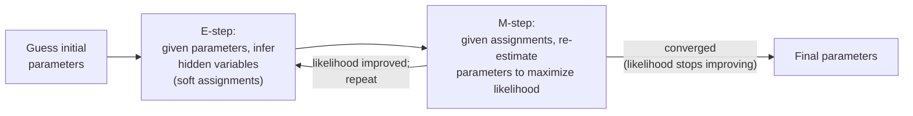

# Probabilistic Models

This file covers classical models that explicitly represent uncertainty via probability distributions, and the general algorithm (Expectation-Maximization) used to fit many of them from data with unobserved (hidden) structure. These ideas recur conceptually in modern deep generative models — most directly in VAEs (see [vaes.md](../04-generative-models/vaes.md)).

## Naive Bayes (cross-reference)

Naive Bayes is covered in depth in [supervised-learning.md](supervised-learning.md), since it's most commonly used and taught as a classifier. It's worth noting here that it belongs equally to this file's family: it's a fully probabilistic model that explicitly models P(features | class) and combines it with Bayes' rule, rather than directly learning a decision boundary the way logistic regression or SVMs do.

## Hidden Markov Models (HMMs)

**Name & definition.** A Hidden Markov Model models a sequence of observations as being generated by an underlying sequence of hidden (unobserved) states, where each state depends only on the previous state (the **Markov property** — the future depends on the past only through the present, not the full history) and each observation depends only on the current hidden state.

**Origin.** The mathematical theory dates to Baum and colleagues in the late 1960s-70s; HMMs became widely known in ML/NLP through their dominant use in speech recognition from the 1980s onward.

**Core mechanism.** An HMM is defined by: a set of possible hidden states; a **transition probability** matrix (probability of moving from each state to each other state at each time step); an **emission probability** distribution (probability of observing each possible output given the current hidden state); and an initial state distribution. Three classic problems are solved with specific algorithms: computing the probability of an observed sequence (the forward algorithm), finding the most likely hidden state sequence given observations (the Viterbi algorithm, a dynamic-programming approach), and learning the transition/emission probabilities from data (via Baum-Welch, a specific instance of the EM algorithm below).

Walkthrough: imagine trying to guess the weather (hidden state: sunny or rainy) purely from observing whether a friend carries an umbrella each day (the observation). You don't see the weather directly, but you know rainy days are more likely to follow rainy days (a transition probability) and umbrellas are more likely on rainy days (an emission probability). An HMM formalizes exactly this kind of reasoning and gives algorithms for both inferring the hidden sequence and learning the probabilities from historical data.

**Why it mattered.** HMMs were the dominant approach to speech recognition and a major approach to part-of-speech tagging and other sequence-labeling tasks in NLP for decades, because they gave a principled, tractable way to reason about sequences with hidden structure using relatively little data and compute.

**Current status.** Almost entirely superseded by deep learning for speech recognition and sequence labeling (RNNs/LSTMs, and now transformers — see [rnn-lstm-gru.md](../03-deep-learning-architectures/rnn-lstm-gru.md) and [transformer-architecture.md](../03-deep-learning-architectures/transformer-architecture.md)), which can model much richer, longer-range dependencies than an HMM's strict Markov (memoryless-beyond-one-step) assumption allows. HMMs remain used in some lower-resource settings, bioinformatics (e.g., gene-sequence modeling), and other niches where their data-efficiency and interpretability are valued over raw accuracy.

## Gaussian Mixture Models (GMMs)

**Name & definition.** A Gaussian Mixture Model represents a probability distribution as a weighted combination of several Gaussian (normal, "bell curve") distributions, each with its own mean and variance.

**Core mechanism.** A GMM assumes the data was generated by first randomly picking one of k Gaussian components (according to a set of mixture weights that sum to 1), then drawing a sample from that component's distribution. Fitting a GMM to data means finding the component means, variances, and mixture weights that best explain the observed data — but since you don't observe *which* component generated each point, this is exactly the kind of hidden-structure problem the EM algorithm (below) was designed for.

**Why it mattered.** GMMs generalize k-means (see [unsupervised-learning.md](unsupervised-learning.md)) in two important ways: clusters can be elongated/elliptical rather than forced to be spherical (because each Gaussian component has its own covariance structure, not just a single center point), and cluster assignment is "soft" (each point gets a probability of belonging to each cluster, rather than a single hard assignment) rather than the hard, all-or-nothing assignment k-means uses.

**Current status.** Still used for density estimation and soft clustering tasks, especially when the underlying assumption of roughly Gaussian-shaped clusters is reasonable; less commonly reached for than k-means for quick clustering, and generally displaced by deep generative models (see [04-generative-models](../04-generative-models/)) for modeling complex, high-dimensional data distributions like images.

## The Expectation-Maximization (EM) algorithm

**Name & definition.** EM is a general iterative algorithm for finding maximum-likelihood parameter estimates when the model involves hidden/unobserved variables (like "which Gaussian component generated this point" in a GMM, or "what was the hidden state at this time step" in an HMM).

**Origin.** Dempster, Laird, Rubin, "Maximum Likelihood from Incomplete Data via the EM Algorithm" (1977) — the paper that formalized and named the general technique, though specific instances (like Baum-Welch for HMMs) predate it.

**Core mechanism.** EM alternates between two steps until convergence:

- **E-step (Expectation):** given the model's current parameters, compute the expected value of the hidden variables (e.g., for a GMM, compute the probability that each data point belongs to each Gaussian component, given the current component parameters).
- **M-step (Maximization):** given those expected hidden-variable values, re-estimate the model's parameters to maximize the likelihood of the observed data (e.g., recompute each Gaussian component's mean and variance using the points, weighted by their E-step membership probabilities).

Walkthrough: this is the same chicken-and-egg pattern seen in k-means (in fact, k-means is a simplified, "hard-assignment" special case of EM applied to a restricted GMM) — you can't know the hidden assignments without knowing the parameters, and you can't estimate the parameters without knowing the assignments, so you alternate, and each full E-M cycle is guaranteed to never decrease the likelihood of the observed data (though it can get stuck in a local optimum, so multiple random initializations are common practice, exactly as with k-means). The one-sentence version to remember: **EM is "guess, then improve one half at a time, forever until it stops improving."** The reason it can never make the likelihood worse is that each half-step is itself a maximization holding the other half fixed — so the only directions it can move are flat or uphill. That guarantee is EM's whole appeal: no learning rate to tune, no risk of a step overshooting and diverging the way gradient descent can.

**Why it mattered.** EM provided a general-purpose recipe applicable to an entire family of "hidden structure" problems (GMMs, HMMs, and many others) rather than requiring a bespoke derivation for each one, and its core idea — alternate between inferring hidden structure and optimizing parameters given that inferred structure — recurs conceptually in the variational inference machinery behind VAEs (see [vaes.md](../04-generative-models/vaes.md)), even though VAEs use gradient-based optimization rather than EM's exact alternating steps.

**Current status.** Still used directly to fit GMMs and HMMs; conceptually foundational to the broader field of probabilistic graphical models and variational inference, even where the exact EM recipe isn't used verbatim.

## Bayesian networks (concept level)

**Name & definition.** A Bayesian network is a graph-based representation of a joint probability distribution over many variables, where each variable is a node, and directed edges represent direct probabilistic dependencies — each node's distribution depends only on its direct "parent" nodes in the graph, not on every other variable.

**Why this matters, conceptually.** Representing a joint distribution over many variables naively requires a probability table whose size grows exponentially with the number of variables — utterly infeasible beyond a handful of variables. A Bayesian network's graph structure encodes *which* variables actually influence each other directly, letting you factor the full joint distribution into a much smaller product of local, per-node conditional distributions (each node's distribution given only its parents). This is the same fundamental idea underlying an HMM (which is, in fact, a particular kind of Bayesian network: a chain where each hidden state depends only on the previous one, and each observation depends only on its corresponding hidden state).

**Current status.** Bayesian networks remain used in specific domains where interpretable, explicit causal/probabilistic structure matters — medical diagnosis systems, some risk-modeling and expert systems — but the general graphical-model inference machinery (belief propagation and related exact/approximate inference algorithms) is a specialized subfield this repository treats at concept level only, since a full treatment requires graduate-level probabilistic graphical model theory beyond this repository's audience calibration (see [scope-and-methodology.md](../00-overview/scope-and-methodology.md)).

## Comparison table

| Model | Represents | Fit via | Modern status |
|---|---|---|---|
| Naive Bayes | P(features \| class) with independence assumption | Closed-form counting | Lightweight baseline (see [supervised-learning.md](supervised-learning.md)) |
| HMM | Sequences with hidden Markov state | Baum-Welch (an EM instance) | Superseded by RNNs/transformers for most sequence tasks |
| GMM | Multi-modal continuous distributions | EM | Used for density estimation/soft clustering; niche vs. deep generative models |
| Bayesian network | General factored joint distribution via a graph | Varies (structure + parameter learning) | Domain-specific (diagnosis, risk modeling); concept-level here |

## Relationship to other algorithms

- k-means (see [unsupervised-learning.md](unsupervised-learning.md)) is a hard-assignment special case of EM applied to a GMM.
- HMMs are a specific kind of Bayesian network, and are the direct conceptual predecessor that sequence models like RNNs/LSTMs (see [rnn-lstm-gru.md](../03-deep-learning-architectures/rnn-lstm-gru.md)) displaced for most practical sequence modeling.
- The EM algorithm's alternating-optimization idea is a conceptual ancestor of the variational inference used to train VAEs (see [vaes.md](../04-generative-models/vaes.md)).

## Sources

- Baum, Petrie, Soules, Weiss, "A Maximization Technique Occurring in the Statistical Analysis of Probabilistic Functions of Markov Chains" (1970) [Baum-Welch/HMM theory]
- Dempster, Laird, Rubin, "Maximum Likelihood from Incomplete Data via the EM Algorithm" (1977)
- Rabiner, "A Tutorial on Hidden Markov Models and Selected Applications in Speech Recognition" (1989) — widely cited applied reference for HMMs in speech
- Pearl, "Probabilistic Reasoning in Intelligent Systems" (1988) [Bayesian networks]
