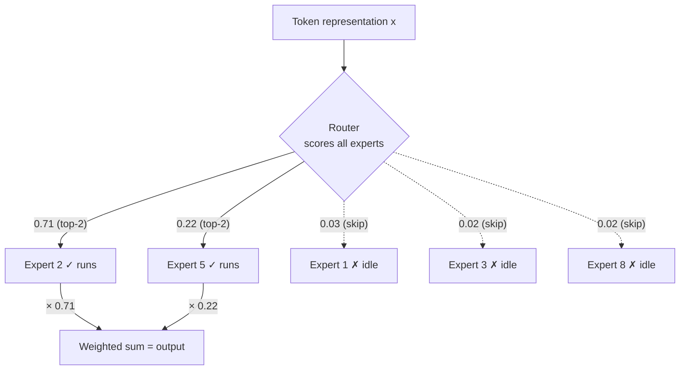

# Mixture of Experts

Mixture of Experts (MoE) is an architectural pattern that decouples a model's total parameter count from the compute cost of processing a single token — letting a model have far more parameters than it actually uses for any given input. It's the second major deviation (after RoPE-style positional encoding) that most frontier LLMs have made from the original 2017 Transformer, and understanding it requires the Transformer background from [transformer-architecture.md](transformer-architecture.md).

## The motivation: decoupling parameters from compute

**The problem.** In a standard ("dense") Transformer, every parameter is used to process every token — doubling the model's parameter count roughly doubles the compute (measured in floating-point operations, or FLOPs) required to process each token, both during training and at inference. This is a rigid coupling: you can't get "more knowledge capacity" without also paying "more compute per token," even though intuitively, a lot of what a very large model "knows" might only be relevant to a small fraction of its inputs (specialized facts, specific languages, particular domains).

**The MoE idea.** Replace a single, dense feedforward sub-layer within a Transformer block (see [transformer-architecture.md](transformer-architecture.md)) with many parallel feedforward sub-networks — called **experts** — plus a small **router** (or "gate") network that, for each token, selects only a small subset of the experts (commonly 1-2 out of dozens or more) to actually process that token. The rest of the experts are skipped entirely for that token, so their parameters exist (contributing to total model size and memory footprint) but contribute no compute cost for that particular token.

Walkthrough with a concrete illustration: imagine a model with 8 experts per MoE layer, each the same size as a normal feedforward sub-layer, but the router only activates 2 experts per token. Total parameter count for that layer is roughly 8× a dense layer's, but the compute cost per token is only roughly 2× — you get a model with much greater total capacity ("knowledge" spread across many experts) without a proportional increase in the compute needed to process each token. This is the core value proposition of MoE: more parameters (and, empirically, often better quality) at a compute cost much closer to that of a smaller dense model.

## Routing mechanisms: top-k gating

**Core mechanism.** The router is typically a simple linear layer that takes a token's hidden representation and produces a score for each expert; a softmax (or a simpler normalization) converts these into weights, and only the top-k highest-scoring experts are actually run, with their outputs combined (weighted by their router scores) into the layer's final output for that token.

```
scores = x · W_router
top_k_experts, weights = TopK(softmax(scores), k)
output = Σ_{i in top_k_experts} weights_i · Expert_i(x)
```



Walkthrough: for each token, the router effectively asks "which of my experts are most relevant to this specific input?" and only pays the compute cost of running those (the solid arrows above — say experts 2 and 5); the rest sit idle for this token (dashed arrows). Because this decision is made per-token (not per-sequence or per-batch), different tokens in the same sequence can be routed to entirely different experts — a natural fit for the intuition that different kinds of content (say, code vs. prose, or different languages) might benefit from specialized sub-networks. The crucial accounting: with 8 experts and top-2 routing, the model has ~8× the parameters of a single-expert layer but only pays ~2× the per-token compute, because 6 of the 8 experts are skipped for any given token. That gap between "parameters you have" and "compute you pay per token" is the entire reason MoE exists.

## Load balancing losses

**The problem this solves.** Left unconstrained, a router trained purely to minimize the model's main loss can easily collapse into using only a small handful of "favorite" experts for almost everything, leaving most experts chronically under-trained and wasting the whole point of having many experts in the first place — a classic rich-get-richer dynamic, since an expert that's used more gets more gradient signal and becomes even more attractive to the router.

**Core mechanism.** An auxiliary **load balancing loss** is added to the training objective, penalizing the router for sending too many tokens to too few experts — typically formulated to encourage the fraction of tokens routed to each expert to be roughly equal across a batch. This loss is added to (not replacing) the main task loss, with a small weighting coefficient, so it nudges routing behavior toward balance without dominating the model's primary training signal.

**Why it mattered.** Without load balancing, MoE training is empirically unstable and prone to exactly the expert-collapse failure mode described above; load balancing losses are a near-universal component of practical MoE training recipes.

## Switch Transformer

**Origin.** Fedus, Zoph, Shazeer (Google), "Switch Transformer: Scaling to Trillion Parameter Models with Simple and Efficient Sparsity" (2021), building on earlier sparsely-gated MoE work for LSTMs (Shazeer et al., 2017).

**Core contribution.** Switch Transformer simplified routing to the extreme: top-1 routing (each token goes to exactly one expert, rather than a blend of several), which the authors showed could still train stably (with appropriate load balancing and other stabilization tricks) while being simpler and more compute-efficient than the top-2-or-more routing common in earlier MoE work. This simplification was a key step in making MoE practical at very large scale.

**Why it mattered.** Switch Transformer demonstrated that MoE architectures could scale to previously unprecedented total parameter counts (into the trillions, at the time a striking figure) while keeping per-token compute costs manageable, directly validating the MoE approach as a viable path to larger models without proportionally larger compute budgets.

## GShard

**Origin.** Lepikhin et al. (Google), "GShard: Scaling Giant Models with Conditional Computation and Automatic Sharding" (2020).

**Core contribution.** GShard's main contribution was less about the routing algorithm itself and more about the distributed-systems engineering needed to actually train MoE models at scale: automatically sharding (splitting) different experts across many accelerator devices, and efficiently routing tokens to whichever device holds their assigned expert — solving the practical problem that with enough experts, no single accelerator can hold them all.

**Why it mattered.** GShard's sharding techniques are foundational infrastructure underlying essentially all large-scale MoE training since, connecting directly to the distributed training techniques in [distributed-training.md](../05-training-methodology/distributed-training.md).

## Mixtral

**Origin.** Mistral AI, "Mixtral of Experts" (2024, following an initial open-weight release in late 2023).

**Core contribution.** Mixtral was a prominent, widely-used open-weight demonstration that MoE architectures (specifically, top-2 routing among 8 experts per layer in the original Mixtral 8x7B) could achieve strong performance relative to their active-compute cost, making the accuracy-per-inference-FLOP benefits of MoE tangible and reproducible outside the largest closed labs.

**Why it mattered.** Mixtral's open release meaningfully broadened practical, hands-on understanding and adoption of MoE architectures across the wider research and open-source community, beyond the handful of large labs that had published MoE research earlier.

### Fine-grained and shared experts (the 2024+ refinement)

More recent open-weight MoE models (the DeepSeek-MoE line being a widely-cited example) refined the basic design in two ways worth knowing for a current picture. First, **fine-grained experts**: instead of a few large experts, use many *smaller* ones and route to more of them per token (e.g., 8-of-64 rather than 2-of-8). The reasoning is combinatorial — with more, smaller experts, the number of possible expert *combinations* a token can be routed to grows enormously, giving the model finer-grained specialization for the same active parameter count. Second, **shared experts**: designate one or a few experts that *every* token always goes through, in addition to its routed experts. The shared expert absorbs the common, general-purpose computation every token needs (so the routed experts don't each have to redundantly relearn it), letting them specialize more cleanly. This fine-grained-plus-shared pattern has become a common template for high-efficiency MoE designs as of 2026, and is a good example of the incremental architectural refinement the field has continued to do on top of the basic Switch/Mixtral idea.

## Current frontier usage patterns

As of 2026, MoE architectures are used by multiple frontier labs for their largest general-purpose models — the accuracy-per-compute benefits of sparsity become increasingly attractive as target model scale grows, since MoE offers a way to keep growing total capacity without a proportional growth in the (very expensive, at frontier scale) compute needed to serve every token. That said, MoE is not a universal default: dense models remain common for smaller-scale and latency-sensitive deployments, since MoE introduces real additional complexity — the routing/load-balancing machinery, the distributed-systems complexity of sharding experts across devices (see [distributed-training.md](../05-training-methodology/distributed-training.md)), and a memory footprint (all experts must be loadable, even though only a few run per token) that doesn't shrink just because per-token compute does, which matters for serving cost (see [serving-and-batching.md](../06-inference-optimization/serving-and-batching.md)).

## Strengths & limitations

- Strengths: substantially better accuracy-per-compute-FLOP at very large scale; total model "knowledge capacity" can grow largely independent of per-token inference cost; empirically effective at frontier scale across multiple labs' publicly known architectures.
- Limitations: full model memory footprint stays large (all experts must be resident somewhere, even if unused per-token), which matters for deployment cost even when compute cost is favorable; training is less stable and more complex than dense models (routing collapse, load balancing tuning); distributed serving/training infrastructure is meaningfully more complex than for dense models; routing decisions are somewhat opaque/hard to interpret.

## Comparison table

| System | Year | Key Innovation | Still Relevant (2026)? |
|---|---|---|---|
| Sparsely-gated MoE (LSTM-based) | 2017 | Original top-k expert routing concept | Historical — superseded by Transformer MoE |
| GShard | 2020 | Automatic expert sharding across devices | Yes — foundational distributed-training technique |
| Switch Transformer | 2021 | Simplified top-1 routing, trillion-parameter scale | Yes — routing-simplicity lineage still influential |
| Mixtral | 2023-2024 | Strong open-weight top-2 MoE demonstration | Yes — widely used/referenced open-weight MoE |

## Relationship to other algorithms

- MoE replaces the dense feedforward sub-layer inside a Transformer block — see [transformer-architecture.md](transformer-architecture.md) for that block's full structure.
- Expert sharding across devices is a specific application of the model/tensor parallelism techniques covered in [distributed-training.md](../05-training-methodology/distributed-training.md).
- MoE's memory-footprint-vs-compute tradeoff is directly relevant to [serving-and-batching.md](../06-inference-optimization/serving-and-batching.md) and [quantization.md](../06-inference-optimization/quantization.md), both of which address the cost of deploying very large models.

## Sources

- Shazeer et al., "Outrageously Large Neural Networks: The Sparsely-Gated Mixture-of-Experts Layer" (2017)
- Lepikhin et al., "GShard: Scaling Giant Models with Conditional Computation and Automatic Sharding" (2020)
- Fedus, Zoph, Shazeer, "Switch Transformer: Scaling to Trillion Parameter Models with Simple and Efficient Sparsity" (2021)
- Mistral AI, "Mixtral of Experts" (2024)
