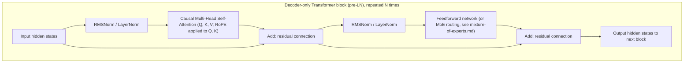

# Transformer Architecture

This is the cornerstone file of the repository. Nearly every large model discussed elsewhere — every LLM in [rlhf-and-alignment.md](../05-training-methodology/rlhf-and-alignment.md), every generative model in [04-generative-models](../04-generative-models/) that touches text or increasingly images/video/audio, and most of the inference-optimization techniques in [06-inference-optimization](../06-inference-optimization/) — is a Transformer or a direct adaptation of one. This file builds the mechanism up from first principles: self-attention, then multi-head attention, then positional encoding, then the three major layout variants (encoder-decoder, encoder-only, decoder-only), the pre-LN vs. post-LN debate, the historical lineage from the original 2017 paper to today's frontier models, and the scaling laws that connect architecture choices to compute and data budgets.

## Why attention needed to exist

As covered in [rnn-lstm-gru.md](rnn-lstm-gru.md), Bahdanau/Luong attention let a seq2seq decoder look back at every encoder position instead of relying on a single bottleneck vector. But the encoder and decoder in that setup were still RNNs — processing their sequences one token at a time, with each step depending on the previous one. This has two consequences worth naming explicitly: it's inherently sequential (you can't compute time step 50 until you've computed time step 49), which limits how well it parallelizes on hardware built to do many independent computations at once (GPUs/TPUs); and it still suffers from the vanishing-gradient-over-distance problem, since information about a token far in the past has to flow through many sequential hidden-state updates to affect a token far in the future. The Transformer's central idea is to keep the attention mechanism but throw away the recurrence entirely — process the whole sequence at once, and let attention itself (not a recurrent hidden state) carry information between positions.

## Self-attention, built up step by step

**The goal.** For each position in a sequence, produce a new representation that incorporates relevant information from every other position — dynamically, based on content, not a fixed pattern.

**Queries, keys, and values, from first principles.** For each input position (e.g., a token's embedding vector — see the glossary for "embedding"), the model computes three different vectors by multiplying that position's input vector by three separate learned weight matrices:

```
q = x · W_Q      (query)
k = x · W_K      (key)
v = x · W_V      (value)
```

Walkthrough with an intuitive analogy: think of this like a soft, differentiable lookup in a dictionary. The **query** represents "what am I currently looking for," computed from the current position. The **key** represents "what do I contain / advertise," computed from every position (including the current one). The **value** represents "what information do I actually offer if you attend to me," also computed from every position. To decide how much a given position should attend to every other position, you compare that position's query against every position's key (via a dot product — a similarity measure: two vectors pointing in similar directions have a large dot product); this comparison, after some normalization, produces a set of attention weights, and the position's new representation is the weighted sum of every position's *value* vector, using those weights.

The critical thing to notice: unlike a CNN filter (fixed weights, same computation regardless of content — see [cnn-family.md](cnn-family.md)) or an RNN's fixed recurrence, the "weights" used to combine information here — the attention weights — are computed dynamically from the actual content of the sequence at inference/training time, not fixed in advance. This is what makes attention a **content-based** mechanism rather than a **position-based** one (though positional encoding, covered below, adds position information back in, since raw attention has no inherent notion of order at all).

## Scaled dot-product attention

**The equation.**

```
Attention(Q, K, V) = softmax(Q·Kᵀ / √d_k) · V
```

Walkthrough, term by term:
- Q, K, V are matrices — one query/key/value vector per position in the sequence, stacked into rows.
- Q·Kᵀ computes the dot product of every query against every key, producing a matrix of raw similarity scores (one row per query position, one column per key position — an n×n matrix for a sequence of length n).
- Dividing by √d_k (the square root of the key vectors' dimensionality) is the "scaled" part. Without this scaling, as d_k grows, the dot products tend to grow large in magnitude (since they're sums of d_k individual products), which pushes the subsequent softmax into a regime where its gradient becomes very small (a saturated softmax — nearly all its probability mass concentrated on one entry, with tiny gradients everywhere) and hurts training stability. Dividing by √d_k keeps the dot products in a well-behaved range regardless of dimensionality.
- softmax converts each row of raw scores into a valid probability distribution (summing to 1) — see [loss-functions.md](../01-foundations/loss-functions.md) for the softmax mechanics.
- Multiplying by V takes, for each query position, a weighted sum of every position's value vector, using that query's attention-weight row as the weights.

The net effect: every position's new representation is a content-dependent blend of every other position's information, with the blending weights determined by how relevant each other position's key is to this position's query.

**The data flow, as a picture.** For a single query position attending over a 3-token sequence:

```
                 ┌──────── keys ────────┐
   query q ──┬──►  k₁      k₂      k₃
             │    (dot)   (dot)   (dot)      ← q·kᵢ : "how relevant is each position to me?"
             │      │       │       │
             │   ÷√d_k    ÷√d_k   ÷√d_k       ← scale down
             │      └───────┼───────┘
             │           softmax               ← turn scores into weights that sum to 1
             │         w₁   w₂   w₃            e.g.  0.1  0.7  0.2
             │          │    │    │
   values ───┼──►  v₁   v₂   v₃                ← each position also offers a value vector
             │       ×0.1 ×0.7 ×0.2
             └────────►  Σ  = output           ← weighted sum: 0.1·v₁ + 0.7·v₂ + 0.2·v₃
```

**A tiny worked example, so "weighted sum of values" is concrete.** Suppose after computing and scaling the dot products, one query's three scores are [1.0, 3.0, 1.0]. Softmax turns these into weights ≈ [0.11, 0.79, 0.11] (the middle position dominates because its score was highest). If the three value vectors happen to be v₁ = [2, 0], v₂ = [0, 4], v₃ = [1, 1], the output for this query is 0.11·[2,0] + 0.79·[0,4] + 0.11·[1,1] ≈ [0.33, 3.28] — overwhelmingly shaped by v₂, because the query found position 2 most relevant. That is the entire mechanism: relevance scores become weights, weights blend the values. Everything else in a Transformer is bookkeeping around this operation.

**Causal masking (brief preview).** For decoder-only, autoregressive generation (see [autoregressive-generation.md](../04-generative-models/autoregressive-generation.md)), each position must only be allowed to attend to *earlier* positions (it shouldn't get to "see the future" it's supposed to be predicting). This is implemented simply by setting the raw attention scores for any position-pair where the key position comes after the query position to negative infinity before the softmax — softmax then assigns those positions exactly zero weight.

**A clarification that resolves a very common confusion.** "Process the whole sequence at once" is true during *training* (and during the "prefill" of a prompt at inference), where all positions and their correct next-tokens are known up front, so the whole n×n attention matrix can be computed in one parallel pass — this parallelism is the Transformer's headline advantage over RNNs. But during *generation*, the model still produces tokens strictly one at a time (it can't compute token 51 before it has decided token 50, because token 50 becomes part of token 51's input). Attention removes the *training-time* sequential bottleneck, not the fundamental left-to-right nature of generating text. This distinction is exactly why the KV cache (see [kv-cache-and-attention-optimization.md](../06-inference-optimization/kv-cache-and-attention-optimization.md)) exists — it stores the keys and values from already-generated tokens so they don't have to be recomputed on every one of those sequential generation steps.

## Multi-head attention

**The idea.** Rather than computing a single attention pattern, split Q, K, V into several smaller "heads," each with its own independently-learned W_Q, W_K, W_V projections, run scaled dot-product attention separately within each head, and concatenate the results back together (followed by one more learned linear projection).

```
head_i = Attention(Q·W_Q_i, K·W_K_i, V·W_V_i)
MultiHead(Q, K, V) = Concat(head_1, ..., head_h) · W_O
```

Walkthrough: a single attention head can only really express one "type" of relevance pattern well at a time (e.g., "attend to the subject of the sentence"). Multiple heads let the model simultaneously track several different kinds of relationships in parallel — one head might learn to track syntactic dependencies (like subject-verb agreement), another might track coreference (which pronoun refers to which noun), another might attend mostly to nearby positions, and so on — each within its own lower-dimensional subspace, then combine all these perspectives together via the final W_O projection. This is analogous to how a CNN layer learns many different filters in parallel rather than just one (see [cnn-family.md](cnn-family.md)), giving the layer more representational capacity for a similar total computational budget.

## The feedforward sub-layer (the other half of the block)

It's easy to read this far and conclude a Transformer "is attention," but that's only half the block — and, by parameter count, usually the smaller half. Every Transformer block is **attention followed by a position-wise feedforward network (FFN)**, and the FFN typically holds roughly two-thirds of the block's parameters and a comparable share of its compute.

**What it is.** The FFN is a small two-layer neural network applied *independently and identically to each position* (the same weights for every token): it projects each position's vector up to a much larger hidden dimension (commonly 4× the model's width), applies a nonlinearity, and projects back down.

```
FFN(x) = W₂ · nonlinearity(W₁ · x + b₁) + b₂
```

**The division of labor.** A useful (if simplified) mental model: attention is where tokens *mix and exchange* information across positions ("what should I pay attention to elsewhere?"), while the FFN is where each token *processes and transforms* the information it has gathered, in isolation ("now that I've gathered context, what do I make of it?"). Attention moves information between positions; the FFN does per-position computation on it. This matters for the rest of the repository: the FFN is the sub-layer that Mixture-of-Experts replaces with many parallel experts (see [mixture-of-experts.md](mixture-of-experts.md) — MoE is fundamentally "swap the one FFN for many, and route each token to a few"), and a good deal of interpretability research (see [open-problems.md](../09-roadmaps/open-problems.md)) suggests much of a model's stored factual "knowledge" lives in these FFN weights rather than in the attention layers.

**The nonlinearity.** Early Transformers used ReLU (see [cnn-family.md](cnn-family.md)); most modern LLMs use a smoother gated variant such as GELU or, very commonly, SwiGLU (a gated unit where one linear projection modulates another). The differences are incremental — the point is that this nonlinearity is what lets the network represent something more expressive than a single big linear map.

## Positional encoding

**The problem.** Self-attention, as described above, is fundamentally **permutation-equivariant** — if you shuffled the order of the input positions, the computed outputs would just be shuffled the same way, with no other change (equivariant means "permute the input, and the output permutes identically"; this is subtly different from permutation-*invariant*, which would mean the output doesn't change at all). Either way, the consequence is the same and it's a problem: attention has no built-in notion of *order*, and word order obviously matters ("dog bites man" ≠ "man bites dog"). Some explicit signal about position needs to be injected.

**Sinusoidal positional encoding** (used in the original 2017 Transformer). A fixed (not learned) vector is added to each position's input embedding, where each dimension of that vector is a sine or cosine function of the position, at a different frequency per dimension:

```
PE(pos, 2i)   = sin(pos / 10000^(2i/d))
PE(pos, 2i+1) = cos(pos / 10000^(2i/d))
```

Walkthrough: this produces a unique "fingerprint" vector for every position, using a range of frequencies (some dimensions oscillate quickly with position, others slowly), which the authors chose specifically because sinusoids have a convenient mathematical property: the encoding for position (pos + k) can be expressed as a fixed linear transformation of the encoding for position pos, which the authors hypothesized would make it easier for the model to learn to attend by *relative* position.

**Learned positional encoding.** A simpler alternative: just give every position its own learned embedding vector (looked up from a table, exactly like a token embedding), trained via backpropagation like any other parameter, rather than fixed in advance. This is simpler to implement but doesn't automatically generalize to sequence lengths longer than what was seen during training (there's no learned embedding for a position index the model never encountered), whereas sinusoidal encoding can, in principle, be computed for arbitrary positions.

**RoPE (Rotary Position Embedding).** The current dominant approach in large language models as of 2026.

- **Origin.** Su et al., "RoFormer: Enhanced Transformer with Rotary Position Embedding" (2021).
- **Core mechanism.** Instead of adding a positional vector to the input embedding, RoPE encodes position by *rotating* the query and key vectors (in pairs of dimensions, treated as 2D planes) by an angle proportional to their position in the sequence, before computing the attention dot product.
- **Why it mattered.** This construction has an elegant property: the dot product between a query at position m and a key at position n, after both have been rotated by RoPE, ends up depending only on their *relative* distance (m − n), not their absolute positions. This gives the "relative position awareness" that sinusoidal encoding only approximately hinted at, in an exact, mathematically clean form, and it tends to generalize better to sequence lengths beyond what was seen in training (an important practical property, since production LLMs are often asked to handle longer contexts at inference than they were originally trained on) — though extending well beyond the training length still typically requires additional techniques (interpolation/extrapolation schemes for the rotation frequencies) to work well in practice.
- **Current status.** RoPE is the default positional encoding scheme in most modern open-weight and frontier LLMs as of 2026, having displaced both sinusoidal and simple learned positional encodings for large-scale language model pretraining.

## Encoder-decoder, encoder-only, and decoder-only architectures

The original Transformer paper introduced an **encoder-decoder** design: an encoder stack processes the entire input sequence (using unrestricted, "bidirectional" self-attention — every position can see every other position, since the full input is available upfront), and a decoder stack generates the output sequence one token at a time, using causally-masked self-attention over what it's generated so far, plus **cross-attention** (a variant where queries come from the decoder but keys/values come from the encoder's output — letting the decoder look back at the input, directly analogous to Bahdanau/Luong attention). This layout is a natural fit for tasks with a genuinely distinct input and output (machine translation being the paper's original target task).

Two simplified variants emerged and came to dominate different niches:

**Encoder-only (BERT-style).** Origin: Devlin et al., "BERT: Pre-training of Deep Bidirectional Transformers for Language Understanding" (2018). Uses only the encoder stack, with unrestricted bidirectional attention over the whole input. Trained via masked language modeling (randomly hide some input tokens and predict them from surrounding context in both directions — see [pretraining-strategies.md](../05-training-methodology/pretraining-strategies.md)). This bidirectional context makes encoder-only models very effective at producing rich representations for *understanding* tasks (classification, extracting an answer span from a passage, sentence-similarity/embedding tasks) but they are not naturally suited to open-ended generation, since generation requires producing tokens one at a time without seeing the "future" tokens you haven't generated yet — something bidirectional attention structurally assumes access to.

**Decoder-only (GPT-style).** Origin: Radford et al. (OpenAI), "Improving Language Understanding by Generative Pre-Training" (GPT-1, 2018). Uses only the decoder stack (with causally-masked self-attention, no cross-attention since there's no separate encoder), trained via next-token prediction (predict each token from only the tokens before it — see [autoregressive-generation.md](../04-generative-models/autoregressive-generation.md)).

**Why decoder-only won for generative LLMs.** A few converging reasons, worth stating plainly since this is one of the most consequential architecture decisions in the field's recent history: (1) next-token prediction on raw, unlabeled text is a training objective with essentially unlimited free supervision — every token in every document is simultaneously a training example, with no manual labeling or masking-scheme design needed, which matters enormously once you're trying to use internet-scale text; (2) a single decoder-only model naturally unifies "understanding" and "generation" — the same next-token-prediction objective, applied at large enough scale, produces a model that can also answer questions, summarize, and follow instructions, without needing a task-specific architecture or fine-tuning head for each capability; (3) decoder-only models are simpler architecturally (no separate encoder, no cross-attention) which simplifies the training and serving infrastructure at a scale where every architectural complexity has a real engineering cost; and (4) empirically, decoder-only models trained at scale turned out to generalize to an enormous range of downstream tasks via prompting alone (zero-shot and few-shot — see the glossary), a capability that became the central finding of the GPT-2/GPT-3 line of work (see [08-history/timeline-2017-2023.md](../08-history/timeline-2017-2023.md)). As of 2026, essentially every frontier general-purpose LLM (across all major labs) is decoder-only; encoder-only models remain in active, genuine use for embedding/retrieval and classification tasks where bidirectional context is a real advantage and open-ended generation isn't needed, and true encoder-decoder Transformers persist in some translation-specific and other sequence-to-sequence-shaped applications.

## Pre-LN vs. post-LN

**The question.** Where, exactly, should Layer Normalization (see [regularization-techniques.md](../01-foundations/regularization-techniques.md)) sit relative to a Transformer block's attention and feedforward sub-layers?

**Post-LN (original 2017 design).** Each sub-layer's output is added to its input via a residual connection (see [cnn-family.md](cnn-family.md) for the general concept), and *then* normalized: `output = LayerNorm(x + Sublayer(x))`.

**Pre-LN (now the dominant choice).** Normalization is applied *before* the sub-layer, and the residual connection bypasses the normalization entirely: `output = x + Sublayer(LayerNorm(x))`.

**Why pre-LN won out.** With post-LN, the residual path itself passes through a normalization operation, which — especially early in training, and especially for very deep stacks of many Transformer blocks — was found to make training less stable, often requiring a careful, slow learning-rate warmup schedule (see [optimization-algorithms.md](../01-foundations/optimization-algorithms.md)) to avoid divergence. With pre-LN, the residual path is a clean, unimpeded identity connection (nothing happens to it directly), which keeps the gradient highway that residual connections are supposed to provide fully intact, and empirically allows much deeper Transformer stacks to train stably with less fragile hyperparameter tuning. The tradeoff is that pre-LN models can, in principle, have a somewhat less normalized final output (since the very last operation isn't itself a normalization), which is why many pre-LN architectures add one final LayerNorm/RMSNorm after the entire stack, before the output projection. As of 2026, pre-LN (or minor variants of it) is the standard choice for essentially all large-scale Transformer pretraining.

## Architecture diagram



## Lineage: from "Attention Is All You Need" to modern frontier models

**Origin.** Vaswani et al. (Google), "Attention Is All You Need" (2017) — introduced the full architecture described above (multi-head self-attention, sinusoidal positional encoding, encoder-decoder layout, post-LN), originally for machine translation.

From that starting point, the lineage most relevant to this repository runs roughly: encoder-only (BERT, 2018) and decoder-only (GPT-1, 2018) forked off as specialized variants → the GPT line (GPT-2, 2019; GPT-3, 2020) demonstrated that scaling a decoder-only model's parameters and training data produced increasingly general, few-shot-capable behavior, without architectural changes → pre-LN became standard as models got deeper → RoPE (2021) displaced sinusoidal/learned positional encoding → Mixture-of-Experts variants (see [mixture-of-experts.md](mixture-of-experts.md)) began decoupling parameter count from compute cost per token → grouped-query and multi-query attention (see [kv-cache-and-attention-optimization.md](../06-inference-optimization/kv-cache-and-attention-optimization.md)) were adopted to make serving long-context models cheaper → and by the mid-2020s, frontier models across labs are, architecturally, decoder-only Transformers (often with MoE layers) using RoPE and pre-LN/RMSNorm, differing more in scale, training data, and post-training methodology (see [05-training-methodology](../05-training-methodology/)) than in fundamental architecture. This convergence — many labs arriving at very similar core architectural choices — is itself a notable, widely-observed pattern in the field's recent history.

## Scaling laws: Kaplan et al. and Chinchilla

**Kaplan et al., "Scaling Laws for Neural Language Models" (2020).** This paper showed that a Transformer language model's loss follows a smooth, predictable power-law relationship with three quantities: model size (parameter count), dataset size (tokens seen), and compute budget (roughly, parameters × tokens processed) — larger values of each, held appropriately in relation to the others, reliably produce lower loss, in a way precise enough to extrapolate and plan large training runs in advance rather than discovering the right scale by trial and error. A specific, influential conclusion from this paper was that, given a fixed compute budget, it's better to spend it on a larger model trained on comparatively less data than to spend it more evenly — this pointed practitioners toward training very large models on datasets that, in retrospect, were undersized relative to the model.

**Hoffmann et al. (DeepMind), "Training Compute-Optimal Large Language Models" (2022) — the "Chinchilla" paper.** This work revisited the compute-allocation question with a broader set of experiments and reached a different conclusion: for a fixed compute budget, the **compute-optimal** split between model size and data size is much closer to even than Kaplan et al.'s original guidance suggested — roughly, model size and training tokens should scale together, in comparable proportion, as compute grows (a commonly cited rule of thumb from the paper is approximately 20 training tokens per parameter, though the precise ratio depends on the specifics of the experimental setup and shouldn't be treated as a rigid universal constant). Their headline empirical demonstration was Chinchilla, a smaller model trained on substantially more data than contemporaneous larger models, which outperformed those larger, "under-trained-relative-to-their-size" models at the same compute budget.

**Why this connects to architecture, not just to training methodology.** Scaling laws directly inform how big a model's layers, attention heads, and hidden dimensions should be for a given target compute/data budget, and the Chinchilla-style rebalancing toward more training data (relative to Kaplan-era guidance) is one of the reasons frontier pretraining runs since 2022 have emphasized data quantity and quality (see [curriculum-and-data-strategies.md](../05-training-methodology/curriculum-and-data-strategies.md)) as heavily as raw parameter count. It's also worth being honest about a limitation here: these scaling laws describe pretraining loss as a function of compute/data/parameters — they don't, by themselves, predict downstream task performance, post-training behavior, or the effects of techniques like RLHF (see [rlhf-and-alignment.md](../05-training-methodology/rlhf-and-alignment.md)), all of which have become at least as important as raw pretraining scale to a frontier model's real-world usefulness.

## Comparison table

| Variant | Attention pattern | Trained via | Best suited for | Still relevant (2026)? |
|---|---|---|---|---|
| Encoder-decoder | Bidirectional (encoder) + causal + cross-attention (decoder) | Task-specific (e.g., translation pairs) | Distinct-input/output sequence tasks | Niche (translation-specific systems) |
| Encoder-only (BERT-style) | Bidirectional | Masked language modeling | Classification, embeddings, retrieval | Yes — dominant for embedding/retrieval |
| Decoder-only (GPT-style) | Causal (masked) | Next-token prediction | Open-ended generation, general-purpose LLMs | Yes — dominant for frontier general-purpose models |

## Relationship to other algorithms

- Self-attention's Q/K/V mechanism is the direct generalization of Bahdanau/Luong attention — see [rnn-lstm-gru.md](rnn-lstm-gru.md).
- Residual connections and normalization layers are covered generally in [cnn-family.md](cnn-family.md) and [regularization-techniques.md](../01-foundations/regularization-techniques.md); this file covers their specific placement within a Transformer block.
- The feedforward sub-layer within a Transformer block is where Mixture-of-Experts routing is inserted in modern MoE architectures — see [mixture-of-experts.md](mixture-of-experts.md).
- Attention's O(n²) cost in sequence length n is the direct motivation for state space models (see [state-space-models.md](state-space-models.md)) and for most of [06-inference-optimization](../06-inference-optimization/) (FlashAttention, KV cache management, GQA/MQA, speculative decoding).
- Next-token prediction training is covered in depth in [autoregressive-generation.md](../04-generative-models/autoregressive-generation.md) and [pretraining-strategies.md](../05-training-methodology/pretraining-strategies.md).

## Sources

- Vaswani et al., "Attention Is All You Need" (2017)
- Devlin, Chang, Lee, Toutanova, "BERT: Pre-training of Deep Bidirectional Transformers for Language Understanding" (2018)
- Radford et al., "Improving Language Understanding by Generative Pre-Training" (2018) [GPT-1]
- Radford et al., "Language Models are Unsupervised Multitask Learners" (2019) [GPT-2]
- Brown et al., "Language Models are Few-Shot Learners" (2020) [GPT-3]
- Su et al., "RoFormer: Enhanced Transformer with Rotary Position Embedding" (2021)
- Kaplan et al., "Scaling Laws for Neural Language Models" (2020)
- Hoffmann et al., "Training Compute-Optimal Large Language Models" (2022) [Chinchilla]
