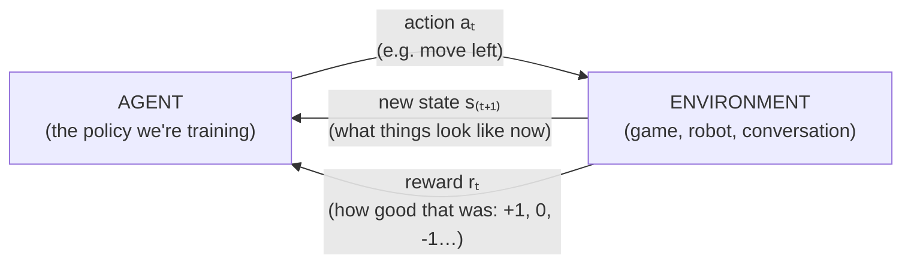

# Value-Based RL Methods

Reinforcement learning (RL) is a distinct branch of machine learning from the supervised/self-supervised learning covered elsewhere in this repository: instead of learning from a fixed dataset of correct answers, an RL agent learns by interacting with an environment, taking actions, and receiving rewards, trying to learn a strategy that maximizes cumulative reward over time. This file covers the Markov Decision Process framing and the classic value-based methods (Q-learning, DQN and its variants) that were RL's first deep-learning success story.

The entire field is built on one loop — the agent acts, the world responds with a new situation and a reward, repeat — and it's worth fixing this picture in mind before any of the algorithms, because everything else (in this file and in [policy-gradient-methods.md](policy-gradient-methods.md) and [rl-for-llms.md](rl-for-llms.md)) is a different strategy for learning inside it:



The one thing that makes RL genuinely harder than supervised learning: the reward often doesn't tell you *which* action was responsible. You might win a game 40 moves after the move that actually mattered, and the reward arrives only at the end — figuring out which earlier actions deserve credit for a delayed reward is the **credit assignment problem**, and nearly every RL algorithm is, at heart, a different answer to it.

## The Markov Decision Process (MDP) framing

**Name & definition.** A Markov Decision Process formalizes sequential decision-making under uncertainty using four core ingredients: a set of possible **states** (a full description of the current situation, e.g., a game board position), a set of possible **actions** (choices available to the agent), a **reward** signal (a number received after taking an action in a state, indicating how good that outcome was), and a **policy** (the agent's strategy — a rule, possibly learned, for choosing an action given the current state).

**Why "Markov"?** As covered in [probabilistic-models.md](../02-classical-ml/probabilistic-models.md), the Markov property assumes the future depends on the past only through the present state — in RL terms, this means the current state contains all the information needed to make an optimal decision; you don't need the full history of everything that happened before to decide what to do next, only where things stand right now. Real-world problems don't always satisfy this exactly (a poker game's optimal action might depend on betting patterns earlier in the hand, not just the current cards), but a well-designed state representation can often capture enough relevant history to make the Markov assumption a reasonable approximation.

**The objective.** An RL agent's goal is to learn a policy that maximizes **cumulative reward** — not just the immediate reward from the next action, but the total reward accumulated over an entire episode or the long run, often with a **discount factor** γ (gamma, a number between 0 and 1) that weights future rewards slightly less than immediate ones, both to keep the total sum mathematically well-behaved over long or infinite horizons and to reflect a reasonable preference for sooner rewards over equally-sized later ones.

## Q-learning

**Name & definition.** Q-learning learns a **Q-function** Q(s, a) — an estimate of the total expected future reward obtainable by taking action a in state s, and then acting optimally from then on — without needing an explicit model of how the environment behaves (a **model-free** method, in RL terminology; contrast with the model-based approaches in [model-based-rl.md](model-based-rl.md)).

**Origin.** Watkins, "Learning from Delayed Rewards" (PhD thesis, 1989).

**Core mechanism.**

```
Q(s, a) ← Q(s, a) + α · [ r + γ · max_a' Q(s', a') − Q(s, a) ]
```

Walkthrough: after taking action a in state s, observing reward r, and landing in new state s', update the current estimate Q(s, a) to move a little bit (controlled by learning rate α — see [optimization-algorithms.md](../01-foundations/optimization-algorithms.md)) toward a better estimate: the reward just received, plus the discounted value of the best action available from the new state s' (max_a' Q(s', a'), assuming you'll act optimally going forward). This is a form of **bootstrapping** — the update uses the model's own current (imperfect) estimate of future value to improve its estimate of present value, gradually refining both as more experience accumulates, rather than needing to wait until a full episode concludes to know the true total reward. Once a good Q-function is learned, the optimal policy is simple: in any state, just pick whichever action has the highest Q-value.

**A concrete update.** Say Q(s, "jump") currently estimates 5.0. The agent jumps, receives reward r = 2, and lands in state s' where the best available action is worth Q(s', best) = 10. With learning rate α = 0.1 and discount γ = 0.9, the "better estimate" (the **target**) is r + γ·max = 2 + 0.9·10 = 11. The update nudges the old estimate 10% of the way toward it: Q(s, "jump") ← 5.0 + 0.1·(11 − 5.0) = 5.6. The quantity in brackets (11 − 5.0 = 6.0) is the **temporal-difference (TD) error** — "reality came out 6 better than I predicted, so nudge my prediction up." Repeat this millions of times across an environment and the estimates converge toward the true long-run values. Notice how the delayed-reward/credit-assignment problem is handled: value flows *backward* one step at a time — a good outcome raises the value of the state just before it, which on a later visit raises the value of the state before *that*, and so on, until credit has propagated back to the early actions that set it up.

**Why it mattered.** Q-learning provided a simple, provably-convergent (under certain conditions) method for learning optimal behavior purely from trial-and-error interaction, without needing to know the environment's underlying dynamics in advance — a foundational result for model-free reinforcement learning.

**The scaling problem.** Classic Q-learning stores Q(s, a) as an explicit table, with one entry per state-action pair — completely impractical for any environment with a large or continuous state space (e.g., raw pixel input from a video game, which has an astronomically large number of possible pixel configurations), since there's no way to store, let alone learn, a separate value for every conceivable state.

## Deep Q-Networks (DQN)

**Origin.** Mnih et al. (DeepMind), "Playing Atari with Deep Reinforcement Learning" (2013), followed by "Human-level control through deep reinforcement learning" (2015, published in Nature).

**Core mechanism.** DQN replaces the impossibly large Q-table with a neural network Q(s, a; θ) that takes a state (e.g., raw pixels) as input and outputs an estimated Q-value for each possible action, trained via gradient descent (see [optimization-algorithms.md](../01-foundations/optimization-algorithms.md)) to minimize the difference between its current predictions and the same bootstrapped target used in tabular Q-learning above (reward plus discounted estimated future value).

**Why it mattered.** DQN was the first system to learn to play a wide range of Atari video games directly from raw pixel input, using a single general architecture and learning algorithm, reaching human-comparable performance on many of them — a landmark demonstration that deep learning and reinforcement learning could be combined successfully at meaningful scale, and a major moment in the broader deep learning narrative covered in [08-history/timeline-2000s-2017.md](../08-history/timeline-2000s-2017.md).

**Two key stabilization tricks introduced alongside DQN:**

- **Experience replay.** Instead of training on experiences (state, action, reward, next-state tuples) immediately as they occur, in the exact temporally-correlated order they were experienced, store them in a large buffer and train on randomly-sampled batches drawn from that buffer. Walkthrough: consecutive experiences in an RL trajectory are highly correlated (the game state five moves from now looks a lot like the game state now), and training a neural network on a stream of highly correlated, non-random data tends to be unstable — random sampling from a large replay buffer breaks this correlation, making training resemble the more well-understood, more stable i.i.d. (independent and identically distributed) data assumption that standard supervised deep learning training relies on.
- **Target network.** Notice that the Q-learning update target (r + γ · max_a' Q(s', a')) uses the *same* network's own predictions as part of its own training target — if the network's parameters are updated after every single step, this target shifts every step too, chasing a constantly-moving goal, which can destabilize training. DQN uses a separate, periodically-updated (rather than continuously-updated) **target network** to compute this bootstrapped target, keeping the training target more stable for a stretch of updates at a time.

## Double DQN

**Origin.** van Hasselt, Guez, Silver, "Deep Reinforcement Learning with Double Q-learning" (2016).

**The problem it addresses.** Standard Q-learning's max_a' Q(s', a') term systematically tends to *overestimate* true action values, because taking a max over several noisy estimates tends to pick out whichever estimate happens to be positively noisy that day, not necessarily the action that's actually best — a well-known statistical bias in max-based estimation.

**Core mechanism.** Double DQN decouples *which* action is selected as best from *how* that action's value is evaluated, using two separate networks for these two roles (in practice, reusing the existing online and target networks from standard DQN in these two roles) — this largely cancels out the overestimation bias, since the two networks' noise is less likely to align on the same overestimated action.

## Dueling DQN

**Origin.** Wang et al., "Dueling Network Architectures for Deep Reinforcement Learning" (2016).

**Core mechanism.** Dueling DQN restructures the network's output into two separate streams: a **state-value** estimate V(s) (how good is this state overall, regardless of which action is taken) and an **advantage** estimate A(s, a) (how much better or worse is this specific action compared to the average action available in this state), which are then recombined into the final Q-value estimate: Q(s, a) = V(s) + A(s, a) (with a normalization adjustment to keep the decomposition well-defined). Walkthrough: in many states, the specific action taken doesn't matter much to the outcome (all actions lead to similar results), and separately learning "how good is this state in general" from "how much does this particular action matter" lets the network learn the state-value part efficiently even in states where distinguishing between actions provides little additional training signal.

## Comparison table

| Method | Year | Key Innovation | Still Relevant (2026)? |
|---|---|---|---|
| Q-learning (tabular) | 1989 | Model-free, bootstrapped value learning | Foundational theory; impractical directly at scale |
| DQN | 2013/2015 | Neural network Q-function + experience replay + target network | Foundational; still used/taught as a baseline value-based method |
| Double DQN | 2016 | Decouples action selection from evaluation, fixes overestimation bias | Common refinement, still used where value-based methods are chosen |
| Dueling DQN | 2016 | Separates state-value and advantage estimation | Common refinement, often combined with the above |

## Relationship to other algorithms

- The Markov property here connects directly to its treatment in [probabilistic-models.md](../02-classical-ml/probabilistic-models.md) (HMMs).
- Value-based methods are one of the two major RL paradigms; the other, policy gradient methods (including PPO, central to modern RLHF), are covered in [policy-gradient-methods.md](policy-gradient-methods.md).
- Model-free methods like Q-learning/DQN are directly contrasted with the model-based approaches in [model-based-rl.md](model-based-rl.md).
- The gradient-based training of DQN's Q-network uses the same optimization machinery as everywhere else in this repository — see [optimization-algorithms.md](../01-foundations/optimization-algorithms.md).

## Sources

- Watkins, "Learning from Delayed Rewards" (PhD thesis, 1989)
- Mnih et al., "Playing Atari with Deep Reinforcement Learning" (2013)
- Mnih et al., "Human-level control through deep reinforcement learning" (2015)
- van Hasselt, Guez, Silver, "Deep Reinforcement Learning with Double Q-learning" (2016)
- Wang et al., "Dueling Network Architectures for Deep Reinforcement Learning" (2016)
