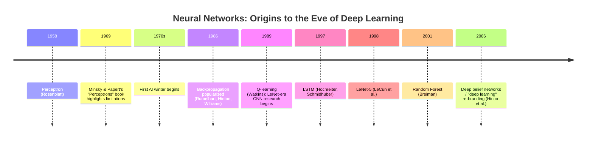

# Timeline: 1950s - 2000s

This is the first of four chronological history files (see also [timeline-2000s-2017.md](timeline-2000s-2017.md), [timeline-2017-2023.md](timeline-2017-2023.md), and [timeline-2023-present.md](timeline-2023-present.md)), covering the origins of neural network research, the field's first major setback, and the slow rebuilding of the ideas that would eventually enable deep learning. Per this repository's methodology (see [scope-and-methodology.md](../00-overview/scope-and-methodology.md)), dates are cited as precisely as the historical record supports, and uncertainty is flagged rather than papered over.

## Timeline diagram

## The Perceptron (1958)

**What it was.** Frank Rosenblatt's Perceptron (1958) was one of the earliest trainable artificial neural network models: a single layer of adjustable weights that could learn to classify simple patterns via an iterative training rule, loosely inspired by ideas about biological neurons. It generated enormous public excitement at the time — including press coverage suggesting machines that could "walk, talk, see, write, reproduce itself and be conscious of its existence" were imminent, a striking early example of AI hype outrunning the technology's actual capability, a pattern that recurs at several later points in this history.

## Perceptron's limitations and the first AI winter

**What happened.** Minsky and Papert's 1969 book *Perceptrons* rigorously demonstrated that a single-layer perceptron (the architecture Rosenblatt had popularized) was mathematically incapable of learning certain simple functions — most famously, the XOR (exclusive-or) logical function, which requires a non-linear decision boundary that a single layer of weights simply cannot represent. This finding is often cited as a major contributor to a subsequent, multi-year pullback in funding and enthusiasm for neural network research — the first "AI winter" — though it's worth being precise that multi-layer networks (which *can* represent XOR and similar functions) were already a known theoretical possibility at the time; what was missing was an efficient, general way to *train* multi-layer networks, which wouldn't be popularized for almost two more decades (see backpropagation, below). The broader first AI winter (roughly the 1970s) also had other contributing causes beyond this specific finding, including broader disappointment with the pace of progress across multiple AI research programs, not neural networks alone.

## Backpropagation popularized (1986)

**What happened.** Rumelhart, Hinton, and Williams's 1986 paper "Learning representations by back-propagating errors" popularized backpropagation — an efficient algorithm for computing how a loss function's gradient depends on every weight in a multi-layer network, using the chain rule of calculus applied systematically backward through the network (see [optimization-algorithms.md](../01-foundations/optimization-algorithms.md) for the modern mechanical treatment). It's worth noting, honestly, that the core mathematical idea behind backpropagation had been discovered independently by several researchers earlier (including work by Werbos in the 1970s, and others), but the 1986 paper is the one most credited with demonstrating its practical value for training multi-layer networks and popularizing it widely within the field.

**Why it mattered.** Backpropagation directly solved the training problem that had made multi-layer networks impractical, providing a scalable route to training the deeper architectures that classical single-layer perceptrons couldn't represent, and reopened serious research interest in neural networks after the first AI winter.

## Early CNNs and LeNet

**What happened.** Building on backpropagation, Yann LeCun and colleagues developed convolutional neural network architectures through the late 1980s and 1990s, culminating in LeNet-5 (1998, see [cnn-family.md](../03-deep-learning-architectures/cnn-family.md)), a CNN trained via backpropagation that achieved strong practical results on handwritten digit recognition — real-world deployment for check processing, notably.

**Why it mattered.** LeNet demonstrated that the convolution-plus-pooling architecture, combined with backpropagation, could solve a genuine practical problem end-to-end, establishing the architectural template (see [cnn-family.md](../03-deep-learning-architectures/cnn-family.md)) that every subsequent CNN in this repository builds on.

## LSTM (1997)

**What happened.** Hochreiter and Schmidhuber's 1997 LSTM paper (see [rnn-lstm-gru.md](../03-deep-learning-architectures/rnn-lstm-gru.md)) introduced gated recurrent units capable of learning long-range dependencies in sequences, directly addressing the vanishing gradient problem that plain recurrent networks suffer from. Notably, this work predates the deep learning boom by roughly a decade and a half — LSTMs existed and were understood well before the computational resources and large datasets needed to fully exploit them became widely available.

## Classical ML developments in this era (context)

Alongside neural network research, this period also produced much of the classical ML toolkit still used today for non-deep-learning tasks (see [02-classical-ml](../02-classical-ml/)): Support Vector Machines (Cortes, Vapnik, 1995), Random Forest (Breiman, 2001), and the AdaBoost/boosting lineage (Freund, Schapire, 1997) all emerged in this same broad window, largely developing in parallel with, rather than in direct competition against, neural network research — for much of this period, these statistical/ensemble methods, not neural networks, were the more practically dominant approach for most real-world classification and regression tasks.

## The 2006 "deep learning" re-branding moment

**What happened.** In 2006, Geoffrey Hinton and colleagues published work on training "deep belief networks" — stacks of a specific kind of probabilistic model (restricted Boltzmann machines) trained one layer at a time, which could then be fine-tuned as a conventional deep neural network. This work is widely credited with popularizing the term "deep learning" for the field and with demonstrating a practical recipe for training networks deeper than had been common practice up to that point, at a time when directly training very deep networks end-to-end via plain backpropagation was still difficult (a problem that, as covered in [cnn-family.md](../03-deep-learning-architectures/cnn-family.md), wasn't fully solved until residual connections arrived nearly a decade later).

**Why it mattered.** This moment is generally treated as the symbolic beginning of the "deep learning" era as a named, self-aware research program, setting the stage for the more dramatic breakthroughs of the following decade covered in [timeline-2000s-2017.md](timeline-2000s-2017.md) — most notably AlexNet's 2012 ImageNet result.

## Relationship to other files

- The optimization and architectural concepts introduced in this era (backpropagation, CNNs, LSTMs) are covered in full modern mechanical depth in [01-foundations](../01-foundations/), [03-deep-learning-architectures/cnn-family.md](../03-deep-learning-architectures/cnn-family.md), and [03-deep-learning-architectures/rnn-lstm-gru.md](../03-deep-learning-architectures/rnn-lstm-gru.md).
- This file continues directly into [timeline-2000s-2017.md](timeline-2000s-2017.md), covering AlexNet, word2vec, seq2seq, ResNet, and the road to the Transformer.

## Sources

- Rosenblatt, "The Perceptron: A Probabilistic Model for Information Storage and Organization in the Brain" (1958)
- Minsky, Papert, "Perceptrons" (1969)
- Rumelhart, Hinton, Williams, "Learning representations by back-propagating errors" (1986)
- Cortes, Vapnik, "Support-Vector Networks" (1995)
- Hochreiter, Schmidhuber, "Long Short-Term Memory" (1997)
- Freund, Schapire, "A Decision-Theoretic Generalization of On-Line Learning and an Application to Boosting" (1997)
- LeCun, Bottou, Bengio, Haffner, "Gradient-Based Learning Applied to Document Recognition" (1998)
- Breiman, "Random Forests" (2001)
- Hinton, Osindero, Teh, "A Fast Learning Algorithm for Deep Belief Nets" (2006)
