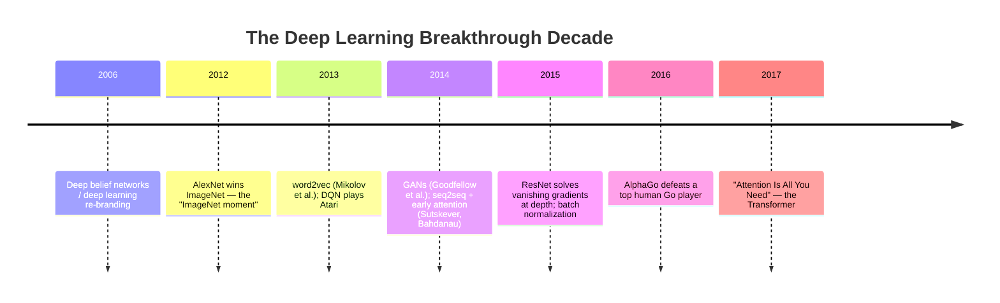

# Timeline: 2000s - 2017

This file covers the period from the deep learning re-branding moment (see [timeline-1950s-2000s.md](timeline-1950s-2000s.md)) through the publication of the Transformer architecture — the decade in which deep learning went from a promising research direction to the dominant paradigm across computer vision, speech, and the early stages of NLP.

## Timeline diagram

## AlexNet and the ImageNet moment (2012)

**What happened.** As covered in depth in [cnn-family.md](../03-deep-learning-architectures/cnn-family.md), Krizhevsky, Sutskever, and Hinton's AlexNet won the 2012 ImageNet Large Scale Visual Recognition Challenge by a wide margin over the next-best (non-deep-learning) approach, using a deep CNN trained on GPUs.

**Why it's treated as a watershed moment.** This result is widely regarded as the single moment that shifted the mainstream computer vision research community's consensus toward deep learning as the dominant approach, rather than one promising technique among several competing paradigms (hand-engineered feature pipelines combined with classical ML, in particular). The scale of the win — and the fact that it relied on ingredients (GPU training, large labeled datasets, ReLU activations, dropout) that would recur throughout the following decade — makes 2012 a natural inflection point in this history.

## word2vec and early embeddings (2013)

**What happened.** Mikolov et al. (2013) introduced word2vec, a method for learning dense vector representations of words (embeddings — see the glossary) purely from co-occurrence patterns in large text corpora, such that words used in similar contexts end up with similar vectors — famously demonstrating that simple vector arithmetic on these embeddings could capture meaningful relationships (the canonical, widely-cited example being that the vector for "king" minus "man" plus "woman" lands close to the vector for "queen").

**Why it mattered.** word2vec was an early, influential demonstration that self-supervised learning (see [pretraining-strategies.md](../05-training-methodology/pretraining-strategies.md)) — learning useful representations from raw, unlabeled text, with no manual annotation — could produce genuinely useful, semantically structured representations, a foreseeable early ancestor of the much larger-scale self-supervised pretraining that would come to define the LLM era.

## DQN and deep reinforcement learning (2013)

**What happened.** As covered in [value-based-methods.md](../07-reinforcement-learning/value-based-methods.md), Mnih et al.'s Deep Q-Network combined neural networks with Q-learning to play Atari games directly from raw pixels, reaching human-comparable performance across a range of games using one general architecture and algorithm.

**Why it mattered.** DQN was an early, prominent demonstration that deep learning and reinforcement learning could be combined successfully — establishing deep RL as a serious research direction and setting up the later, even more prominent AlphaGo result (below).

## GANs (2014)

**What happened.** Goodfellow et al. introduced Generative Adversarial Networks (see [gans.md](../04-generative-models/gans.md)), framing generative modeling as an adversarial game between a generator and a discriminator network.

**Why it mattered.** GANs became, for the following several years, the leading approach to high-fidelity image generation, and represented a genuinely novel training paradigm (adversarial competition between two networks) distinct from the more standard likelihood-maximization framing used elsewhere in deep learning at the time.

## Seq2seq and early attention (2014-2015)

**What happened.** Sutskever, Vinyals, and Le's sequence-to-sequence framing (2014, see [rnn-lstm-gru.md](../03-deep-learning-architectures/rnn-lstm-gru.md)) gave a general encoder-decoder recipe for mapping one sequence to another using RNNs/LSTMs, and Bahdanau et al.'s attention mechanism (2014) and Luong et al.'s follow-up refinements (2015) fixed seq2seq's information bottleneck by letting a decoder dynamically attend back over every encoder position.

**Why it mattered.** This attention mechanism is, as covered in [rnn-lstm-gru.md](../03-deep-learning-architectures/rnn-lstm-gru.md) and [transformer-architecture.md](../03-deep-learning-architectures/transformer-architecture.md), the single most direct conceptual ancestor of the self-attention mechanism that would define the Transformer three years later — this period is where the core idea (compute relevance scores, softmax them into weights, take a weighted sum) first appeared, still embedded within a recurrent architecture rather than as a full replacement for it.

## ResNet (2015)

**What happened.** He, Zhang, Ren, and Sun's ResNet (see [cnn-family.md](../03-deep-learning-architectures/cnn-family.md)) introduced skip/residual connections, solving the vanishing gradient problem that had prevented plain networks from training reliably past roughly 20-30 layers, and enabling networks over 100 layers deep.

**Why it mattered.** Beyond its immediate computer vision results, the residual connection became one of the most widely-reused architectural components in all of deep learning — it's a core structural element of the Transformer block (see [transformer-architecture.md](../03-deep-learning-architectures/transformer-architecture.md)) and of nearly every deep architecture developed since.

## AlphaGo (2016)

**What happened.** DeepMind's AlphaGo defeated Lee Sedol, one of the strongest professional Go players in the world, in a widely-watched, publicly covered match — a result many in the field had expected to be a decade or more away, given Go's enormous game tree and the difficulty of hand-crafting an evaluation function for board positions the way earlier chess engines had relied on.

**Why it mattered.** AlphaGo combined deep neural networks (for evaluating positions and suggesting moves) with Monte Carlo Tree Search planning (see [model-based-rl.md](../07-reinforcement-learning/model-based-rl.md) for the closely related, later MuZero system), and its very public success became one of the most widely recognized "AI milestone" moments with the general public, not just within the research community — a pattern that would repeat, at even larger scale, with ChatGPT's release six years later (see [timeline-2017-2023.md](timeline-2017-2023.md)).

## "Attention Is All You Need" (2017)

**What happened.** Vaswani et al.'s Transformer paper (see [transformer-architecture.md](../03-deep-learning-architectures/transformer-architecture.md)) demonstrated that a machine translation model built entirely from attention mechanisms — no recurrence, no convolution — could match or exceed the quality of the best RNN/LSTM-based seq2seq systems, while training substantially faster due to its parallelizability.

**Why it's the hinge point of this entire history.** Every major architectural and methodological development covered in [timeline-2017-2023.md](timeline-2017-2023.md) and [timeline-2023-present.md](timeline-2023-present.md) — BERT, GPT, scaling laws, RLHF, the entire modern LLM era — builds directly on this architecture. This is the clearest possible dividing line in this repository's historical narrative: nearly everything in [03-deep-learning-architectures](../03-deep-learning-architectures/) and [05-training-methodology](../05-training-methodology/) downstream of the Transformer file exists because of this single 2017 paper.

## Relationship to other files

- This file continues directly from [timeline-1950s-2000s.md](timeline-1950s-2000s.md) and into [timeline-2017-2023.md](timeline-2017-2023.md), which picks up immediately with BERT and the GPT lineage.
- Nearly every architecture named here has a full mechanical treatment elsewhere: [cnn-family.md](../03-deep-learning-architectures/cnn-family.md) (AlexNet, ResNet), [rnn-lstm-gru.md](../03-deep-learning-architectures/rnn-lstm-gru.md) (seq2seq, early attention), [gans.md](../04-generative-models/gans.md), [value-based-methods.md](../07-reinforcement-learning/value-based-methods.md) (DQN), [transformer-architecture.md](../03-deep-learning-architectures/transformer-architecture.md).

## Sources

- Krizhevsky, Sutskever, Hinton, "ImageNet Classification with Deep Convolutional Neural Networks" (2012)
- Mikolov, Chen, Corrado, Dean, "Efficient Estimation of Word Representations in Vector Space" (2013) [word2vec]
- Mnih et al., "Playing Atari with Deep Reinforcement Learning" (2013)
- Goodfellow et al., "Generative Adversarial Networks" (2014)
- Sutskever, Vinyals, Le, "Sequence to Sequence Learning with Neural Networks" (2014)
- Bahdanau, Cho, Bengio, "Neural Machine Translation by Jointly Learning to Align and Translate" (2014)
- He, Zhang, Ren, Sun, "Deep Residual Learning for Image Recognition" (2015)
- Silver et al., "Mastering the game of Go with deep neural networks and tree search" (2016) [AlphaGo]
- Vaswani et al., "Attention Is All You Need" (2017)
