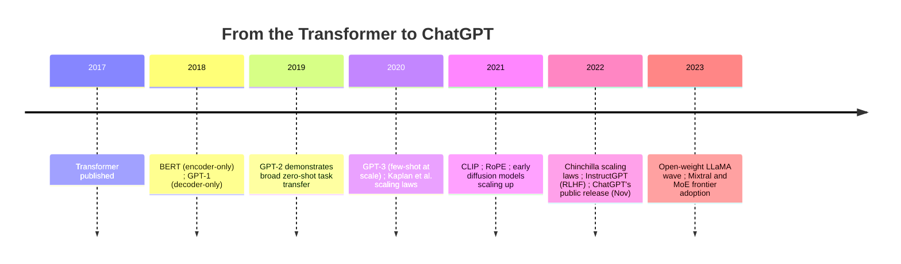

# Timeline: 2017 - 2023

This file picks up immediately after the Transformer's publication (see [timeline-2000s-2017.md](timeline-2000s-2017.md)) and covers the period in which that architecture, combined with aggressive scaling and new post-training methodology, produced the modern LLM as a product category — culminating in ChatGPT's public release, widely regarded as the moment the broader public, not just the research community, became aware of the field's progress.

## Timeline diagram

## BERT and GPT-1 (2018)

**What happened.** Two specialized forks of the Transformer architecture emerged in the same year: Devlin et al.'s BERT (encoder-only, masked language modeling, see [transformer-architecture.md](../03-deep-learning-architectures/transformer-architecture.md)) and Radford et al.'s GPT-1 (decoder-only, next-token prediction, see [autoregressive-generation.md](../04-generative-models/autoregressive-generation.md)).

**Why it mattered.** This is the point where the "which architecture variant wins for which purpose" question (covered in depth in [transformer-architecture.md](../03-deep-learning-architectures/transformer-architecture.md)) began to be answered empirically — BERT became the dominant approach for understanding/embedding tasks, while the GPT line's decoder-only, generative approach would go on to define the general-purpose LLM category.

## GPT-2 progression (2019)

**What happened.** GPT-2 scaled up the same decoder-only architecture and next-token-prediction objective, and demonstrated — notably, its release was initially staged due to concerns about potential misuse, itself a early sign of the field grappling with dual-use concerns around increasingly capable generative text models — that a sufficiently large model trained this way could perform a wide range of tasks it was never explicitly trained on, purely by being prompted appropriately (an early, striking demonstration of zero-shot task transfer — see the glossary).

**Why it mattered.** This was the first strong public evidence that scale alone, without task-specific architectures or fine-tuning, could unlock broad general capability — directly foreshadowing GPT-3's much larger-scale confirmation of the same trend the following year.

## GPT-3 and scaling laws (2020)

**What happened.** Brown et al.'s GPT-3 (2020) scaled the same recipe further and demonstrated strong few-shot learning (see the glossary) purely via prompting, with no gradient-based fine-tuning needed for many tasks. The same year, Kaplan et al. published the first influential scaling laws paper (see [transformer-architecture.md](../03-deep-learning-architectures/transformer-architecture.md)), showing that language model loss followed predictable power-law relationships with model size, data size, and compute.

**Why it mattered.** GPT-3's few-shot results made "prompting a large pretrained model" a serious alternative to fine-tuning for many tasks, reshaping how practitioners thought about using LLMs. Kaplan et al.'s scaling laws gave the field, for the first time, a way to plan large training runs based on predictable extrapolation rather than trial and error — directly shaping the "bigger is better" scaling race that characterized the next several years, before Chinchilla's 2022 revision (below) rebalanced the field's thinking about *how* to scale.

## CLIP and RoPE (2021)

**What happened.** Radford et al.'s CLIP (see [pretraining-strategies.md](../05-training-methodology/pretraining-strategies.md)) demonstrated that contrastive pretraining on image-text pairs could produce strong zero-shot image classification and a shared vision-language embedding space, becoming foundational infrastructure for later multimodal and text-to-image systems. Separately, Su et al.'s RoPE (see [transformer-architecture.md](../03-deep-learning-architectures/transformer-architecture.md)) introduced rotary position embeddings, which would go on to become the dominant positional encoding scheme in large language models.

## Diffusion models scale up (2020-2022)

**What happened.** Following Ho et al.'s 2020 DDPM formulation (see [diffusion-models.md](../04-generative-models/diffusion-models.md)), the diffusion model family scaled rapidly through 2021-2022, culminating in latent diffusion (Rombach et al., 2021/2022) and its widely-used realization, Stable Diffusion, alongside other prominent text-to-image systems released in the same broad window.

**Why it mattered.** This period is when diffusion models displaced GANs (see [gans.md](../04-generative-models/gans.md)) as the dominant approach to image generation, for the reasons covered in depth in [diffusion-models.md](../04-generative-models/diffusion-models.md) — training stability, sample diversity, and a natural conditioning mechanism (classifier-free guidance) all played a role.

## Chinchilla (2022)

**What happened.** Hoffmann et al.'s Chinchilla paper (see [transformer-architecture.md](../03-deep-learning-architectures/transformer-architecture.md)) revised the field's understanding of compute-optimal training, showing that many contemporaneous large models were undertrained relative to their size, and that a smaller model trained on substantially more data could outperform a larger, less-thoroughly-trained one at the same compute budget.

**Why it mattered.** This directly reshaped subsequent pretraining practice (see [pretraining-strategies.md](../05-training-methodology/pretraining-strategies.md)) toward heavier emphasis on data quantity and quality, not just raw parameter count.

## InstructGPT and RLHF (2022)

**What happened.** Ouyang et al.'s InstructGPT paper (see [rlhf-and-alignment.md](../05-training-methodology/rlhf-and-alignment.md)) demonstrated the full modern RLHF pipeline — supervised fine-tuning, reward model training, and PPO-based policy optimization — applied to a GPT-3-scale model, producing a model that followed instructions and matched user intent substantially better than the raw pretrained model, according to human evaluators, despite being much smaller than the base GPT-3 model it was built from.

**Why it mattered.** This is the paper this repository credits as establishing the methodology that turned raw pretrained LLMs into usable, instruction-following assistants — directly setting up ChatGPT's release later that same year.

## ChatGPT's public release (November 2022)

**What happened.** OpenAI's public release of ChatGPT in late 2022, built on the RLHF-style methodology described above, reached an enormous general-public audience extremely quickly — widely reported as one of the fastest-growing consumer software products in history at the time.

**Why it mattered, for the field and beyond it.** This is the single most significant "public awareness" inflection point in this entire history — comparable in visibility to AlphaGo's 2016 match (see [timeline-2000s-2017.md](timeline-2000s-2017.md)) but reaching a vastly larger, more mainstream audience, and directly triggering a dramatic acceleration in industry investment, public discourse, competitive urgency across labs, and policy attention to AI that has continued through the period covered in [timeline-2023-present.md](timeline-2023-present.md).

## The open-weights wave: LLaMA and successors (2023)

**What happened.** Meta's LLaMA model family (first released February 2023) and its many successors and derivatives (across multiple organizations) made increasingly capable model weights available for researchers and, in varying license terms, broader use — a meaningfully different distribution model than the closed, API-only access that had characterized GPT-3 and ChatGPT.

**Why it mattered.** This substantially broadened who could do hands-on research and development with genuinely capable LLMs, fueling a wave of open-source fine-tuning, PEFT method development and adoption (see [finetuning-and-peft.md](../05-training-methodology/finetuning-and-peft.md)), and experimentation across the wider community, not just inside large labs.

## Mixture-of-Experts frontier adoption (2023)

**What happened.** Building on earlier MoE research (Switch Transformer, GShard — see [mixture-of-experts.md](../03-deep-learning-architectures/mixture-of-experts.md)), Mistral AI's Mixtral (late 2023) was a prominent open-weight demonstration that MoE architectures could achieve strong performance relative to their active-compute cost.

**Why it mattered.** This is a notable point in the timeline where a previously more academic architectural direction (sparse MoE) became a concretely, publicly demonstrated practical option, contributing to its broader adoption across multiple labs' frontier models in the years since.

## Relationship to other files

- This file continues directly from [timeline-2000s-2017.md](timeline-2000s-2017.md) and into [timeline-2023-present.md](timeline-2023-present.md), which covers multimodal convergence and reasoning-focused training.
- Nearly every event here has a full technical treatment elsewhere: [transformer-architecture.md](../03-deep-learning-architectures/transformer-architecture.md) (BERT, GPT-1, RoPE, scaling laws), [rlhf-and-alignment.md](../05-training-methodology/rlhf-and-alignment.md) (InstructGPT/RLHF), [diffusion-models.md](../04-generative-models/diffusion-models.md), [mixture-of-experts.md](../03-deep-learning-architectures/mixture-of-experts.md).

## Sources

- Devlin, Chang, Lee, Toutanova, "BERT: Pre-training of Deep Bidirectional Transformers for Language Understanding" (2018)
- Radford et al., "Improving Language Understanding by Generative Pre-Training" (2018) [GPT-1]
- Radford et al., "Language Models are Unsupervised Multitask Learners" (2019) [GPT-2]
- Brown et al., "Language Models are Few-Shot Learners" (2020) [GPT-3]
- Kaplan et al., "Scaling Laws for Neural Language Models" (2020)
- Ho, Jain, Abbeel, "Denoising Diffusion Probabilistic Models" (2020)
- Radford et al., "Learning Transferable Visual Models From Natural Language Supervision" (2021) [CLIP]
- Su et al., "RoFormer: Enhanced Transformer with Rotary Position Embedding" (2021)
- Rombach, Blattmann, Lorenz, Esser, Ommer, "High-Resolution Image Synthesis with Latent Diffusion Models" (2021/2022)
- Hoffmann et al., "Training Compute-Optimal Large Language Models" (2022) [Chinchilla]
- Ouyang et al., "Training language models to follow instructions with human feedback" (2022) [InstructGPT]
- Touvron et al. (Meta), "LLaMA: Open and Efficient Foundation Language Models" (2023)
- Mistral AI, "Mixtral of Experts" (2023/2024)
