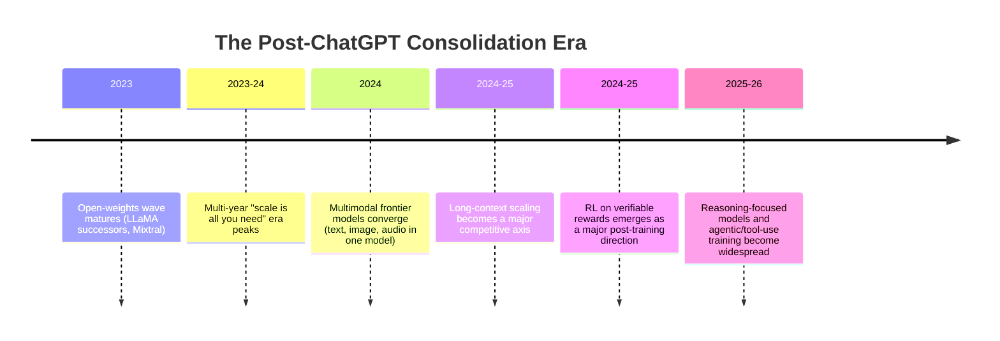

# Timeline: 2023 - Present

This is the most recent, and necessarily the least settled, of the four history files — events here are closer to the writing of this repository (mid-2026) and haven't had the benefit of years of hindsight and academic post-mortems the way earlier eras have. Per this repository's methodology (see [scope-and-methodology.md](../00-overview/scope-and-methodology.md)), this file sticks to widely-reported developments and is explicit about where the historical record is still unsettled; for genuinely forward-looking speculation, see [09-roadmaps](../09-roadmaps/), where such claims are clearly labeled `[Projection]`.

## Timeline diagram

## Continued open-weights competition and MoE adoption

**What happened.** Following the LLaMA and Mixtral developments covered in [timeline-2017-2023.md](timeline-2017-2023.md), the period since has seen continued, competitive releases of increasingly capable open-weight model families from multiple organizations, alongside continued adoption of Mixture-of-Experts architectures (see [mixture-of-experts.md](../03-deep-learning-architectures/mixture-of-experts.md)) among frontier labs' largest models.

**Why it matters to this history.** The gap between the best open-weight models and the best closed/API-only frontier models has been widely reported to narrow considerably during this period relative to the 2020-2022 window, though closed frontier labs have generally continued to lead on the most capable systems at any given time — a competitive dynamic that continued to evolve through the period covered here.

## Multimodal convergence

**What happened.** Frontier model development shifted from separate, specialized models per modality (a language model, a separate image model, a separate audio model) toward single models trained to natively handle multiple modalities — text, images, audio, and in some cases video — within one architecture and one set of weights, rather than gluing together separately-trained components.

**Why it mattered.** This reflects a broader bet that shared representations and joint training across modalities produce more capable and more efficient systems than maintaining separate specialized models, and it made "natively multimodal" a standard expectation for frontier general-purpose models rather than a specialized add-on capability.

## Long-context scaling

**What happened.** Context window sizes (how much text/input a model can process at once — directly related to the KV cache costs covered in [kv-cache-and-attention-optimization.md](../06-inference-optimization/kv-cache-and-attention-optimization.md)) grew substantially across this period, with frontier models moving from tens of thousands of tokens of context to context windows large enough to process very long documents, extensive conversation histories, or large codebases in a single pass.

**Why it mattered.** This shift is a direct driver of much of the inference-optimization work covered in [06-inference-optimization](../06-inference-optimization/) — GQA, PagedAttention, and the renewed research interest in state space models (see [state-space-models.md](../03-deep-learning-architectures/state-space-models.md)) are all, in part, responses to the cost pressure that longer contexts place on attention's quadratic scaling and the KV cache's linear-but-still-substantial memory footprint.

## RL on verifiable rewards and reasoning-focused training

**What happened.** As covered in depth in [rl-for-llms.md](../07-reinforcement-learning/rl-for-llms.md), a significant post-training methodology shift emerged in which models are trained via reinforcement learning against automatically verifiable rewards (checking whether a math answer is correct, whether code passes tests, and similar objectively-checkable criteria) rather than relying solely on learned, human-preference-trained reward models. This has been widely reported as central to producing models with substantially stronger multi-step reasoning behavior — models that work through problems step by step before producing a final answer, sometimes described as exhibiting extended "thinking" or deliberation before responding.

**Why this is treated as the most recent major methodological shift.** Per this repository's honest-uncertainty policy for recent events, this is presented as a widely-reported and clearly significant direction — reflected in multiple labs' publicly described training approaches — rather than a single, precisely-dated, universally-agreed "moment" the way ChatGPT's release was. The exact techniques, terminology, and relative emphasis vary across organizations, and this remains an active, fast-evolving area at the time of this repository's writing (mid-2026), which is why [rl-for-llms.md](../07-reinforcement-learning/rl-for-llms.md) treats it as a genuinely important development while being explicit about what's still unsettled about it.

## Agentic and tool-use training

**What happened.** Alongside reasoning-focused training, increasing emphasis has been placed on training models to use external tools (running code, searching the web, calling external APIs/functions) and to operate over longer, multi-step task horizons with less direct human supervision at each step — often described under the umbrella term "agentic" behavior.

**Why it matters, and honest uncertainty about where this settles.** This direction connects directly to the open problems around long-horizon agentic reliability discussed in [09-roadmaps/open-problems.md](../09-roadmaps/open-problems.md) — as of this writing, this remains an active area of rapid capability improvement and correspondingly rapid discovery of new failure modes, and this repository deliberately avoids overclaiming how "solved" reliable long-horizon agentic behavior is as of mid-2026.

## A note on writing history this close to the present

This file is, by construction, the part of this repository's historical narrative most likely to look incomplete or differently-weighted in hindsight a few years from now — some events treated here as significant may prove less durably important than they currently appear, and some quieter developments not yet widely reported may retrospectively turn out to matter more. This isn't a flaw specific to this repository; it's an inherent property of writing recent history, and it's exactly why this repository draws a firm line between this file (widely-reported past/current developments) and [09-roadmaps](../09-roadmaps/) (explicitly labeled forward-looking speculation) rather than blurring the two together.

## Relationship to other files

- This file continues directly from [timeline-2017-2023.md](timeline-2017-2023.md) and is the most recent point in this repository's chronological narrative; [09-roadmaps](../09-roadmaps/) picks up from here into explicitly speculative territory.
- RL on verifiable rewards is covered in full in [rl-for-llms.md](../07-reinforcement-learning/rl-for-llms.md); long-context/KV-cache cost pressure is covered in [kv-cache-and-attention-optimization.md](../06-inference-optimization/kv-cache-and-attention-optimization.md) and [state-space-models.md](../03-deep-learning-architectures/state-space-models.md).

## Sources

- This file relies more heavily on "widely reported" characterizations than the earlier three timeline files, reflecting the more recent, less-settled nature of these events, per this repository's stated methodology (see [scope-and-methodology.md](../00-overview/scope-and-methodology.md)).
- Touvron et al. (Meta), "LLaMA: Open and Efficient Foundation Language Models" (2023) [context for continued open-weights competition]
- Mistral AI, "Mixtral of Experts" (2023/2024) [context for continued MoE adoption]
