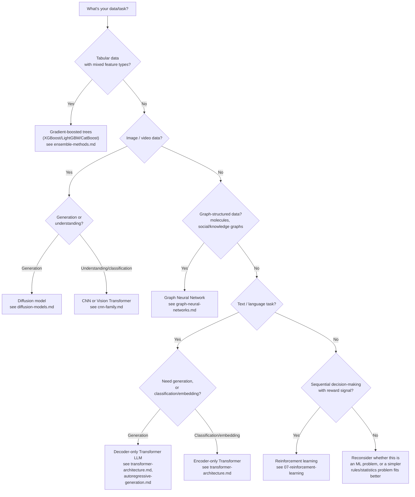

# When to Use What

This is practical decision guidance, synthesized from the rest of this repository — no new algorithms are introduced here. Use the decision tree for a quick first pass, and the explanatory text below it for the reasoning behind each branch.

## Decision tree: choosing a modeling approach

## Classical ML vs. deep learning

**Use classical ML (gradient-boosted trees especially — see [ensemble-methods.md](../02-classical-ml/ensemble-methods.md)) when:** the data is tabular, feature counts are moderate, dataset size is small-to-medium relative to what a competitive deep model would need, and interpretability or fast iteration matters. As covered in [ensemble-methods.md](../02-classical-ml/ensemble-methods.md), this isn't a "settle for less" choice — gradient-boosted trees frequently *outperform* deep learning on genuinely tabular data, for structural reasons (heterogeneous, non-smooth features; smaller datasets relative to competitive deep model sizes) that don't go away with more research effort.

**Use deep learning when:** the data has meaningful spatial, sequential, or relational structure (images, audio, text, graphs) that an architecture can exploit as an inductive bias (see [cnn-family.md](../03-deep-learning-architectures/cnn-family.md), [transformer-architecture.md](../03-deep-learning-architectures/transformer-architecture.md), [graph-neural-networks.md](../03-deep-learning-architectures/graph-neural-networks.md)), and/or when there's enough data available to make learned representations outperform hand-engineered features.

## Choosing an optimizer

Per [optimization-algorithms.md](../01-foundations/optimization-algorithms.md): **default to AdamW** for essentially any deep learning training task unless you have a specific reason not to. Consider Lion or Sophia only if you're doing large-scale pretraining and have the engineering capacity to validate an alternative against AdamW on your specific setup; consider LAMB/LARS specifically when scaling to very large batch sizes across many accelerators.

## Choosing a generative model family

Per [04-generative-models](../04-generative-models/): **for images/video/audio, default to diffusion** (see [diffusion-models.md](../04-generative-models/diffusion-models.md)) unless you specifically need GAN-like single-pass fast sampling (see [gans.md](../04-generative-models/gans.md)) or exact likelihood computation (flow-based models — see [flow-based-models.md](../04-generative-models/flow-based-models.md)), both narrower niches as of 2026. **For text, autoregressive decoder-only generation is the default** (see [autoregressive-generation.md](../04-generative-models/autoregressive-generation.md)) — there isn't currently a mainstream alternative displacing it for open-ended text generation.

## Choosing a fine-tuning approach

Per [finetuning-and-peft.md](../05-training-methodology/finetuning-and-peft.md): **default to LoRA** for adapting a pretrained model to a new task or domain; **use QLoRA specifically when hardware memory is the binding constraint**; **reserve full fine-tuning** for cases where maximum task performance is worth the considerably higher compute/memory cost, or where you're doing large-scale continued pretraining rather than narrow task adaptation.

## Choosing an alignment/post-training approach

Per [rlhf-and-alignment.md](../05-training-methodology/rlhf-and-alignment.md): **default to DPO** for preference-based fine-tuning if you want a simpler, more stable pipeline without RL infrastructure; **use full RLHF** if you specifically need a standalone, reusable reward model or finer-grained RL-based control over training; **use RL on verifiable rewards** (see [rl-for-llms.md](../07-reinforcement-learning/rl-for-llms.md)) specifically for domains with automatically checkable correctness (math, code, logic), layered alongside, not instead of, preference-based methods for open-ended tasks.

## Choosing inference optimizations

Per [06-inference-optimization](../06-inference-optimization/): **apply FlashAttention and continuous batching essentially always** — they're close to free wins with no quality tradeoff (see [kv-cache-and-attention-optimization.md](../06-inference-optimization/kv-cache-and-attention-optimization.md) and [serving-and-batching.md](../06-inference-optimization/serving-and-batching.md)). **Apply quantization** (see [quantization.md](../06-inference-optimization/quantization.md)) when memory/cost is the binding constraint and you can validate the accuracy impact is acceptable for your use case. **Apply speculative decoding** (see [speculative-decoding.md](../06-inference-optimization/speculative-decoding.md)) when latency matters and you can maintain a well-matched draft model or use a draft-model-free variant (Medusa, lookahead decoding). **Choose GQA-style architectures at training time** (not something you can retrofit as easily as the other techniques here) when you know long-context, high-concurrency serving is a priority.

## Relationship to other files

- This file's guidance is a practical distillation of [algorithm-comparison-master.md](algorithm-comparison-master.md) and [compute-cost-comparison.md](compute-cost-comparison.md) — read those for the underlying comparative data this guidance is based on.
- For the full mechanism and reasoning behind any recommendation here, follow the cross-links into the relevant section file.
